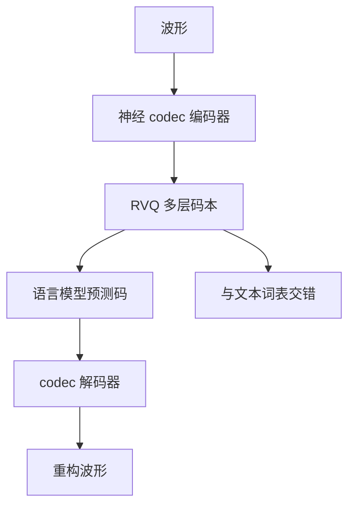

# 音频 codec 与离散 token

神经编解码器先把波形变成码本下标，语言模型才把「听」写成预测下一个下标；码率与码本大小决定语音在词表里占多宽。

<footer>—— 对照 SoundStream / EnCodec / DAC 一类神经音频编解码器，以及 AudioLM、VALL-E 将其当作语言符号</footer>

[上一课](/llm/audio-lm) 把音频语言模型写成在混合词表上做 $p(z_t\mid z_{<t})$。本课补它默认已经存在的那一层：**离散码从哪来**。[语音 tokenizer](/llm/speech-tokenizer) 讲过一般切分；这里钉的是 codec：残差向量量化（RVQ）多层码本、帧率、以及为何「能听懂」和「能还原波形」对码的要求不一致。后课的视频时序默认你会：音频侧已经是时间上均匀的离散序列，不是梅尔谱上的连续回归。

## 问题

Audio LM 不能直接在 16 kHz 采样点上做 softmax：帧率太高，词表若按振幅量化又没有语音结构。ASR 用连续编码器 + 文本解码，得不到可回放的中间符号。神经音频 codec 提供第三条路：编码器把短时帧映到连续向量，RVQ 把它拆成 $Q$ 层码本下标 $c_{1:Q}$，解码器从码重构波形。语言模型看见的是这些下标，不是波形。

缺口有两层。第一，码要多细才够「像语言」：太粗，音色与辅音丢失，LM 再强也合成含混；太细，帧率 × 层数把上下文打满，文本能力被音频符号淹没。第二，多层码之间有残差依赖：粗层管全局、细层管残差。若 LM 对 $Q$ 层当独立词表乱序预测，等于忽略 codec 的生成顺序。VALL-E 把粗层自回归、细层非自回归，正是在认这个依赖。

### 离散化损失不是语言模型损失

Codec 的训练目标是重构与感知（对抗、特征匹配），不是下一个 token。码本崩溃、使用率不均，会让某些下标几乎从不见面，LM 词表里出现死符号。反过来，LM 可以在崩溃的码上拟合出「听起来对的」统计，但解码器还原失败。两条损失必须分开验收：码级 perplexity 降了不等于 MOS 升了。EnCodec / DAC 等把量化器写成 RVQ：第一层量化残差，第二层量化上一层误差。层间不是可交换的词表。把 $Q$ 层拍扁成一个超大词表，会丢掉残差结构，也会让 softmax 大到 Cut CE 都头疼。

## 方法

### 三种接入策略

记帧率 $r$（如 50 Hz），每帧 $Q$ 个码。一秒音频是 $rQ$ 个离散符号。接入 LLM 的典型策略：

- **扁平交错**：按时间展开，每帧依次写 $c_1,\ldots,c_Q$，词表大小为各码本大小之和或并上文本词表。
- **分层生成**：先对 $\{c_1^{(t)}\}_t$ 做语言模型，再条件粗码生成细码（VALL-E 式）。
- **延迟图案 / 多头**：同一 Transformer 步并行预测若干层，用延迟错开因果依赖。

理解型 Audio LLM（听写、音频问答）可以不走 codec，而走连续音频编码器 + 连接器，类似 [早融合](/llm/early-late-fusion) 的视觉塔。本课的 codec 路径是为了**既能理解又能生成波形**。两条路径不要在同一张架构图里画成一个块。

## 机制

RVQ 的第一层码往往已经能驱动可懂度，后续层修频谱细节与说话人。LM 若平均对待所有层，会把容量浪费在人耳不敏感的残差上，却仍可能漏掉第一层的音素错误。分层损失或对粗层给更高采样温度，是在承认感知上的不平等。

时间对齐上，codec 帧通常均匀；文本 token 不是均匀时间。交错训练时，「一秒语音对应多少文本 token」随语速变。位置编码若只按符号序号，语速信息丢失。需要时间戳、或把音频 RoPE 的时间分量按绝对秒来走，与视频课将遇到的「帧索引不是时间」是同一原则。

SoundStream、EnCodec、DAC 是编码器–量化–解码器；HuBERT / w2v-BERT 离散单元来自自监督聚类，重构波形要另接声码器。两者都能当 Audio LM 的符号，但「codec」一词应留给带可微或可训练解码器、能闭环回波形的系统。评测生成必须过解码器，不能只报码准确率。

### 词表膨胀与文本污染

音频码并入 LLM 词表后，softmax 变宽，文本 perplexity 可能被拖累——稀有码的梯度噪声进共享层。缓解：分离音频头（只在音频位置上走音频 softmax）、或保持独立 codec 词表、用特殊切换 token 进入音频模式。共享一个巨大词表最简单，也最容易在纯文本基准上掉点。这是配比问题，不是「离散化是否优雅」。

## 边界与工程取舍

低码率 codec 适合语义 LM（内容、转写），高码率适合保真 TTS。用 1.5 kbps 的码去训音乐生成，谐波细节不够；用 24 kbps 的码去训长音频理解，上下文会被码流撑爆。任务应先定感知预算再定 $r,Q$。流式场景还要看 codec 的 lookahead：为了量化一层而看未来几十毫秒，会把首包延迟写进产品。

离散扩散（后课）可以在码序列上做双向去噪，不强制自回归；但 codec 的层间残差依赖仍然在，扩散的前向加噪若把各层当独立比特打乱，会比 AR 更伤重构。Codec 选择约束生成器，不论生成器是 AR 还是扩散。

不要发明「某年某号 codec 论文」当唯一标准。工程上锁版本：同一条 LM 必须配对训练时用的解码器；换 EnCodec 带宽却不重训 LM，码本错位，生成会崩成噪声。

## 小结

- 神经 codec 把波形变成 RVQ 下标，Audio LM 预测这些下标再解码回放。
- 码率 × 层数是上下文税；粗层与细层不可当独立可交换词表。
- 理解可用连续编码器，生成回放必须走 codec 闭环。
- 音频词表并入 LLM 会污染文本 softmax，常用分头或模式切换隔离。
- 帧率均匀不等于与文本时间对齐；位置编码要能表达绝对时间。
- 出处：SoundStream / EnCodec / DAC；AudioLM、VALL-E 的码序列语言建模。
