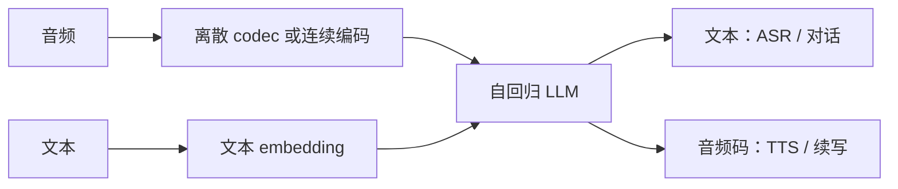

# 音频语言模型

若语音已经是 token，那么「听、说、续写」都可以写成同一个条件：给定过去的符号，预测下一个符号。

<footer>—— 归纳自 AudioLM / VALL-E / AudioPaLM 一系工作</footer>

音频语言模型（Audio LM）把离散或软对齐的音频符号放进自回归 Transformer，用语言建模损失训练。它不是 ASR 的别名：ASR 把音频映到文字；Audio LM 可以在音频符号上续写、可以条件文本生成语音（TTS），也可以两者交织。VALL-E 证明神经编解码器的码序列可以被 LLM 式模型当「语音文本」来生成。AudioPaLM 把 PaLM 的文本能力与音频 token 接到同一套解码器上。Qwen-Audio 则把大规模音频编码器接到 LLM，走理解与指令跟随，而不只做 codec 续写。三者共享「音频进入语言模型」这一骨架，输出空间不同。本篇区分这些变体，避免把所有带语音的 LLM 都叫成同一件事。

## 问题

经典 ASR 是判别式：最大化 $p(y_{\mathrm{text}}\mid x_{\mathrm{audio}})$。TTS 是另一套生成式：$p(x_{\mathrm{audio}}\mid y_{\mathrm{text}})$。对话系统还要 $p(y_{\mathrm{text}}\mid x_{\mathrm{audio}}, \text{context})$。三套模型、三套特征、三套对齐，拼接时接口损耗大。Audio LM 的设想是：若存在音频词表 $\mathcal{V}_a$ 和文本词表 $\mathcal{V}_t$，一个模型估计

$$
p(z_{t}\mid z_{<t}),\qquad z_i\in\mathcal{V}_a\cup\mathcal{V}_t.
$$

条件里既可以有文字也可以有声学码，任务变成前缀不同的同一种解码。困难在于 $\mathcal{V}_a$ 的帧率高、噪声大，且与 $\mathcal{V}_t$ 没有天然对齐。硬拼词表会导致文本能力被音频噪声梯度带偏，或音频生成变成含混的嗡嗡。

另一条路不扩展离散音频词表，只用连续编码器输出当软前缀，LLM 仍只生成文本。Qwen-Audio 更接近这条：理解优先。VALL-E 更接近 codec 上的语言模型：生成优先。AudioPaLM 试图在离散音频与文本之间做联合。

### 续写、合成与理解不是一个损失

在声学 token 上做 next-token prediction，目标是听感连贯，可以无文本。条件文本再生成声学 token，目标是可懂度和音色。条件声学 token 再生成文本，才是 ASR。同一个 Transformer 可以切三种数据，但采样温度、停词和评估指标完全不同。把「Audio LM」理解成「能听的 GPT」可以，把它理解成「已经解决 ASR」不行。

VALL-E 的冲击是零样本音色克隆：用数秒 EnCodec 码当 prompt，生成同一说话人的新句。能力来自 codec LM，风险也来自它。理解型 Audio LM 不必具备克隆，不应被同一套监管叙事覆盖。

## 方法

VALL-E 使用神经编解码器把语音变成多层离散码，再训练自回归（及非自回归 refinement）模型预测这些码。推理时，文本与短音频 prompt 作为条件，模型生成目标句的 codec，再由解码器反变换波形。它是 TTS 侧的 Audio LM，不是转写器。

AudioPaLM 在 PaLM 上扩展音频 token，使同一解码器能做语音翻译、ASR 与 TTS 等交错任务，展示文本预训练对音频任务的迁移。Qwen-Audio（Chu 等）用大规模音频编码器（以 Whisper 一类结构为起点）连接 Qwen LLM，在多任务音频理解上做指令微调：语音识别只是任务集合之一，还有音频字幕、音景、音乐等。后续 Qwen2-Audio、Qwen2.5-Omni、Qwen3-Omni 把这条理解线推进到流式与全模态，但「Audio LM」这个词在文献里仍常兼指 codec 生成与编码器+LLM 理解。

### 条件前缀的写法

理解型：音频特征经 projector 写成一段前缀，随后是用户指令，解码只走文本词表。生成型：文本 token 与 codec 层 token 交错或分阶段解码，停在音频词表。联合型：特殊分隔符切开模态，损失在两种词表上分别计算。Qwen3-ASR 的 LALM 属于理解型加转写头：先形成音频的高层次理解，再生成文字，而不是在 codec 上采样。它与 VALL-E 方向相反，却都依赖「语言模型当解码器」。

## 机制

自回归 Audio LM 的归纳偏置是：局部声学相关由最近的码解释，长程韵律和句法由更深的注意力解释。文本预训练提供句法与世界知识，对 ASR 的专名、口语修复有帮助，这是 LALM 相对纯 CTC 的理由。但文本先验也会「听成」更常见的词，在噪声里用语言模型盖掉声学——这是另一类错误，不是 WER 表能单独解释的。

连续编码器+LLM 把时间压缩放在编码器（例如 12.5 Hz），LLM 看到的是已经对齐语义的软 token。离散 codec LM 把时间分辨率留得更细，LLM 必须自己学音素结构。计算预算相同时光，理解路线把容量给语言解码，生成路线把容量给码本分层。Qwen 系 Omni 用 Thinker 做理解与文本、Talker 做 codec，是显式拆开这两条损失，避免单一 next-token 目标互撕。

Qwen-Audio 论文的定位是通用音频理解，而不是神经 TTS。引用时不要把 Qwen-Audio 写成 VALL-E 的开源复现。Qwen2.5-Omni 技术报告（arXiv:2503.20215）才把 Thinker–Talker 的生成侧写全。

### 评估必须分任务

WER/CER 测转写；MOS 与 speaker similarity 测合成；指令跟随测理解。用 LibriSpeech 分数比较 VALL-E 没有意义，用 MOS 比较 Qwen-Audio 的 ASR 模式也没有意义。AudioPaLM 的论文用多任务表并列，正是因为任务不可比。写系统卡时，应标明这个 Audio LM 实例打开的是哪一张词表。

## 边界与工程取舍

长音频使离散码序列极长，纯 codec LM 的上下文先爆。理解型用编码器下采样缓解，却损失时间精度，时间戳要另接对齐模块。流式 TTS 还要因果 codec 与低首包延迟；流式 ASR 要块状编码与稳定的语言模型前缀。两者的工程栈只在「Transformer 解码器」这一层相似。

数据方面，codec LM 需要大量波形；理解 LM 需要音频–文本–指令三元组。用 TTS 合成数据训理解，会缺真实噪声；用 ASR 数据训 codec LM，会缺韵律多样性。联合训练必须调模态采样比，否则文本或音频一方退化——这正是 Qwen3-Omni 强调「无模态退化」时要打的点。

「音频语言模型」在产品文案里经常等于「能聊天的语音模型」。技术上应还原成：离散或连续音频条件 + 自回归语言头 + 明确的输出词表。缺任何一项，只是管道拼接。

## 小结

- Audio LM 用语言建模目标在音频符号或软音频前缀上训练；任务由条件与输出词表切换，覆盖续写、TTS 与理解。
- VALL-E 是 codec 上的生成式 LM；AudioPaLM 联合文本与音频离散 token；Qwen-Audio 是编码器+LLM 的理解路线。
- 理解与生成的损失冲突时，Omni 类架构把 Thinker 与 Talker 拆开，而不是单头硬扛。
- 文本先验帮助专名与长上下文，也可能在噪声中覆盖声学证据。
- 评估必须按 ASR / TTS / 指令跟随分表，不能用一个 WER 概括 Audio LM。
- 出处：Wang 等，VALL-E；Rubenstein 等，AudioPaLM；Chu 等，Qwen-Audio。生成与流式侧见 Qwen2.5-Omni 技术报告（arXiv:2503.20215）与 Qwen3-Omni 技术报告（arXiv:2509.17765）。
