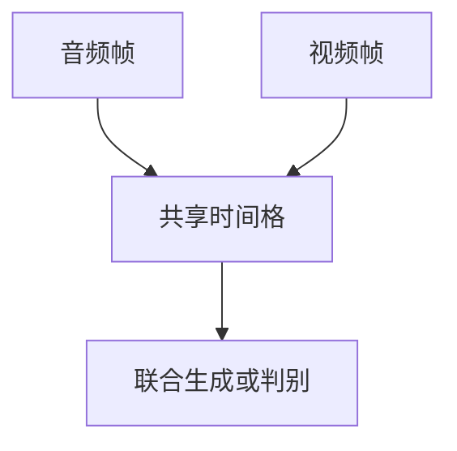

# 音画同步

共享一个时钟比共享一套权重更硬。口型、节拍与物体碰撞必须落在同一时间戳上，否则 omni 只是并排播放。

<footer>—— Chung, Zisserman, SyncNet；Prajwal 等 Wav2Lip；视频生成见 [时空建模](/llm/video-gen-spatiotemporal)</footer>

[上一课](/llm/omni-model-alignment)把策略对齐写完。主干[视频 token](/llm/video-tokens) 已要求时间 ID 对齐绝对时间。本课缺口是生成与理解里的音画锁相：说话口型、音乐节拍切镜、撞击声对上动作。本课程多模态生成到此收束。

## 问题

独立的文生视频 + TTS，只有全局文本相关，没有帧级互信息：嘴在动、声在响，相位却漂。SyncNet 用双塔判断口型与波形是否同步，成为说话脸的判别信号。Wav2Lip 等把唇形生成条件在音频特征上。视频扩散若只把 MEL 当全局向量，只能控风格不能控帧。需要把音频帧与视频帧写进同一时间网格（TM-RoPE 一类），或在损失里加同步判别。

同步是相对时延：50–100 ms 的口型错位人就能察觉。全局 CLIP 图文分完全看不见这件事。

## 方法

协议：音视频用同一时间戳采样（如 80 ms 一格）。训练：加 SyncNet 式对比/判别、或在 DiT 里交叉注意音频帧。评测：唇同步 LSE-C/D、节拍切镜对齐、人评「是否对上」，不要用 FID/FAD 单独过关。理解侧问答「第几秒出现鼓点」也依赖同一时钟，而不是只靠 [CLIP](/llm/clip) 标签。

## 机制

锁相意味着条件从「这段音频的全局向量」变成「$t$ 时刻的声学向量对 $t$ 时刻的口型格」。注意力或卷积必须在时间维上局部；只有文本前缀时，模型会用语言先验补一段「像在说话」的嘴，相位随机。这与物体幻觉对称：没有帧级证据就用先验演。

## 边界

同步约束不解决内容安全，也不提高单帧分辨率。理解、生成、语音三条线在时钟上交汇；之后是系统与产品，不再展开新的主干课序。

## 小结

- 音画同步是共享时钟与帧级条件，不是并排播放。
- 口型与节拍要用同步损失或时间对齐的交叉注意。
- 全局嵌入看不见几十毫秒的错位。
- 出处：SyncNet；Wav2Lip；时空视频扩散与 omni 时间位置编码。
