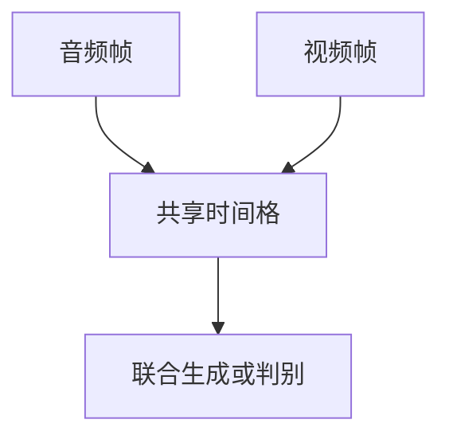
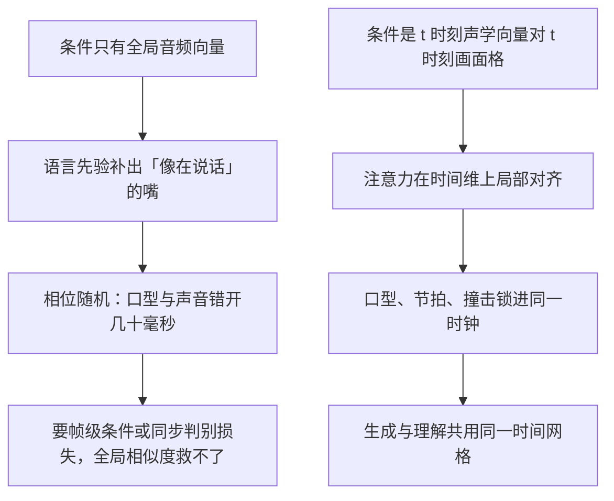

# 音画同步

共享一个时钟比共享一套权重更硬。口型、节拍与物体碰撞必须落在同一时间戳上，否则 omni 只是并排播放。

<footer>—— Chung, Zisserman, SyncNet；Prajwal 等 Wav2Lip；视频生成见 [时空建模](/llm/video-gen-spatiotemporal)</footer>

[上一课](/llm/omni-model-alignment)把策略对齐写完。主干[视频 token](/llm/video-tokens) 已要求时间 ID 对齐绝对时间。本课缺口是生成与理解里的音画锁相：说话口型、音乐节拍切镜、撞击声对上动作。本课程多模态生成到此收束。

## 问题

独立的文生视频 + TTS，只有全局文本相关，没有帧级互信息：嘴在动、声在响，相位却漂。SyncNet 用双塔判断口型与波形是否同步，成为说话脸的判别信号。Wav2Lip 等把唇形生成条件在音频特征上。视频扩散若只把 MEL 当全局向量，只能控风格不能控帧。需要把音频帧与视频帧写进同一时间网格（TM-RoPE 一类），或在损失里加同步判别。

数字实例：25 fps 的视频一帧 40 ms，50 Hz 的音频一帧 20 ms。人眼能察觉的口型错位约 50–100 ms，折算下来不过是视频里的 2 帧上下——所以「音画差了两帧」在电影里是事故，在生成模型里却意味着两条时间轴根本没对齐：一个按视频帧数走、一个按音频采样点走，谁来当公共时钟就成了架构问题。

同步是相对时延：50–100 ms 的口型错位人就能察觉。全局 CLIP 图文分完全看不见这件事。

## 方法

协议：音视频用同一时间戳采样（如 80 ms 一格）。训练：加 SyncNet 式对比/判别、或在 DiT 里交叉注意音频帧。评测：唇同步 LSE-C/D、节拍切镜对齐、人评「是否对上」，不要用 FID/FAD 单独过关。理解侧问答「第几秒出现鼓点」也依赖同一时钟，而不是只靠 [CLIP](/llm/clip) 标签。

术语翻译：「SyncNet 式双塔」就是给模型配一位「找茬裁判」——一座塔只看嘴部画面，另一座塔只听声音片段，各自压成一个向量；同步的音画配对打高分，故意错开几帧的配对打低分。训练出这个裁判后，反过来用它当损失，逼生成器把口型做到「裁判挑不出错」。

```mermaid
flowchart TD
  AUD["音频帧"] --> CLK["共享时间格"]
  VID["视频帧"] --> CLK
  CLK --> GEN["联合生成或判别"]
```

## 机制

锁相意味着条件从「这段音频的全局向量」变成「$t$ 时刻的声学向量对 $t$ 时刻的口型格」。注意力或卷积必须在时间维上局部；只有文本前缀时，模型会用语言先验补一段「像在说话」的嘴，相位随机。这与物体幻觉对称：没有帧级证据就用先验演。

直觉类比：「先验补嘴」像看一段外语配音配错片源——嘴在动、声音也有内容，但你知道口型和声音各走各的。模型没有帧级音频条件时，生成的正是这种「各走各的」：单看画面很自然、单听声音也对，剪在一起就是塑料感。

```mermaid
flowchart TD
  GV["条件只有全局音频向量"] --> PRI["语言先验补出「像在说话」的嘴"]
  PRI --> DRIFT["相位随机：口型与声音错开几十毫秒"]
  FT["条件是 t 时刻声学向量对 t 时刻画面格"] --> LOC["注意力在时间维上局部对齐"]
  LOC --> SYNC["口型、节拍、撞击锁进同一时钟"]
  DRIFT --> FIX["要帧级条件或同步判别损失，全局相似度救不了"]
  SYNC --> OK["生成与理解共用同一时间网格"]
```

## 边界

同步约束不解决内容安全，也不提高单帧分辨率。理解、生成、语音三条线在时钟上交汇；之后是系统与产品，不再展开新的主干课序。

## 小结

- 音画同步是共享时钟与帧级条件，不是并排播放。
- 口型与节拍要用同步损失或时间对齐的交叉注意。
- 全局嵌入看不见几十毫秒的错位。
- 出处：SyncNet；Wav2Lip；时空视频扩散与 omni 时间位置编码。
