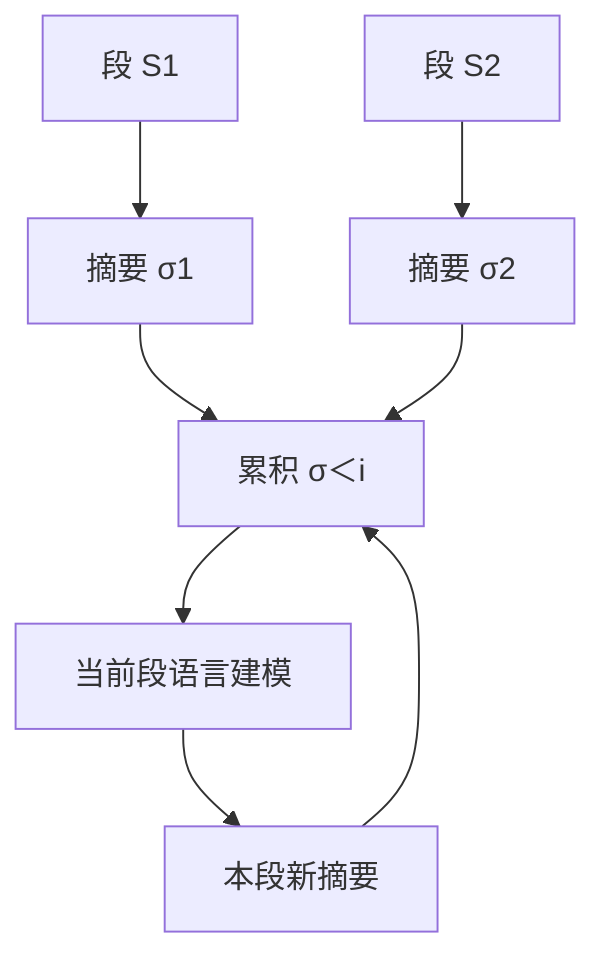

# AutoCompressors

    
让语言模型自己把每一段压成一组摘要向量，当作后续段的软提示；把所有旧摘要拼在一起，而不是只留下最近一次覆盖写。

    <footer>—— Chevalier, Wettig, Ajith, Chen，Adapting Language Models to Compress Contexts，EMNLP 2023</footer>

[RMT](/llm/rmt) 把记忆写成少数 token，段与段之间覆盖传递：新一段的写记忆替换旧状态，远段信息只能活在那 $m$ 个槽的有损更新里。Chevalier、Wettig、Ajith 与 Chen 把同一套「摘要 token → 软提示」接到**已预训练**的 OPT / Llama-2 上，并改了两件关键事：摘要累积（过去每一段的摘要向量全部拼上，而不是只传上一段），以及训练时随机切段。目标不再是从零训循环 Transformer，而是用无监督语言建模，教会现成模型把任意上下文压成可缓存的短向量。本篇写 EMNLP 2023 原文的压缩接口、与 RMT 的差分、以及它把摘要用在上下文学习与检索上的实验边界。

## 问题

预训练 LM 的窗口有限，长文档要么截断，要么把注意力窗口硬外推——后者显存随 $n^2$ 涨，且往往破坏已学好的位置几何。另一条路是为每个新上下文单独优化一段软提示，去蒸馏「有上下文」与「无上下文」的续写分布，但每个文档都要跑一遍优化，不能把压缩器当成函数 $x\mapsto\sigma(x)$ 复用。

RMT 已经证明：在段尾加摘要 token，取其输出当下一软提示，可以循环处理长序列。直接拿来微调 OPT 仍不够。覆盖写会让早期段在后续步骤里消失，长文档后半段几乎只看见最近一次压缩；固定段长则让模型不会压「128 token 的短示范」或「可变长度的检索段落」。问题是：如何在预训练权重上学会一种**可缓存、可变长、可拼接**的压缩，使摘要既服务语言建模，又能替换上下文学习里的明文示范。

### 软提示必须是上下文的函数

Wingate 等人的提示压缩对每个 $x$ 单独训 $\sigma$，没有跨文档的压缩器。AutoCompressors 把 $\sigma$ 写成模型自身的输出：追加 $\kappa$ 个摘要专用 token，其最后一层状态就是摘要向量，下一前向当软提示用。嵌入空间是几千维，一组向量可以插值许多离散 token，抽象程度高于「再生成一段短文本摘要」。代价是摘要活在连续空间，不能当普通词送进未改编解码器。

摘要向量不是 KV 缓存的无损切片，也不是检索返回的明文段落。它是有损软提示：长度通常比原文短一到两个数量级。评测必须问「同等额外 token 预算下，摘要是否比明文更值」，而不是问「是否等于看见全文」。

## 方法

扩展词表，加入 $\kappa$ 个摘要 token（原文常用 $\kappa=50$）。段 $S_i$ 末尾接上这些 token，对应输出状态记为 $\sigma_i$。RMT 只把 $\sigma_{i-1}$ 接到 $S_i$ 前面。AutoCompressors 做摘要累积：

$$
\sigma_{\lt i}=\sigma_1\circ\sigma_2\circ\cdots\circ\sigma_{i-1},
$$

再把 $\sigma_{\lt i}$ 作为软提示接到 $S_i$。累积长度是 $(i-1)\kappa$，随段数线性增长，但仍远小于各段原文之和。绝对位置模型（OPT）不给摘要加位置编码，以免占用预训练位置、并允许训练期任意多次压缩；RoPE 类模型（Llama-2）则按相对位置照常旋转。

### 无监督目标与随机切段

文档上的损失仍是标准下一词交叉熵，条件里多了累积摘要：

$$
\mathcal{L}=-\frac{1}{N}\sum_{i=1}^{n}\sum_{t=1}^{m_i}\log p\bigl(x_t^i\mid x_{\lt t}^i,\sigma_{\lt i}\bigr).
$$

第一段没有过去摘要，保留预训练能力；后续段必须靠 $\sigma_{\lt i}$ 降损失，否则多出来的上下文等于没看见。段长 $m_i$ 在训练时随机抽，只要单段仍塞进原窗口。随机切段让同一压缩器既能压短示范，也能压 2k 段，这是下游 ICL 与检索段落长度不一的前提。

BPTT 配激活检查点。摘要在两步压缩之后停梯度并缓存，类似 XL 停梯度：学「如何压缩 $S_i$」主要靠预测相邻的 $S_{i+1}$，不必把计算图拉过整篇 30k。这一刀使 OPT-2.7B 能在单卡 80GB 上微调，而同等设定的朴素 RMT 会显存爆掉。

### 下游怎么用已经算好的摘要

上下文学习：把多条示范先压成摘要，推理时只向模型提供软提示加当前题，而不是把几十条明文示范塞进窗口。检索增强：语料离线压成摘要并缓存，查询时取回摘要而非原文，在同等序列长度预算下比较困惑度。段落重排：用摘要向量给候选打分，在吞吐与质量之间折中。三条应用共享同一压缩器，不再为每个任务另训软提示。

## 机制

覆盖写把历史收进固定槽，远段只能以被改写的形式存在。累积把每段的 $\sigma$ 留下一条直连边：当前段的注意力可以分别点名早期摘要，而不必经过中间段的记忆更新。这更接近「文档级目录」而不是「RNN 隐状态」。线性增长的软提示长度是代价：段数极多时，累积本身会重新变成窗口压力，原文用几十段、每段 50 向量的量级，而不是无限累积。

随机切段改变的是压缩器对「原文有多长」的不变性。固定 2k 段训出来的模型，面对 128 token 的短上下文可能不会写有用的 $\sigma$；随机段长迫使其在多种压缩比下都对语言建模有贡献。停梯度则假设压缩的局部监督足够：若真正需要的信息要跨过许多段才在损失里出现，停梯度会切断那条信用分配。长程针测式依赖不是这篇的主评测。

Llama-2 上作者冻结骨干，只用摘要嵌入加注意力 LoRA 微调。这是适配成本，不是「压缩不需要改注意力」。摘要要能被后续层读懂，注意力必须学会点软提示；只训嵌入往往不够。

## 边界与工程取舍

OPT-2.7B 上，累积摘要在 6k 上下文上持续降困惑度，覆盖写的 RMT 在加长后几乎不再改善；30k 设定里 AutoCompressor-2.7B 单卡可训，RMT-2.7B 报 OOM。相对「把窗口扩到 4k 再做满注意力」，满注意力在能放下的长度上通常更准，但额外 token 是千计的明文，摘要只用 $50\times$ 段数的软提示，且还能继续往 30k 走。域外（Gutenberg vs Books3）摘要仍有收益，但与满注意力的差距会拉大：压缩器对域偏移比原注意力头更敏感。

Llama-2-7B 上，4k 明文压成 100 个摘要向量，困惑度大约相当于扩展满注意力看见 512 个明文 token——有损很明显。ICL 实验里，摘要在 11 个分类任务中的多数上，用更少的上下文 token 超过同等预算的明文 few-shot；这不保证开放生成、工具调用或长思维链也能被 50 维一组的向量替代。检索设定下，同等序列长度时摘要带来的困惑度收益约为明文段落的 1.5 倍量级（以原文表为准），前提是语料已经离线压好。

不要把 AutoCompressors 写成「无限上下文」。累积线性涨；停梯度限制信用；摘要不能无损还原被压掉的实体与数字。与 [Infini-Attention](/llm/infini-attention) 的固定矩阵记忆相比，这里的状态随段数变长，换来的是可单独缓存、可跨文档拼接的向量。

预计算摘要的收益全部来自「同一段文本会被多次条件到」。一次性长文档、从不复用，压缩前向本身就是额外开销，不如直接做分段注意力。缓存策略与失效（文档一改就要重压）是系统问题，论文只演示可行性。

### 何时不必上 AutoCompressors

任务依赖短于原窗口，不要为了压缩而微调。需要逐 token 精确回看，用满注意力、XL 或检索明文。已经有跨段工作记忆、且满足于覆盖写的算法任务，RMT 更简单。不能改词表、不能在推理图里接连续软提示的服务栈，这篇的接口接不进去。

## 小结

- AutoCompressors 把预训练 LM 调成压缩器：段尾摘要 token 的输出当作后续软提示。
- 相对 RMT，改用摘要累积与随机切段，并在两步后停梯度以便单卡训到 30k。
- 摘要可缓存，用于长文档语言建模、压缩 ICL 示范、检索段落与重排。
- 有损：同等质量通常仍低于把同等明文放进能放下的满注意力窗口。
- 累积长度随段数线性增长；停梯度限制超长程信用分配。
- 出处：Chevalier, Wettig, Ajith, Chen，*Adapting Language Models to Compress Contexts*，EMNLP 2023，arXiv:2305.14788。
