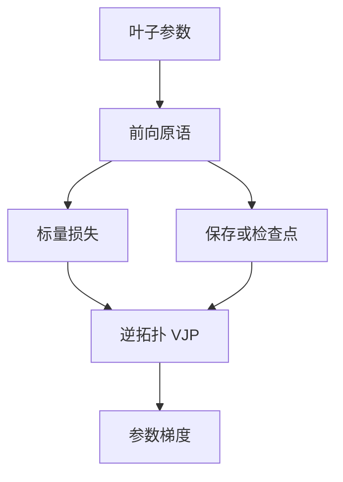

# 自动微分与计算图

反向模式把标量损失对全体输入的导数，收成一次与计算图拓扑相反的扫描；每条原语只提供局部 Jacobian-向量积。

<footer>—— 据 Rumelhart, Hinton & Williams, Nature 1986；综述见 Baydin et al., Automatic Differentiation in Machine Learning, JMLR 2018</footer>

[上一课](/llm/attention-backward)把 softmax 注意力的 $dQ,dK,dV$ 手写清楚了。缺口立刻出现：一层注意力只是图上的一个子图，还有嵌入、RMSNorm、FFN、残差与交叉熵。逐算子手推 Jacobian 既不能随架构改动，也容易漏掉广播与掩码。本课把「反传」从一条注意力公式换成**计算图上的反向模式自动微分**。后课的初始化假定：框架会按图把梯度送回每一个叶子参数，你要管的是尺度，不是有没有链式法则。

## 问题

前向把张量运算排成有向无环图：节点是值，边是原语（矩阵乘、softmax、加减、gather）。训练要的是 $\partial\mathcal{L}/\partial\theta$，其中 $\theta$ 是全部叶子。符号微分会把表达式胀成指数级；数值微分对每个参数前向两次，十亿参数不可行。反向模式（即深度学习里的反传）只要求损失是标量：先正向记录中间值或重算所需的检查点，再从 $\partial\mathcal{L}/\partial\mathcal{L}=1$ 逆拓扑传播向量-Jacobian 积。

[注意力反向](/llm/attention-backward) 已是这条规则在一个子图上的实例。本课的缺口不是再写一遍 $dS$，而是：**图如何决定保存什么、何时释放、广播如何把梯度求和回同一缓冲**。漏掉 residual 的加法边，底层嵌入会少一半梯度；漏掉 embedding gather 的 scatter-add，被多个位置共用的 token 只收到最后一次写入。

PyTorch 一类动态图在前向现场把 Function 压栈；静态图则先编译再跑。对你要写的 Transformer，二者的数学对象相同，差别在控制流与重算策略。Paszke 等人把动态图写成可运行的原语，并不另造一种导数定义。

## 方法

每个原语 $y=f(x)$ 必须实现：已知 $v=\partial\mathcal{L}/\partial y$，求 $v^\top Df(x)$，即 VJP。矩阵乘 $Y=XW$ 的 VJP 是 $dX=dY W^\top$、$dW=X^\top dY$，与手推公式同类。加法 $y=a+b$ 把 $dy$ 原样发给 $a$ 和 $b$。广播把较瘦的那个输入上的梯度沿被扩张的轴求和。`gather` 的反向是 `scatter_add`：同一 index 出现多次，梯度相加。

实现上通常有两类检查点。默认：保存前向张量供反向读取，显存随深度与序列长涨。梯度检查点：只保存若干边界，中间段反向时重算前向。FlashAttention 是核内重算，检查点是层间重算，可以叠用，但都改变「图上哪些边被物化」，不改变 VJP 定义。

混合精度把部分节点改成 BF16/FP16，反向仍可能在 FP32 累加器里做。这是数值策略，不是另一种微分。若某节点在前向被 `detach` 或 `stop_gradient`，图在那里断开，下游参数收不到这条路径的梯度——MoE 负载均衡有时故意这么做，必须写进配方，不能当框架 bug。

## 机制

反向模式的代价：对标量损失，一次反传得到全体 $\partial\mathcal{L}/\partial\theta$，时间与前向量级相同（常数因子，通常 1–2 倍于前向），额外存储与「保存的激活」成正比。前向模式 AD 适合输入维远小于输出维，语言模型正好相反，所以训练不用前向模式扫参数。

拓扑顺序必须尊重数据依赖。流水线并行把图画成跨设备的阶段，微批之间的激活仍是边；ZeRO 把叶子参数切到不同 rank，反向时梯度在切分后的叶子上做 All-Reduce 或 Reduce-Scatter。这些是同一张逻辑图的切分，VJP 公式不改。错的切分表现为「某一层梯度恒为零」或「范数少乘了 $\sqrt{N}$」，要用后课的梯度范数监控来抓，而不是改 softmax 公式。

## 边界

自动微分不保证梯度有用。饱和的 softmax、被 mask 成 0 的位置、以及 `float16` 下变成 Inf 的中间值，图仍会返回一个数，那个数可以是 0 或 NaN。本课只保证：**若前向定义了 $f$，反向实现了对应 VJP，得到的就是 $\nabla f$**（在浮点误差内）。尺度、裁剪、跳过坏 batch，是后课。

不要用手写注意力反向去替代框架；手写的用途是审查融合核。若融合核的 VJP 与 [注意力反向](/llm/attention-backward) 不一致，那是实现错误，不是「另一种注意力」。二阶量（Hessian-向量积）可以再在此图上套一层前向-over-反向，本课不进入二阶优化。

## 小结

- 反向模式 AD 把标量损失的梯度收成一次逆拓扑扫描；每个原语只提供 VJP。
- 注意力手推公式是图上一个子图；残差、广播、gather 的求和边同样不可漏。
- 保存激活、层间检查点、核内重算改的是存储，不改导数定义。
- 图断开（detach）与混合精度是配方决策，必须显式。
- 有梯度不等于梯度可用；尺度留给初始化与稳定性课。
- 出处：Rumelhart, Hinton & Williams, *Nature* 1986；Baydin et al., *JMLR* 2018；Paszke et al., PyTorch, NeurIPS 2019。
