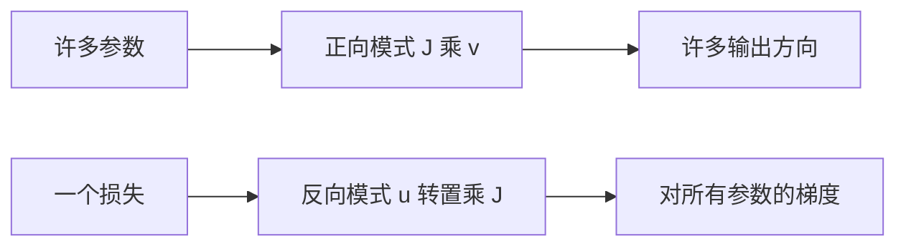

# 自动微分的正向与反向模式

同一条链式法则，从输入往输出推是正向模式，从输出往输入推是反向模式；谁便宜，取决于自变量多还是因变量多。

<footer>—— 据 Griewank &amp; Walther, Evaluating Derivatives；Baydin et al., Automatic Differentiation in Machine Learning, JMLR 2018 整理</footer>

[反向传播一行一层](/llm/backprop-layerwise)默认从损失往参数走。本课不重写线性层的两次 GEMM。缺口是：自动微分还有另一种扫法——正向模式：每个中间量携带对某个输入的导数，随前向一起走。训练几乎总用反向，因为 $L$ 是标量、$\theta$ 是百万到千亿维。正向模式在「少数输入、许多输出」时才更便宜。本课把两种复杂度钉住，避免把 backprop 当成 AD 的唯一定义。

## 问题

计算图有 $n$ 个独立输入、$m$ 个输出。要全部一阶导数，即 $m\times n$ 的 Jacobian。正向模式选一个输入方向 $v$，一次扫图得到 $Jv$（Jacobian-vector）；要满 Jacobian，约需 $n$ 次。反向模式选一个输出余向量 $u$，一次扫图得到 $u^\top J$（vector-Jacobian）；要满 Jacobian，约需 $m$ 次。缺口不是新的局部导数，而是这次计数：深度学习训练 $m=1$、$n$ 极大，故反向一次就够；若问「每个输出对某一个输入」的敏感度，$n=1$ 则正向一次就够。

框架里的 autograd 默认反向。Jacobian-vector 接口（有的叫 forward-over-reverse）用于二阶、用于梯度惩罚，那是后话。本课只要求能回答：为什么训练不跑正向 AD。

### 正向模式不是「再做一次前向传播」

前向传播算的是值。正向 AD 算的是值与切空间里的种子一起走：每个张量多带一个与自身同形的切向量。开销大约是常数倍的前向，不是「免费」。反向 AD 则要保存中间值，内存与图深度（或与检查点策略）相关。把正向 AD 理解成「不占内存的反向」，形状和次数都错：它省的是反向那次扫，不省对每个输入各扫一次的次数。

标量损失对参数的梯度是 $1\times n$ 的行。反向一次得到整行。正向要对每个参数种子跑一次，才能填满这一行。这就是训练不用正向模式的全部理由。

## 方法

记图为复合 $f=f_k\circ\cdots\circ f_1$。正向 AD：选 $v$，令 $\dot x_0=v$，递推 $\dot x_{i}=J_{f_i}\dot x_{i-1}$，最后得到 $J_f v$。反向 AD：选 $u$，令 $\bar x_k=u$，递推 $\bar x_{i-1}=J_{f_i}^\top\bar x_i$，最后得到 $J_f^\top u$。实现上，正向 AD 可与数值前向融合；反向 AD 要先完整前向再逆序。混合模式对中间层切分，用于极深图的检查点，本课只点名，不展开。

## 机制

复杂度差来自矩阵乘法结合律：$(AB)v$ 与 $u^\top(AB)$ 的结合顺序不同，中间维被收缩的次数就不同。层很宽时，物化完整 Jacobian 不可能；两种模式都只传播向量。反向模式还要面对内存：残差块可以把反向路径变短，检查点则用重计算换存储。这些是系统课的主题；机制上只需记住，反向不是计算上无条件更优，只是对「标量损失 + 大量参数」更优。

数值梯度检验常用正向有限差分对单个参数，那是 $O(n)$ 次前向，只能抽样若干坐标。它检验的是局部规则写得对不对，不能替代 AD。

## 边界

本课不推导 Hessian-vector 的两次反向。下一课[梯度消失与爆炸](/llm/vanish-explode-grad)问的是反向路径上局部增益的连乘，不是 AD 模式选错。后课默认：训练用反向 AD；说到 Jacobian-vector，才考虑正向或正向嵌反向。

## 小结

- 正向 AD 一次得 $Jv$，次数随输入维；反向 AD 一次得 $u^\top J$，次数随输出维。
- 训练 $m=1$，故反向一次给出全部参数梯度。
- 正向 AD 不是免费前向，每个张量携带切向量。
- 反向 AD 的代价在内存与检查点，不在「算不出梯度」。
- 出处：Griewank &amp; Walther；Baydin et al., JMLR 2018。
