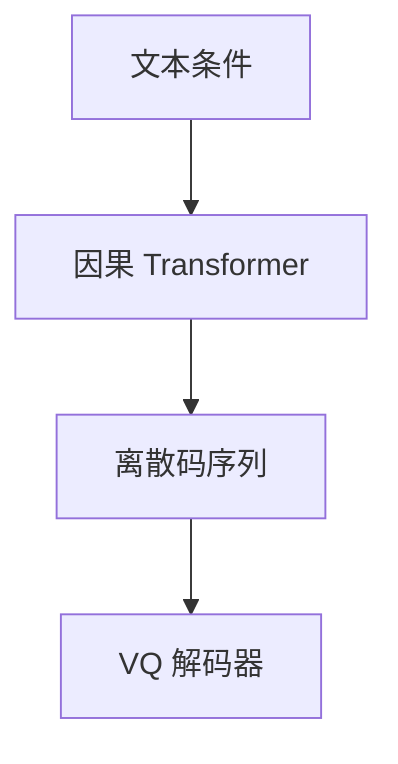

# 自回归图像生成

把图变成离散码序列之后，图像生成就是语言模型：预测下一个下标，再交给解码器变回像素。

<footer>—— Esser 等 VQGAN 上的 Transformer；Ramesh 等 DALL·E；Yu 等 Parti</footer>

[上一课](/llm/cfg-image)在连续潜空间里用 CFG 拉条件。[VQGAN](/llm/vqgan) 已给出可感知的码本。缺口是：在这些离散视觉 token 上做 next-token，与文本 LLM 同构。后课 VAR 默认 raster 扫描不是唯一的分解顺序。

## 问题

像素 softmax 不可行。量化后长度为 $hw$ 的码序列，因果 Transformer 建模 $p(k_{1:hw})$。DALL·E 用 dVAE 码 + 文本条件；Parti 把这条路做到更大的编码器–解码器；VQGAN 论文的后半是码上的 GPT。上限仍是 tokenizer 重构天花板：LM 完美，图也回不到比解码器更好。

扫描顺序默认 raster。竖直邻居在序列上相距一行宽度，与[2D RoPE](/llm/2d-rope) 之前理解侧的一维编号是同一扭曲——生成侧会表现为纵向结构难、局部纹理靠码本。

条件可以是文本 token 前缀，不必是 [LLaVA 投影器](/llm/llava-projector) 那种连续视觉前缀。理解连续、生成离散，正是后课统一模型要缝的缝。

## 方法

先训或冻 tokenizer，再在码上做语言建模，文本为前缀或交叉注意力。采样温度、top-k 与扩散 CFG 不同旋钮：过低温会重复图案。验收：FID + 文本遵守 + 文字可读；不要用 [CLIP](/llm/clip) 图文检索单独选 AR 超参。

## 机制

似然在码上分解为逐步条件。错误会沿 raster 传播：早错一个码，后面整行跟着歪。这与扩散每步改整张潜图不同。因此 AR 对全局布局敏感于开头码，扩散对噪声日程敏感。

## 边界

序列长度随分辨率平方涨，双向纹理要靠深注意力补。下一课把「下一步」改成下一尺度，而不是下一格。

## 小结

- 离散码上的 AR 让图像生成与 LLM 同构。
- 质量受 VQ 天花板与扫描顺序双重约束。
- 与连续扩散是两条接口，不是同一损失。
- 出处：VQGAN Transformer；DALL·E；Parti。
