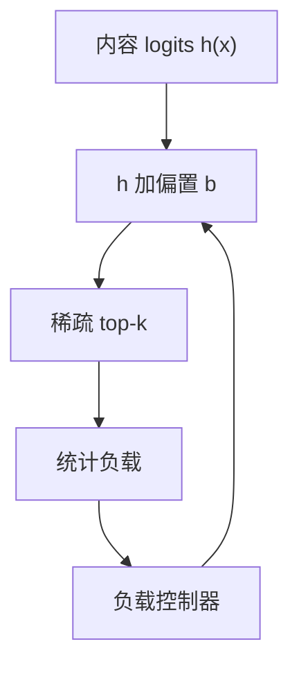

# 无辅助损失均衡

不把负载写进损失，而把一个随批次更新的偏置加到路由 logits 上，让过载专家下次更难被选。

<footer>—— DeepSeek-V3 技术报告中的 auxiliary-loss-free 策略；思想亦见后续对无辅助损失均衡的专门讨论</footer>

[上一课](/llm/soft-moe)用全软混合回避均衡。[MoE 路由](/llm/moe-routing) 默认加辅助损失，与语言损失抢权：权重大了伤困惑度，小了专家崩塌。[负载均衡](/llm/moe-load-balance) 主干课写过辅助项长什么样。本课补差：在**保持稀疏 top-$k$** 的前提下，用路由偏置做反馈控制，主损失不再掺均衡项。后课节点受限、序列级均衡，都默认主损失可以干净。

## 问题

辅助损失通常惩罚「专家接收分数的方差」或「实际分派与均匀的 KL」。它不区分「这个 batch 语义上就该偏某些专家」与「门崩了」。结果是路由被拉平，特化被抑制，或权重调不好时损失尖峰。缺口是把均衡从目标函数拿到**控制器**：观察实际负载，调 logits 偏置，语言梯度只训练专家与门的内容项。

DeepSeek-V3 采用对每个专家一个可更新的偏置 $b_i$，根据最近负载增减 $b_i$，不通过反向传播。课序把它当成方法原型，不绑定某个开源代号的全部配方。

偏置不是专家内部的 BatchNorm。它加在路由 logits 上，只改谁被选，不改专家 MLP 的激活尺度。

## 方法

路由 logits $h_i(x)+b_i$，再 softmax 或 sigmoid 打分，top-$k$ 与以往相同。每次（或每若干步）统计专家 $i$ 的负载 $\ell_i$（token 数或分数和）。若 $\ell_i$ 高于目标，$\,b_i\leftarrow b_i-\gamma$；低于则加 $\gamma$。$\gamma$ 是控制步长，过大振荡，过小跟不上数据分布漂移。$b$ 通常不进 Adam，不当成普通参数。

可以与极小的辅助项并存做冷启动，稳定后关掉。与[哈希路由](/llm/hash-routing) 不同，$h_i(x)$ 仍可学习，特化保留；偏置只纠正系统过载。

### 与 Switch 辅助损失的对照

Switch 的辅助损失是可微的，门会主动学均匀。无辅助损失时门可以学得很尖、很特化，均匀靠 $b$ 在时间上补偿。尖门加慢偏置，是「内容决定形状、反馈决定水位」。

## 机制

这是离散事件的负载均衡闭环，类似排队里的动态标价。语义上热门的专家会经常过载，$b_i$ 变负，把边缘 token 挤到次优专家，保护容量。分布一变，热门改名，$b$ 跟着挪。因为 $b$ 不反传，语言损失不会为了降低辅助项而把表示弄平——这是特化课要依赖的前提。

失败模式：$\gamma$ 与 batch 频率不匹配导致 $b$ 振荡，路由在两个专家群之间抖，后课「路由抖动」会再写。控制论上要对 $b$ 做动量或对 $\ell_i$ 做滑动平均。

推理时 $b$ 应冻结在训练末值，或按在线负载继续调。继续调会让同一前缀在不同并发下路由不同，复现性差；冻结则遇到分布偏移会局部过载。部署要选一种并写进配置。

## 边界

无辅助损失不是无均衡。没有 $b$ 或容量限制，崩塌仍在。偏置解决的是平均负载，不解决单序列内部的极端不均——那是下一课之后的序列级问题。节点受限路由会再给可选集合加硬约束，偏置只在候选子集里调水位。不要把本课写成已经替代容量因子：过满仍要 drop 或溢出。

## 小结

- 无辅助损失均衡用路由偏置做负载闭环，主损失不再掺均匀项。
- 门可保持尖锐特化；偏置不进反传，只改水位。
- 步长失配会振荡，成为路由抖动的来源之一。
- 不替代容量因子与节点约束；推理要规定 $b$ 冻结与否。
- 出处：DeepSeek-V3 技术报告中的 auxiliary-loss-free 策略。
