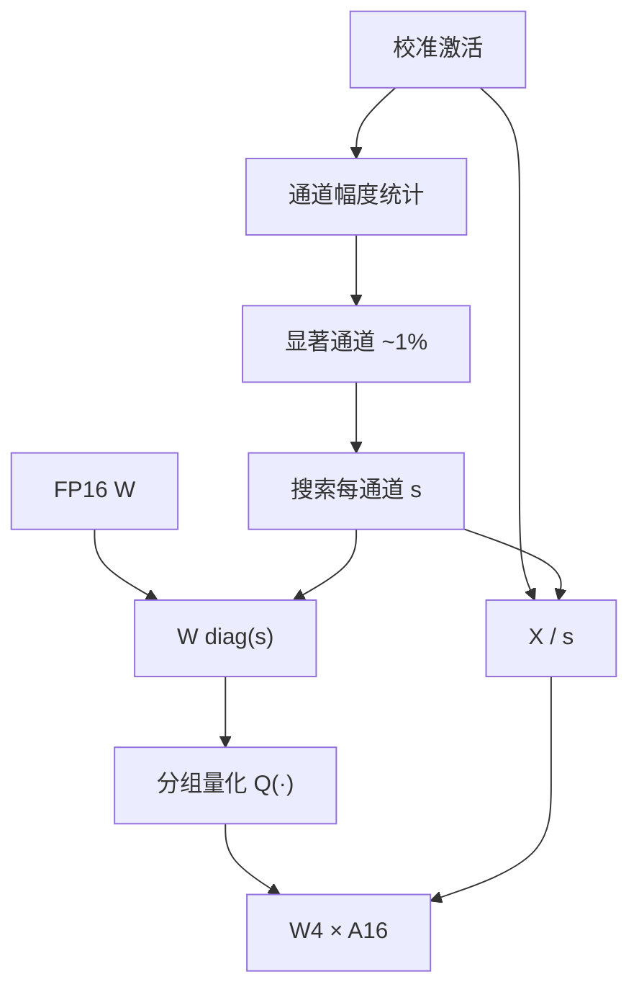

# AWQ

少数通道上的权重大，是因为对应激活长期大；把这些通道先放大再量化，舍入相对变小，不必用 Hessian 去拟合校准句，也能保住指令与多模态那一类「换分布就掉点」的能力。

<footer>—— Lin et al., AWQ: Activation-aware Weight Quantization, MLSys 2024</footer>

权重量化到 4-bit 时，不是每个权重同等重要。一层 $Y=WX$ 里，若某输入通道的激活长期幅度大，连着它的那一列权重对输出的贡献也大，量化误差会被激活放大。Lin、Tang、Han 等人 2023 年的 AWQ 不去做 GPTQ 那种逐列最小二乘补偿，而是先找**显著通道**（论文常用激活幅度最大的约 1%），再搜一组每通道尺度 $s$，把显著列放大、其余列相对缩小，然后做普通的逐组取整。前向用 $X$ 除以同一组 $s$，代数上等价，量化却发生在更保护显著权重的网格上。校准只用来估激活统计与搜 $s$，不做重构拟合，因此对校准集过拟合更轻，指令微调模型、视觉-语言投影上往往比单纯 GPTQ 更稳。目标仍是端侧友好的 W4A16，不是 W8A8。

## 问题

Round-to-nearest 把同一组里的大小权重塞进同一尺度。大权重相对误差小、小权重被拖死；但输出误差是 $(w-\hat{w})x$，小权重若乘的是巨大激活，照样能主导。LLM 激活的通道异常值文献（SmoothQuant 等）已经指出：少数通道幅度可以比中位数高一个数量级。权重量化若无视这一点，等于把误差预算花在不显著的列上。

GPTQ 用校准激活的 Hessian 去补偿，层输出 MSE 在校准集上会很好。论文与后续观察提出的问题是：补偿可能把权重改到对校准句最优、对别的模态或指令分布不优；部分模型还需要重排列才能稳住。端侧与多模型分发还希望量化又快、又不必对每个下游任务重跑二阶过程。AWQ 要的是一种**保护显著权重、校准廉价、不改网络拓扑**的 PTQ。

### 显著不等于「权重大」

权重大小是静态的；显著是 $w$ 与 $x$ 的搭配。只看 $|W|$ 的 RTN 或只看权重量级的稀疏，会漏掉「权重普通、激活极大」的列，也会过度保护「权重大、激活长期接近零」的死通道。AWQ 用校准激活的通道统计（幅度）来定义显著，这是 activation-aware 的本意。校准仍然需要，但用途是统计，不是逐列拟合。

不要把 AWQ 的通道缩放写成 SmoothQuant。SmoothQuant 把激活异常值的难度迁到权重上，为的是两边都能 INT8；AWQ 把显著权重抬高，为的是权重量化误差更小，激活在推理时仍是高精度，只是先除 $s$。公式都是对角缩放，目的相反。

## 方法

对一层，先在校准集上估每个输入通道的激活幅度，标出显著子集。再搜每通道正数 $s_j$，使得

$$
Q(W\,\mathrm{diag}(s))\,\mathrm{diag}(s)^{-1} X \approx WX,
$$

其中 $Q$ 是分组均匀量化。$s$ 把显著列拉大，量化阶梯相对这些列更细（相对误差变小）；非显著列被压低，它们本就不该占用阶梯。$s$ 的搜索是低维的（可按通道分组或用网格搜一个与幅度相关的参数），远小于 GPTQ 的 Hessian 更新。确定 $s$ 后，把缩放写进权重再量化，推理时对激活做对应的除法（或把 $s^{-1}$ 融进前一层的输出尺度里），不必存一份额外的浮点 $W$。

实现上常把 $s$ 融进相邻的 LayerNorm 或上一层权重，使推理图仍是「量化 GEMM + 标准归一化」，方便在端侧与 CUDA 核里落地。论文强调 on-device：4-bit 权重减小包体积与内存带宽，decode 加速来自少搬字节。与 GPTQ 一样，没有 4-bit 核就只有压缩没有加速。

### 不重构，是故意的

GPTQ 的补偿会改尚未量化的权重，使校准输出 MSE 下降，也使权重离开原预训练点更远。AWQ 只做对角等价变换再 RTN，权重的相对结构保持得更多。代价是校准集上的 MSE 可能不如 GPTQ 抠得死；收益是指令遵循、视觉 token 一类分布偏移时更不容易「校准过的那种句子还行、别的不会」。若任务固定且校准就是任务数据，GPTQ 仍可能 PPL 更好。工程上应按任务选，而不是按开源仓库哪一个文件多。

## 机制

对角缩放不改变浮点网络的函数：

$$
(W\mathrm{diag}(s))(\mathrm{diag}(s)^{-1}x)=Wx.
$$

量化算子 $Q$ 不与对角交换：先放大再量化，大通道的舍入单位相对该通道的动态范围变小。这与「给显著通道更多比特」同类，但比特数仍是 4，只是尺度分配变了。1% 显著的经验来自激活异常值的稀疏性：保护头部通道，对输出误差的收益最大；再扩大显著集，$s$ 的自由度变多，搜索变难，收益递减。

端侧机制与服务端 W4A16 相同：decode 扫权重。AWQ 额外适合「一个量化包打多个下游」的分发，因为没有把包拟合到某一校准语料的二阶补偿。多模态里视觉特征的通道统计可以并进校准，这是论文相对 GPTQ 强调的场景，不是 AWQ 数学上只能用于视觉。

显著通道的 1% 是论文默认，不是物理常数。激活异常更重的模型可以多保护一些；很匀的层几乎退回 RTN。要把比例写成超参，并在验证集上扫，不要抄 Llama-7B 的默认去打所有结构。

与 [KIVI](/llm/kivi) 的相邻故事：KV 也有通道异常值，但 KIVI 量化的是缓存不是权重，轴也不一样。不要把 AWQ 的 $s$ 直接套到 KV 上。

## 边界与工程取舍

AWQ 仍是权重量化。大 batch 的 prefill 若算力墙在 INT8 Tensor Core，W8A8 的 SmoothQuant 可能吞吐更高。小模型、短上下文上，反量化开销能吃掉 4-bit 的带宽收益。lm_head、嵌入有时留高精度，否则词表投影先糊。分组大小与核布局必须和推理引擎一致；Hugging Face 上的 AWQ 包、LMDeploy、TensorRT-LLM 的 AWQ 路径在尺度存放上可能不同，不能只看「都叫 AWQ」。

搜索 $s$ 依赖校准激活。校准可以比 GPTQ 更少、更通用，但完全空校准不行。领域极偏的模型（仅代码、仅法律）仍应用领域文本估幅度，否则「显著」是错的通道。AWQ 不解决 KV 体积，也不替代剪枝。

社区里存在 GPTQ 后再做 AWQ 式缩放、或反过来的混合配方。那是工程组合，质量要单独测；不要把混合配方的数字写进 Lin 等人的 MLSys 表格。

相对 [GGUF k-quants](/llm/gguf)：AWQ 通常产出 GPU 友好的分组 INT4 布局；k-quant 是 ggml 超块格式，保护异常值的方式是更细的超级块尺度，不是搜 $s$。两者都是 4-bit 权重量化，文件不能互换，核也不能互换。

### 把 $s$ 融进邻层时要对齐归一化

论文把通道尺度融进 LayerNorm 或上一层，推理图更干净，也更容易写错：融合后的 Norm 权重必须与量化后的 $W$ 来自同一次 AWQ 运行；中途又换了一份 FP16 Norm，等于取消保护。多模态里视觉塔与语言模型的边界层，激活统计来自图像还是文本，会改变哪些通道算显著。融合是实现细节，不是可省略的「等价变换」口头禅——量化已经破坏了浮点等价，融合只是把破坏固定下来。

## 小结

- AWQ 按激活幅度找出显著权重通道，对角放大后再做分组量化，推理时对激活除回同一尺度。
- 它刻意不做 GPTQ 式 Hessian 重构，以减轻校准过拟合，利于指令与多模态。
- 代数上缩放等价，量化后不再等价；收益来自误差预算重新分配。
- 目标仍是 W4A16 与端侧/带宽，不是 INT8 激活。
- 与 SmoothQuant 同为对角缩放，迁移方向相反。
- 加速取决于 4-bit 核与分组布局，仓库之间的「AWQ」要对齐实现。
- 出处：Lin et al., *AWQ: Activation-aware Weight Quantization for LLM Compression and Acceleration*, MLSys 2024（arXiv:2306.00978）。
