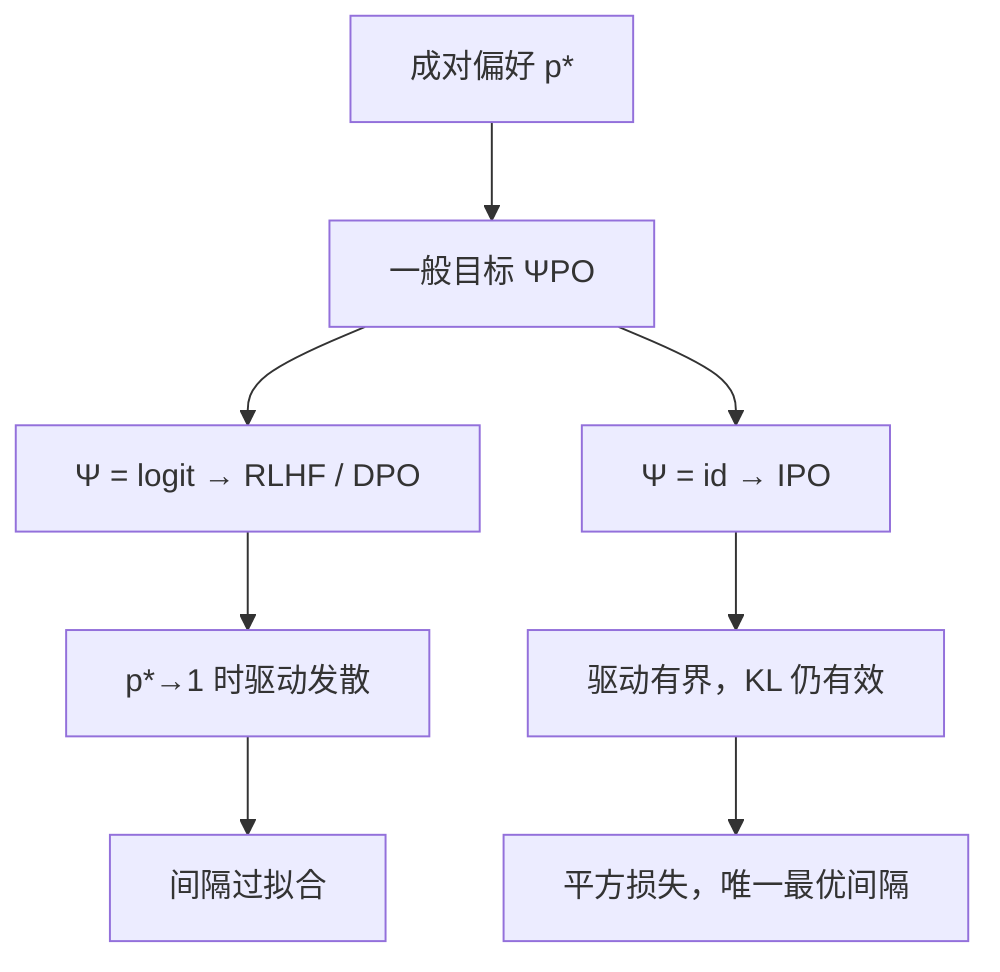

# IPO 原文

    
成对偏好本身就是目标，不必先换成点式奖励；Ψ 取恒等时间隔有界，KL 才不会在确定性比较上被对数几率冲掉。

    <footer>—— Azar, Rowland, Piot, Guo, Calandriello, Valko, Munos，A General Theoretical Paradigm to Understand Learning from Human Preferences，AISTATS 2024</footer>

已有 [IPO](/llm/ipo) 篇写的是落地损失：把对数比差 $h$ 回归到 $1/(2\tau)$，以及它和 [DPO](/llm/dpo) logistic 在过拟合间隔上的差别。本篇钉 Azar 等人 AISTATS 2024（arXiv:2310.12036）的理论地图。原文要解释的不是又一个训练技巧，而是 RLHF 与 DPO 共用的两条近似：把成对偏好换成点式奖励，以及假定该奖励能泛化到策略新采样的分布。他们写出一般目标 $\Psi$PO，证明 DPO/RLHF 对应 $\Psi=\mathrm{logit}$，并指出确定性偏好会让正则失效；恒等映射给出可证明性质的 IPO。算法配方仍见前一篇，这里写论文实际证明了什么、实验是什么量级、以及后来的在线 IPO / Nash-MD 不应写进这篇的主声称。

## 问题

标准 RLHF 流水线做两次替换。第一次：人给出 $y\succ y'$，却用 Bradley–Terry 写成 $\sigma(r(y)-r(y'))$，于是学习对象从偏好概率 $p^*$ 变成点式 $r$。第二次：在离线比较上拟合的 $r_\phi$，被拿到策略自己采样的 $y\sim\pi$ 上去当奖励，假定 $r_\phi$ 在这片分布上仍然对。DPO 用最优策略的对数比消去显式 $r$，绕开了第二次——训练不再需要 RM 对 OOD 样本打分——但第一次仍在：损失仍是 BT 似然，即 $\Psi$ 取对数几率。

当比较接近确定（标注者几乎总是选同一边，$p^*\to 1$），$\mathrm{logit}(p^*)$ 发散。正则项 $\tau\,\mathrm{KL}(\pi\|\pi_{\mathrm{ref}})$ 面对无穷的偏好驱动时相对消失：策略会被推到用任意大的对数比去拟合「永远赢」，$\tau$ 失去作为权衡旋钮的意义。这不是实现把 $\beta$ 设错，而是目标类在确定性数据上的结构缺陷。原文要一张只依赖成对 $p^*$、不必经过点式 $r$ 的目标，并把 RLHF、DPO 放进去对照。

### 两条近似各自坏在哪

点式奖励假定存在一个与比较相容的 $r$，且人的噪声是 logistic。真实偏好可以非传递、可以依赖上下文的绝对质量而非差，也可以是「略好」而不是「无限好」。RM 泛化假定更脆：策略一离 SFT，RM 未见过的失败模式会得到荒谬高分，这正是 reward hacking 的理论位置。DPO 不训 RM，但 logistic 对确定对的不饱和梯度，会在离线数据上制造类似的「间隔 hacking」。$\Psi$PO 同时绕开两条：目标里直接出现 $\Psi(p^*(y\succ y'\mid x))$。

论文里的 $\Psi$ 是单调映射，不是神经网络。把它理解成「又一个超参网络」会写错。可选的是偏好概率进入目标的标度：对数几率无界，恒等有界，两者都是标量函数。

## 方法

一般 $\Psi$PO 目标（略写提示 $x$）是在策略采样的 $y$ 与某个对比分布 $\mu$ 的 $y'$ 上，最大化变换后的胜率，减去 KL：

$$
\max_\pi\;\mathbb{E}_{y\sim\pi,\,y'\sim\mu}\bigl[\Psi\bigl(p^*(y\succ y')\bigr)\bigr]-\tau\,\mathrm{KL}(\pi\|\pi_{\mathrm{ref}}).
$$

$\mu$ 可以是数据收集策略、参照、或 $\pi$ 自己，对应离线或不同的在线变体。取 $\Psi(q)=\log\bigl(q/(1-q)\bigr)$ 且 $p^*$ 服从 BT，最优条件回到熟悉的 $r=\tau\log(\pi/\pi_{\mathrm{ref}})$，即 RLHF/DPO 这一族。取 $\Psi(q)=q$，偏好以 $[0,1]$ 尺度进入目标，最优间隔有限，KL 项保持与 $\tau$ 同阶的权衡。这就是 Identity Preference Optimisation。

### 平方损失来自恒等映射的最优条件

在成对数据、用经验胜负代替 $p^*$ 时，恒等 $\Psi$ 的正则最优要求两条回答的对数比差等于常数 $1/(2\tau)$（符号约定随原文；落地实现见 [IPO](/llm/ipo)）。于是可替换成回归

$$
\mathcal{L}_{\mathrm{IPO}}=\mathbb{E}\Bigl[\Bigl(h_\theta(x,y_w,y_l)-\tfrac{1}{2\tau}\Bigr)^2\Bigr],
$$

而不必估计软标签 $p^*$。论文强调该二次目标有唯一解：给定参照与 $\tau$，最优 $h$ 被钉住，不会像 logistic 那样存在「再大一点仍然更好」的方向。这是可证明的稳定性来源，不是把 DPO 的 sigmoid 随手换成 MSE。

### 原文实验是说明性的

主文用可控例子展示 DPO 在确定偏好或噪声标签下把隐含奖励拉爆、正则失效，而 IPO 停在有限间隔。大规模对话表不是这篇的中心贡献——它首先是范式论文。把后来开源库里「IPO 在 AlpacaEval 上超过 DPO」的某一行，写成本文定理，是把落地复现与原文声称混表。超参 $\tau$ 的扫法、长度归一、参照必须是 SFT，仍以前一篇工程文为准。

## 机制

logit $\Psi$ 在 $p^*=1$ 处的导数无穷，梯度永远要求更大的 $h$。恒等 $\Psi$ 的导数常数，过了目标间隔，平方损失的梯度反号，把 $h$ 拉回来。KL 因此重新变成有效约束：策略不能靠把 $\pi_{\mathrm{ref}}$ 几乎为 0 的区域推到数值极限来「更确定地赢」。性能保证针对这一目标类：在给定 $\Psi$ 与 $\tau$ 下，IPO 对应的最优策略存在且由间隔条件刻画；它不保证该策略在真实人类效用上最优，因为 $\Psi=\mathrm{id}$ 本身是选择。

### 离线 IPO 不是 Nash 均衡求解器

原文 IPO 吃的是固定比较分布，优化的是对该分布的偏好概率，不是两个策略互相对打的均衡。后来 Calandriello 等人证明**在线** IPO（两条回答都由当前策略采样、再用偏好模型标注）与正则化偏好博弈上的 Nash Mirror Descent 等价，并给出 IPO-MD。那是 2024 年另一篇。把 Nash-MD 写进 Azar 原文的贡献列表会错置时间与假设：AISTATS 这篇给出 $\Psi$PO 与离线 IPO，没有把自我对弈当成主算法。

$\mu$ 的选择改变「和谁比」。离线数据里 $y'$ 来自旧策略，IPO 学的是相对该分布的有限间隔；若 $\mu=\pi$，目标变成与自己比，理论性质随在线过程变。实现时必须写清采样来源，不能只写损失名字。

## 边界与工程取舍

$\Psi$PO 不消除标注噪声、长度捷径或覆盖不足。恒等映射在只有 0/1 胜负时，线性于真 $p^*$ 的优点被量化吃掉，实务价值收缩为「有限间隔」。没有 $p^*$ 的重复标注，就不要宣称无偏估计了偏好概率。论文对 DPO 的批评限于「logit $\Psi$ + 确定比较 ⇒ 正则失效」这一机制；干净、软标签、接近 BT 的数据上，DPO 仍可以够用。

一般目标里的 $\mu$、$\tau$、$\Psi$ 是三个旋钮。只改损失形状、却把对比分布换成另一个模型的教师回答，失败模式属于数据，不属于 $\Psi$。SLiC 的铰链、cDPO 的平滑标签，都可以看成在同一地图附近改「间隔如何饱和」，但它们不是 $\Psi$PO 的特例声明，除非证明 $\Psi$ 与损失一一对应。

出处钉 Mohammad Gheshlaghi Azar、Mark Rowland、Bilal Piot、Daniel Guo、Daniele Calandriello、Michal Valko、Rémi Munos，AISTATS 2024。DeepMind 后续的在线偏好优化论文引用这篇，但不替代这篇。

### 何时不必翻原文再实现一遍

只需要可跑的平方损失与 $\tau$ 网格，读 [IPO](/llm/ipo) 即可。需要论证「为何 DPO 在确定对上 KL 形同虚设」、需要把新算法登记为某个 $\Psi$、需要和 Nash 自我对弈划清离线/在线，才回到这篇。没有成对数据时，$\Psi$PO 的期望根本写不出来，应看 [KTO](/llm/kto)。

## 小结

- Azar 原文的主对象是 $\Psi$PO：直接优化变换后的成对偏好，绕开点式奖励与 RM 泛化两条近似。
- RLHF/DPO 对应 $\Psi=\mathrm{logit}$；确定性比较让该映射发散，KL 正则失效。
- IPO 取 $\Psi=\mathrm{id}$，落地为对 $h$ 的平方回归，最优间隔有限且唯一。
- 主实验是机制说明，不是大规模聊天榜的配方声明。
- 在线 IPO 与 Nash-MD 的等价是后续工作；本篇是离线范式。
- 出处：Azar et al.，*A General Theoretical Paradigm to Understand Learning from Human Preferences*，AISTATS 2024，arXiv:2310.12036。算法对照见 [IPO](/llm/ipo)。
