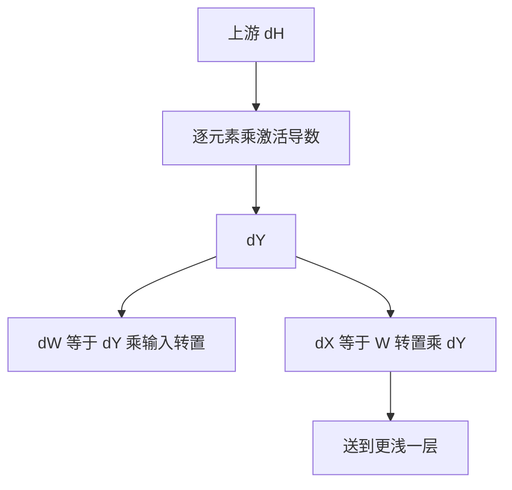

# 反向传播一行一层

每一层只做一件事：把上游送来的输出梯度，乘上本层的局部导数，变成输入梯度与权重梯度。

<footer>—— 据 Rumelhart, Hinton &amp; Williams, Nature 1986；Goodfellow et al., Deep Learning, 2016 整理</footer>

[链式法则与计算图](/llm/chain-rule-graph)给出逆序乘局部 Jacobian 的程序。本课不重画整图。缺口是：把「层」当成注册好的算子，列出线性层与逐元素非线性在矩阵记号下的一行规则，使后课谈到 MLP、残差时不必每次从标量链式法则推起。自动微分的两种模式、梯度消失，分别是后两课。

## 问题

图上的结点可以细到一次加法。训练时人思考的单位是层：$y=Wx$、$h=\sigma(y)$、再接到损失。若每改一种层都回到 $\partial w_i/\partial x_j$ 的双重求和，笔记会比代码还长。缺口是把常见层的正向与反向并排写成形状合法的矩阵乘与逐元素乘，并指出哪些中间量必须缓存。

以线性层为例。正向 $Y=XW^\top$，形状 $(B,d_{\mathrm{out}})=(B,d_{\mathrm{in}})\times(d_{\mathrm{in}},d_{\mathrm{out}})$。上游 $\mathrm{d}Y$ 与 $Y$ 同形。则 $\mathrm{d}X=\mathrm{d}Y\,W$，$\mathrm{d}W=\mathrm{d}Y^\top X$。这不是新的链式法则，只是把 Jacobian 乘积收成两次 GEMM。激活函数 $h=\sigma(y)$ 的反向是 $\mathrm{d}y=\mathrm{d}h\odot\sigma'(y)$，缓存 $y$ 或 $\sigma'(y)$。

### 层的反向不是「把正向公式里的符号对调」

$Y=XW^\top$ 并不意味 $\mathrm{d}X=Y\,\mathrm{d}W$ 之类随意排列。每一条规则都来自 $\mathrm{d}L=\langle\mathrm{d}Y,\mathrm{d}Y_{\mathrm{from}\,X,W}\rangle$ 的配对本。写错转置是最常见的实现错误，形状检查会立刻抓住——这正是第一课形状纪律的用处。不要用「反向就是正向的逆矩阵」来记：ReLU 没有逆，线性层的 $W$ 也几乎不可逆。

批维 $B$ 在 $\mathrm{d}W$ 上是求和：每个样本贡献一份外积，加在同一张 $W$ 上。这与「$W$ 被所有样本共享」是同一件事的反向说法。序列维同样求和。

## 方法

对堆叠 $h^{(\ell+1)}=\sigma(W^{(\ell)}h^{(\ell)})$（偏置暂略），反向从最后一层的 $\mathrm{d}h^{(L)}$（对交叉熵接 softmax，即 $p-y$）开始：

1. 若本层有激活，$\mathrm{d}y\leftarrow\mathrm{d}h\odot\sigma'(y)$；
2. $\mathrm{d}W\leftarrow\mathrm{d}y\,h_{\mathrm{prev}}^\top$（按批求和写成矩阵乘）；
3. $\mathrm{d}h_{\mathrm{prev}}\leftarrow W^\top\mathrm{d}y$；
4. 进入更浅一层。

一行一层，直到输入或嵌入表。嵌入表的反向是 scatter：只把 $\mathrm{d}h$ 加到被查中的行上，与[嵌入作为查找](/llm/embed-as-lookup-motive)将要强调的稀疏更新一致；本课先在稠密线性层上把形状写对。

## 机制

把反向写成层规则之后，实现可以融合：线性+激活+损失不必三次写全局内存。更重要的是诊断：某一层 $\mathrm{d}W$ 的范数接近 $0$，问题在该层局部导数（饱和激活、过大的 softmax），而不是「整网不会求导」。某一层 $\mathrm{d}W$ 爆炸，问题在局部增益连乘，那是[梯度消失与爆炸](/llm/vanish-explode-grad)的主题。

缓存换计算：不存 $y$ 就要在反向再算一次正向局部量。激活省内存的重计算策略属于工程，本课只要求：规则里出现的 $\sigma'(y)$ 必须在反向时刻能得到。

## 边界

本课不引入正向模式自动微分，不写注意力的反向（注意力还没定义）。下一课[自动微分的正向与反向模式](/llm/autograd-two-modes)比较两种扫图方式的复杂度。后课默认：线性层与逐元素激活的梯度形状与正向张量对齐，按本课三步写。

## 小结

- 线性层反向是两次 GEMM：$\mathrm{d}X=\mathrm{d}Y\,W$，$\mathrm{d}W=\mathrm{d}Y^\top X$。
- 逐元素激活反向是 $\odot\sigma'(y)$，必须能拿到 $y$。
- 批与序列维对 $\mathrm{d}W$ 求和，因为权重共享。
- 反向不是正向的逆映射，转置由配对本决定。
- 出处：Rumelhart et al., 1986；Goodfellow et al., Deep Learning, 2016。
