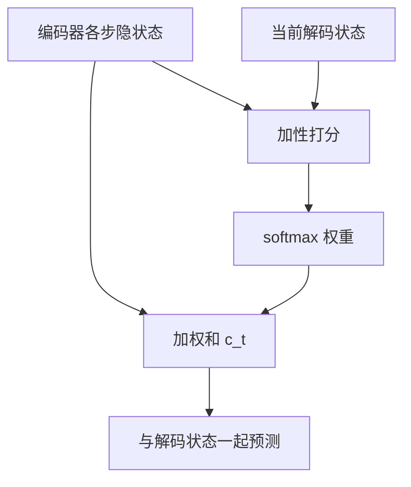

# Bahdanau 加性注意力

解码器不必把整句源塞进一个向量；每一步用当前状态去给编码器各步打分，再加权求和当成上下文。

<footer>—— 据 Bahdanau, Cho &amp; Bengio, Neural Machine Translation by Jointly Learning to Align and Translate, ICLR 2015 整理</footer>

[Teacher forcing](/llm/teacher-forcing)处理了训练输入协议。本课不重写暴露偏差。缺口仍是上一课留下的定长 $s$：长源句早期信息在 $h_n$ 里被覆盖。方法是加性注意力：保留编码器全部 $h_j^{\mathrm{enc}}$，解码器在 $t$ 步用 $h_t^{\mathrm{dec}}$ 与每个 $h_j$ 算一个分数 $e_{tj}$，softmax 成 $\alpha_{tj}$，上下文 $c_t=\sum_j\alpha_{tj}h_j$。本课写清加性打分；内容寻址与点积是后两课。不要写成 scaled dot-product，也不引入多头。

## 问题

Seq2Seq 的交接是一次。翻译却需要**随目标位置而变**的源侧对齐：生成目标第 $t$ 个词时，应侧重源的某一段。人工对齐是另一套标注；这里要对齐与翻译联合学习。缺口不是更大的 LSTM，而是解码器每步对源隐状态做一次读取。读取必须可微：硬选 $\mathrm{argmax}_j$ 无法反传，故用 softmax 权重。

Bahdanau 的打分是加性网络：

$$
e_{tj}=v^\top\tanh(W_d h_t^{\mathrm{dec}}+W_e h_j^{\mathrm{enc}}),
$$

分数不是点积，而是先把两边映到同一空间再相加、过 tanh、再与 $v$ 点积。这为下一课「注意力是内容寻址」提供具体实例，也为再下一课「为何可以改成点积」留下对照。

### 注意力权重不是对齐标注的硬拷贝

$\alpha_{tj}$ 可以解释成软对齐，但训练目标只有翻译交叉熵，没有强制 $\alpha$ 与人工对齐一致。多词对一词、空对齐、注意力分散，都是合法现象。把 $\alpha$ 当成必须与语言学家对齐表重合，会把可视化当金标准。本课的 $\alpha$ 是加权系数，对齐是事后阅读。

掩码：源的 PAD 位置在 softmax 前把 $e_{tj}$ 打成极负，与[Softmax 与数值稳定](/llm/softmax-numerics)同一规则。否则 PAD 隐状态会分走质量。

## 方法

编码器仍是（双向）RNN，输出序列 $H\in\mathbb{R}^{n\times d}$，不再丢弃中间步。解码器每步：算 $e_{t,:}$，稳定 softmax 得 $\alpha_{t,:}$，$c_t=H^\top\alpha_t$（形状按批广播）。将 $c_t$ 与 $h_t^{\mathrm{dec}}$ 拼接或相加，再送分类头。参数 $W_d,W_e,v$ 与循环参数一起训练。计算量每步 $O(n)$，源长线性——比定长 $s$ 贵，这是换瓶颈的代价。

## 机制

$c_t$ 随 $t$ 变，解码器每步看到的源摘要不同。反向把目标词的误差通过 $\alpha$ 分到被看重的 $h_j$，编码器因而学到「可被对齐的」表示。长程：源位置 $j$ 不必活过 RNN 的 $\rho^{n-j}$ 才能影响目标末尾——只要在被查询时仍存在于 $H$ 的第 $j$ 行。RNN 仍要在编码阶段把局部上下文写进 $h_j$，但不必把全句写进 $h_n$。

加性网络比点积多几次仿射，表达力更宽，也更贵。后课会问：若只关心「方向相近」，点积是否够用。本课不提前换公式。

## 边界

本课不定义查询—键—值三套投影，不除 $\sqrt{d}$。下一课[注意力作为内容寻址](/llm/attention-content-address)把「按内容取」从翻译对齐里抽象出来。后课默认：有注意力的 seq2seq 每步读全体编码器状态；打分暂时是加性的。

## 小结

- 定长 $s$ 是瓶颈；加性注意力用 softmax 权重读取全体 $h_j$。
- 打分是 $\tanh$ 里相加再与 $v$ 点积，不是 $QK^\top$。
- $\alpha$ 可当软对齐读，但不是对齐监督本身。
- 每步对源长线性；PAD 在 softmax 前掩掉。
- 出处：Bahdanau, Cho &amp; Bengio, ICLR 2015。
