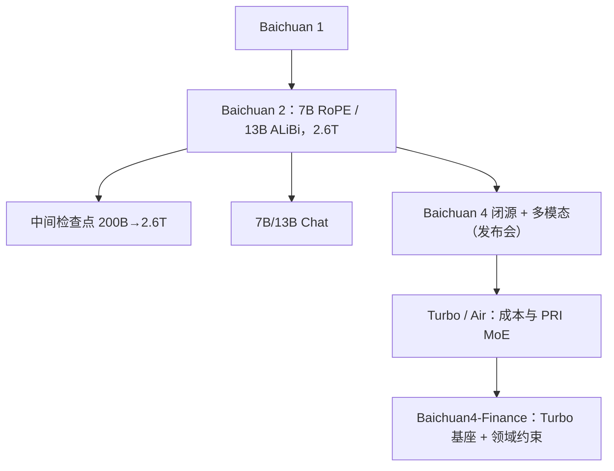

# Baichuan 2 / 4

    
Baichuan 2 从零训 7B / 13B 各 2.6T，并放出从 200B 到满训的中间检查点；Baichuan 4 是闭源产品代，结构细节只出现在后续垂直报告与官方商业化说明里。

    <footer>—— Yang 等，Baichuan 2: Open Large-scale Language Models，arXiv:2309.10305；Baichuan4-Finance，arXiv:2412.15270；百川 2024-10 一站式方案公开说明</footer>

百川智能的开源高峰是 2023 年 9 月的 **Baichuan 2**：多语言 7B 与 13B，各 **2.6T** token，Base 与 Chat，并承诺放出预训练过程检查点。架构是当时的主流解码器，但 7B 用 [RoPE](/llm/rope)、13B 用 [ALiBi](/llm/alibi)，词表扩到 **125696**。2024 年的 **Baichuan 3 / 4** 转入闭源与企业 API：4 代官方强调多模态与通用能力提升，同年 10 月发布 **Baichuan4-Turbo / Air** 商业化矩阵。4 没有与 2309.10305 对等的综合技术报告；能引用的结构句子来自 **Baichuan4-Finance**（在 Turbo 基座上做金融继续训）以及产品发布会。本篇把 2 写全，把 4 标成「公开信息上限」。

## 问题

2023 年开源中文模型要么数据远小于 1T，要么不放过程检查点，社区无法画 7B 在 2T 之后是否还在涨。Baichuan 2 要同时打 MMLU / CMMLU / C-Eval，并把数学、代码相对一代近乎翻倍，还要在 MedQA、JEC-QA 这类垂直榜上能当领域微调底盘。训练上，大词表的 softmax 与 logits 爆炸会让 Hugging Face 的 repetition penalty 把概率拧变形，需要显式压 logits 尺度。

到 4 代，问题换成企业私有化：要在两张消费卡上跑「接近上一代旗舰」的 Turbo，以及用自研 **PRI** MoE 把 Air 的推理成本打到官方所称的百分之一量级。这些是发布会指标，不是开源层表。

### 7B 与 13B 故意用两种位置编码

报告写明：FlashAttention 对乘法式 RoPE 更友好，ALiBi 外推故事更好，但多数开源核还没把 bias 注意力优化到同等程度。他们用 7B 走 RoPE、13B 走 ALiBi，方便社区对比两类位置方案，而不是声称某一种绝对更强。预训练消融认为位置选择对最终损失影响不大。

Baichuan 1 词表 6.4 万；2 扩到 125696，压缩率（越低越好）报到 0.498，优于 Llama 2 的 1.037。数字被切成单个 digit，空白另加 token。换词表就不能热启动一代嵌入。

## 方法

数据：网页、书、论文、代码等，强调规模与代表性。处理上自建万亿级去重聚类（LSH 与稠密嵌入），按簇给文档打分再采样。分词 BPE（SentencePiece），不做 dummy prefix，覆盖率 0.9999，罕见字符回退 UTF-8 字节，中文长词最大 token 长 32。

结构：SwiGLU，中间维收到隐藏维的 $8/3$ 再对齐 128；RMSNorm 预归一化；注意力走 xFormers 内存高效实现以容纳 ALiBi bias。优化器 AdamW，$\beta_2=0.95$，clip 0.5，2k step 线性预热再余弦，BF16。对数值敏感的位置索引用全精度，避免 `arange` 在 BF16 上超过 256 撞车。

### NormHead 与 max-z 损失

输出嵌入（lm_head）做归一化：**NormHead**。动机一是稀有 token 的头范数在训练中会塌，扰动动态；二是语义更接近余弦，而点积混进了 L2，NormHead 减弱范数干扰。另加

$$
\mathcal{L}_{\mathrm{max\text{-}z}} = 2\times 10^{-4}\, z^{2},
$$

$z$ 为最大 logit，借鉴 PaLM z-loss，避免推理期 repetition penalty 直接乘巨大 logits 把分布拧断。

缩放律：10M–3B 小模型各训到约 1T，用 $\mathcal{L}_C = a C^b + \mathcal{L}_\infty$ 拟合，预测 7B/13B 在 2.6T 上的最终损失，报告称与实测星标吻合。7B：隐藏 4096、FFN 11008、32 头 32 层、RoPE、峰值 LR $2\times 10^{-4}$；13B：隐藏 5120、FFN 13696、40 头 40 层、ALiBi、峰值 LR $1.5\times 10^{-4}$；序列均为 4096。基础设施：机内张量并行 + 跨机 ZeRO 数据并行，按机器弹性调度。

对齐：放出 7B/13B Chat。安全与 RLHF 在报告后半展开，包括有害内容与价值观约束；本篇不把未开源的 4 代 RL 系数写进来。中间检查点从 **200B token** 起直到 2.6T，用来画 7B 在超 Chinchilla 区间是否仍涨——报告的结论是仍在涨，这与「小模型早停」的直觉相反，也是他们愿意把切片公开的原因。垂直域上 MedQA、JEC-QA 相对同尺寸开源更好，适合作为医、法继续微调的底盘，而不是直接当执业系统。

### Baichuan 4：只写已见诸报告与发布会的句子

官方时间线（公开新闻）：2024 年 5 月发布带多模态能力的 Baichuan 4，称通用能力相对上代提升超过 10%，数学 / 代码分别约 14% / 9%。10 月 31 日发布 **Turbo** 与 **Air**：Turbo 称效果提升、推理成本下降 85%、首 token 与流式速度提升；Air 称 **PRI**（金字塔、残差、区间）混合专家，效果与 4 持平、推理成本下降 99%。Turbo 称两张 4090 可部署。企业方案允许把私有数据与百川通用数据混合微调。

**Baichuan4-Finance**（2412.15270）写明：金融系列建在 **Baichuan4-Turbo 基座**上。该文披露的结构选择——BBPE 词表 **141056**、RMSNorm、[GQA](/llm/gqa)、RoPE——属于 Turbo 衍生线，**不是** 2 的 125696 / ALiBi-13B。继续预训练约 400B 通用 + 100B 金融，提出 domain self-constraint 以免忘通识，再 SFT + RLHF/RLAIF。不要把金融 500B 继续训写成通用 Baichuan 4 的预训练总量。

## 机制

2 的主贡献是 **数据量 × 过程透明**，不是新注意力。NormHead 把分类几何从「范数乱飘的点积」拉回余弦主导；max-z 把 softmax 平移自由度钉住，服务端惩罚超参才稳定。双位置编码是对照实验留下的分叉：移植 13B 必须实现 ALiBi bias，不能当标准 RoPE Llama 加载。

4 代机制在公开文本里是 **产品分层**：Turbo 打效果与可部署性，Air 打 MoE 单价，Finance 展示「通识约束下的领域继续训」。self-constraint 的具体损失以金融论文为准，不能外推到所有行业包。发布会里的「96% 多场景可用率」是企业评测口径，不是 MMLU。

第三方目录里的「Turbo 1300 亿参数」未出现在 2309.10305 或 2412.15270。本篇不采用无报告来源的参数量。

## 边界与工程取舍

Baichuan 2 序列 4K，不是 128K 旗舰。13B+ALiBi 在今日 FlashAttention 生态里比 RoPE 别扭，这是 2023 年的对照遗产。4 的 PRI 内部定义、专家数、共享专家、预训练 token 均未开源。医学 / NPC 角色模型是旁支：Baichuan-NPC 只在 4 系综述里被点名为角色定制线，没有开源成 2 那样的 7B/13B 切片。许可证：2 的商用以当时 GitHub 协议为准；4 走商业 API 与私有化合同。企业混合微调声称把私有数据与百川通用数据对齐分布，这是产品能力，缺公开配比就不能写成可复现的领域自适应算法。

中间检查点用来研究训练动态，不是每一个 200B 切片都能当 Chat 用。评测应对齐满训 Base。

## 小结

- Baichuan 2：7B（RoPE）与 13B（ALiBi），2.6T，词表 125696，NormHead + max-z，放出过程检查点与 Chat。
- Baichuan 4：闭源多模态旗舰；Turbo/Air 的成本与 PRI 以 2024-10 官方说明为准。
- Finance 报告给出 Turbo 衍生线的 GQA/RoPE/141056 词表，以及领域自约束继续训。
- 出处：Yang 等，*Baichuan 2*，arXiv:2309.10305，2023；Zhang 等，*Baichuan4-Finance*，arXiv:2412.15270，2024。
