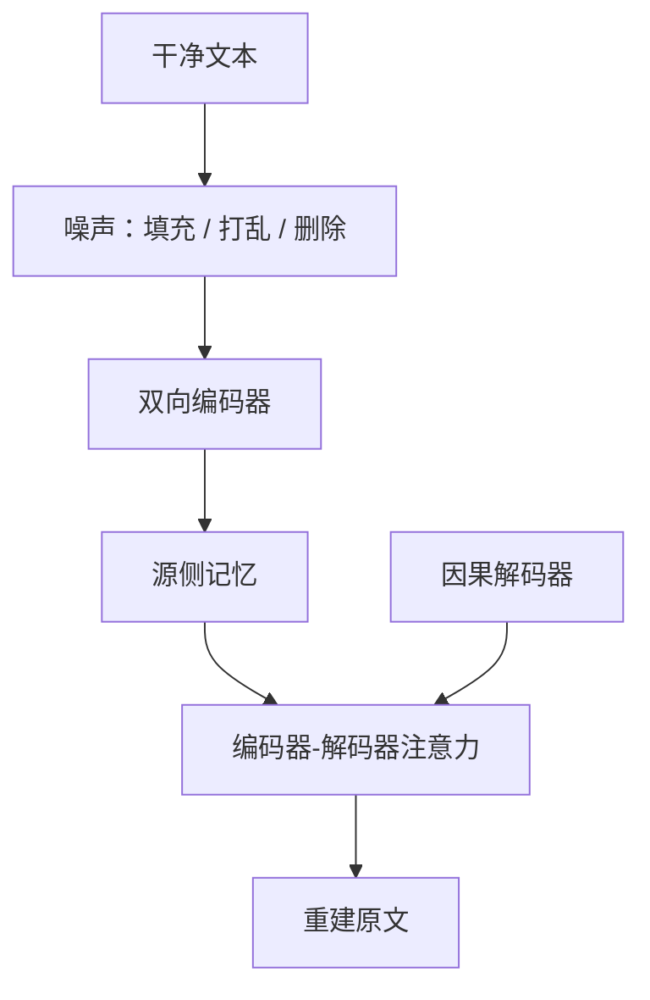

# BART 与去噪编解码

用任意噪声函数损坏文本，再训练一个标准的编码器–解码器去重建原文；预训练于是与微调时的生成接口对齐。

<footer>—— Lewis et al., BART: Denoising Sequence-to-Sequence Pre-training, ACL 2020</footer>

[上一课](/llm/t5-relative-bias)解决了编解码注意力里位置怎么进 logits。结构仍是「源完整、目标自回归」，但还没有说明**预训练目标**怎样才能让这条结构在生成微调时不裂缝。[掩码语言模型](/llm/masked-lm)挖词、只在被挖位置算损失，解码器从来没有被训练去写一整句。本课补 BART：噪声加在源侧，解码器从左到右重建干净文本。后课比较纯解码器与编解码器时，默认你会「去噪预训 = 编码器读脏源、解码器写净目标」。

## 问题

BERT 编码器预训练结束，生成要对每个位置迭代填掩码，或另接一个从未用去噪目标训过的解码器。T5 把所有任务收成文本进、文本出，源侧是已经写成自然语言的指令与输入，不是「被挖烂的同一句话」。缺口是：希望预训练时的计算图与摘要、翻译、改写微调时同构——编码器看见损坏的源，解码器自回归写出未损坏的目标。

损坏必须足够重，编码器才不能靠局部抄写；又必须保留可恢复的线索，否则任务退化成无条件语言模型，编码器闲置。BART 要选的是噪声族，不是再设计一种注意力。

T5 的 span 腐蚀也是去噪，但源里留下哨兵、目标只输出被挖的片段。BART 的目标是**整段原文**，接口更接近「给定脏文档，写干净文档」。

## 方法

标准 Transformer 编解码：编码器双向，解码器因果自注意力加[编码器–解码器注意力](/llm/encoder-decoder-attention)。预训练时对无监督文本施加一种或多种噪声，编码器吃噪声后的序列，解码器以教师强制重建原始 token 序列，损失是整句的负对数似然。

Lewis 等人比较的噪声包括：随机 token 删除、文本填充（把一段换成单个掩码）、句子打乱、文档旋转、token 掩码。实践里填充加句子打乱对生成任务更有效——编码器必须跨句重组，解码器必须写出完整表面形式。微调时噪声关掉，源改成下游输入（文章、问句），目标改成下游输出（摘要、答案）。

### 与 MLM 头的差别

MLM 只在 15% 位置上有监督信号，其余位置的隐状态不直接接到词表。BART 的解码器每一步都有下一个词损失，编码器的双向表示通过交叉注意力被每一步查询。编码器因此被训练成「给生成器当记忆」，而不是「给分类头当特征」。

## 机制

噪声把源与目标的表面对齐打乱。删除与填充造成长度不匹配，交叉注意力必须学会多对一、一对多的对齐，而不能假设位置 $i$ 抄源位置 $i$。句子打乱迫使编码器在双向栈里恢复篇章顺序，相对位置偏置或绝对位置都只提供局部线索，全局顺序要靠内容。

解码器的因果掩码保证生成接口：推理时左边是已写出的摘要，右边是空的，与训练时教师强制看见的前缀一致。这是 BERT 式填词做不到的对齐。

去噪强度是超参。过轻，模型抄源；过重，编码器提供的记忆接近无信息，模型退化为解码器只语言模型，白付一层交叉注意力的计算。

## 边界

BART 不规定必须用 T5 相对偏置，原文用的是标准 Transformer 位置；本课把它接在相对偏置之后，是课序上的编解码工具箱，不是声称两篇论文共用同一套位置。判别任务上，BART 仍可用编码器端特征，但预训练主业是生成，`[CLS]` 不是一等公民。纯理解、短分类，双向编码器加 MLM 往往更便宜。

## 小结

- BART 用标准编解码器做去噪自编码：源侧任意噪声，目标侧整句重建，使预训练与生成微调同构。
- 相对 MLM，监督信号覆盖每一个目标位置，编码器被训成生成器用的记忆。
- 填充与句打乱故意破坏长度与顺序对齐，交叉注意力必须真正对齐，而不能按下标抄。
- 噪声过重会把模型退化成不用源的语言模型。
- 出处：Lewis et al., *BART*, ACL 2020。
