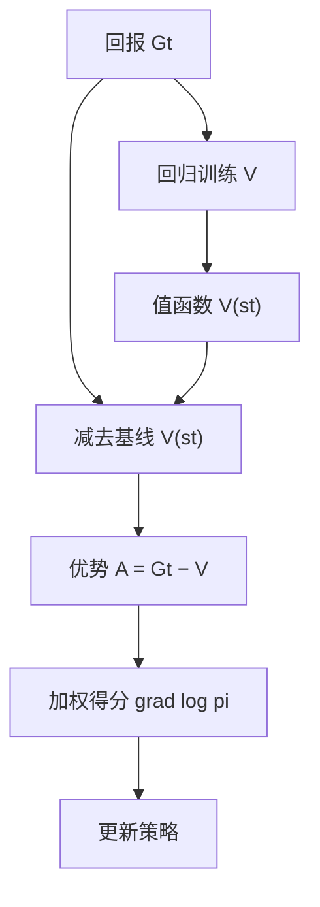
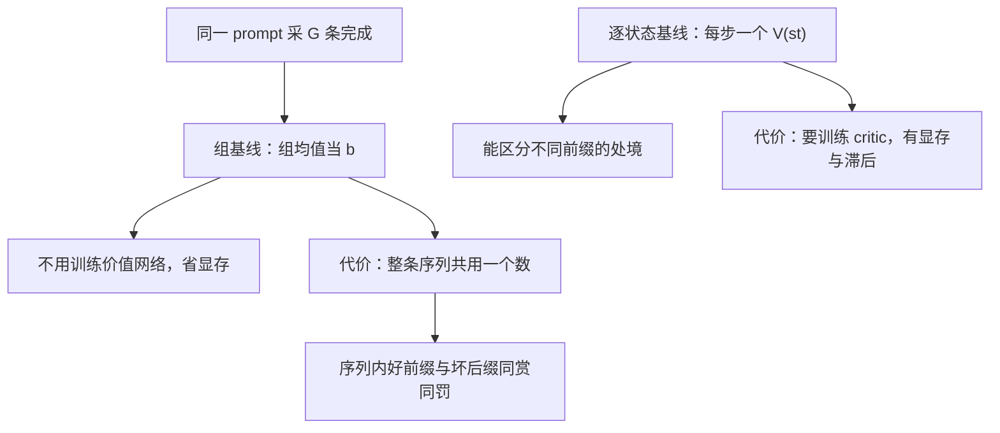

# 基线与优势函数

从回报里减掉一个只看状态、不看动作的数，期望纹丝不动，方差却大幅下降；剩下的那点差额，才配叫「优势」。

<footer>—— 据 Williams, 1992；Greensmith, Barto &amp; Anderson, 2004；Sutton &amp; Barto, 2018 §13.4 整理</footer>

[上一课](/llm/reinforce-variance)把方差拆成回报波动与得分范数的耦合项，批内标准化只是运气版的对策。缺口是要一个有原则的减法：减什么、为什么不会减坏、最优能减到哪。本课写基线定理——$b(s)$ 不改期望只改方差；取 $b=V^{\pi}$ 得到优势函数 $A=Q-V$；再把这套语言对上 LLM 后训练里现成的组归一化基线（[GRPO](/llm/grpo)）。

## 问题

上一课的四件经验减缩里，标准化依赖同一批恰好采到什么，批间漂移没法控制；梯度裁剪有偏。想要的是逐状态的中心化：同一状态，有的轨迹走运、有的倒霉，这部分波动与「策略在该状态怎么选」无关，却全被乘进了梯度。问题因此精确化：找一个量 $b(s_t)$ 从 $G_t$ 里减掉，要求期望严格不变、方差尽量小。

可以把它想成考试划平均分：全班平均 72 分，你考 80 分，老师表扬的是高出的那 8 分，而不是 80 本身——这里的 72 就是基线，8 就是优势。同一个你在尖子班里可能只考 65 分、低于班均，绝对分数变了，但「比平均水平好多少」永远算得清，这才是真正要传递给学习算法的信号。

## 方法

期望不变是恒等式的直接推论：$\mathbb{E}_{a\sim\pi_\theta}[b(s)\nabla_\theta\log\pi_\theta(a\mid s)]=b(s)\sum_a\nabla_\theta\pi_\theta(a\mid s)=b(s)\,\nabla_\theta 1=0$。于是

$$
\nabla_\theta J=\mathbb{E}\bigl[(G_t-b(s_t))\,\nabla_\theta\log\pi_\theta(a_t\mid s_t)\bigr]
$$

对任何 $b(s)$ 成立。方差是 $b$ 的二次函数，逐状态求极小得最优基线 $b^{*}(s)=\mathbb{E}[G_t\lVert\nabla\log\pi\rVert^2\mid s_t=s]/\mathbb{E}[\lVert\nabla\log\pi\rVert^2\mid s_t=s]$；把得分范数的加权略去，它约等于 $\mathbb{E}[G_t\mid s_t=s]=V^{\pi}(s)$。取 $b=V^{\pi}$，权重变成

$$
A^{\pi}(s,a)=Q^{\pi}(s,a)-V^{\pi}(s),
$$

优势：这个动作比该状态的平均水平好多少。它正是策略改进想要的量——好于平均就抬高，差于平均就压低，状态的运气被 $V$ 吸收掉了。

初学者容易把优势为负读成「这个动作很糟」。它只说明该动作不如同一状态下的平均水平，绝对回报可能仍是正的；正优势也不保证动作完美，只说明它好过平均。信用分配比较的对象是「同状态下其他可选动作」，不是零分——这也是为什么换一个更难的场景，同一个动作的优势会整个翻号。

基线的合法条件是「与正在求导的那个动作独立」：可以依赖状态、依赖其他样本、甚至依赖 $\theta$。同提示采 $G$ 条完成、用组内均值当基线时，若自己的分数也漏进了均值与标准差（[GRPO](/llm/grpo) 的组归一化正是如此），严格说已带一点偏差；留一均值的 [RLOO](/llm/rloo) 是干净的版本。

## 机制

组归一化恰好是基线定理在 LLM 里的落地：同一 prompt 采一组完成，组均值当 $b$，组内相对名次当优势——不学任何价值网络。代价在时间结构：$V^{\pi}(s_t)$ 是逐状态基线，能区分同一序列里不同前缀的处境；组基线整条序列共用一个数，序列内部的好前缀与坏后缀仍然同赏同罚。标准差除法是尺度归一，超出定理允许的「减法」，好处是奖励量纲跨题可比，坏处是组内全对或全错时归一化没有信号。方差省了多少可以算：$\{0,1\}$ 奖励、成功率 $p$ 时，减去 $V\approx p$ 把权重二阶矩从 $p$ 压到 $p(1-p)$——成功率越极端，相对收益越大。

代入数字感受一下：成功率 $p=0.5$ 时，二阶矩从 $0.5$ 压到 $0.5\times(1-0.5)=0.25$，方差减半；$p=0.95$ 时从 $0.95$ 压到约 $0.0475$，缩到约二十分之一。任务越接近「全对或全错」的极端，减基线省下的方差越多——这也解释了可验证奖励任务上组归一化为什么格外划算。

## 边界

基线的收益取决于 $V$ 估得多准：$V$ 靠回归学，学坏了可能不如「减组均值」。$A=Q-V$ 若两边都靠估计，误差相加而不相消——除非走自举的差分形式，让 $V$ 的误差在差分里部分对消，那是下一课。逐状态基线要求学一个价值函数，显存与滞后都是成本；组基线要求同提示多采样，用生成预算换 critic。哪条划算取决于奖励噪声：可验证的 0/1 组内干净，噪声大的 RM 分数会被组内抖动放大，[GRPO](/llm/grpo) 一课已把这条件写清。

## 小结

- 基线定理：$b(s)$ 与动作独立则期望不变；方差是 $b$ 的二次函数，存在最优值。
- $b=V^{\pi}$ 给出优势 $A=Q-V$：把状态运气从信用分配里剥离。
- 合法条件是「不依赖当前动作」；自己的分数漏进基线会引入偏差，留一是干净版。
- 组归一化 = 基线定理的 LLM 批量实现：省 critic，付的是序列内时间结构。
- 出处：Williams, 1992；Greensmith, Barto &amp; Anderson, *Variance Reduction Techniques for Gradient Estimates in Reinforcement Learning*, JMLR 2004；Shao et al., DeepSeekMath, 2024。
