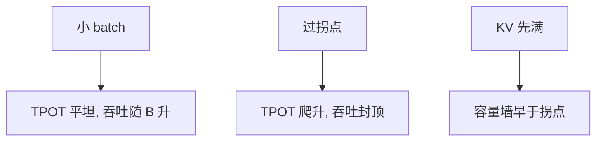

# 批大小与 roofline 拐点

同一份权重被更多序列复用时，强度随 batch 上升；越过屋顶比之后，再加大 batch 主要加吞吐、不再降逐步延迟。

<footer>—— 屋顶线见 Williams et al., CACM 2009；连续批使 batch 成为时间上的变量见 Yu et al., Orca, OSDI 2022</footer>

[上一课](/llm/arithmetic-intensity-decode)定义了 decode 的 $I$。本课把 $I$ 看成 $B$ 的函数，找出拐点：从带宽绑定进入算力绑定的那个并发。连续批让 $B$ 随时间变，产品感觉是「人一多，每个字变慢」还是「人一多，总吞吐上去」——取决于你在拐点哪一侧。[连续批处理](/llm/continuous-batching)改成员；本课只写工作点，不重写调度器。

## 问题

小 $B$ 时每步时间 $\approx (W+\mathrm{KV})/\mathrm{bandwidth}$，与 $B$ 几乎无关，TPOT 稳定、吞吐线性于 $B$。$B$ 大到 GEMM 打满 Tensor Core，逐步时间改由 $\mathrm{FLOPs}(B)/\mathrm{peak}$ 决定，随 $B$ 上升，TPOT 变差，吞吐接近常数（算力屋顶）。缺口是估计拐点 $B^\star$，否则 SLA 会写成互相矛盾的「高并发且低 TPOT」。

KV 随 $B$ 涨，容量墙可能先于拐点到来：还没打满算力就 OOM。此时优化应减 KV 字节，而不是再加卡的 FLOPS。反之，KV 很瘦（MLA、短上下文）时，拐点来得早，再堆并发只伤延迟。

拐点不是一个通用整数。它随模型宽、量化、是否投机（$n_q>1$）、以及 prefill 是否混入而变。同一集群白天聊天与夜间批推理，工作点可以分居两侧。

## 方法

令 $T_{\mathrm{mem}}=(W_{\mathrm{bytes}}+B\cdot \overline{\mathrm{KV}})/(\eta_b B_{\mathrm{HBM}})$，$T_{\mathrm{cmp}}=\mathrm{FLOPs}(B)/(\eta_c\,\mathrm{peak})$。$B^\star$ 满足 $T_{\mathrm{mem}}\approx T_{\mathrm{cmp}}$。权重主导时 $B^\star$ 大致与 $W/\overline{\mathrm{KV}}$ 和屋顶比有关：KV 越大，$B^\star$ 越小（每条序列自己就带来很多字节）。测：$B=1,2,4,\ldots$ 画 TPOT 与 tokens/s。TPOT 平坦段是带宽区；开始爬升是过拐点。吞吐的弯折应对上。

混合批次：[chunked prefill](/llm/chunked-prefill) 把算力密的工作掺进 decode 拍，等效 $I$ 上升，拐点左移，正在流式的用户 TPOT 抖动。分离 prefill/decode 池是为了让 decode 池停在选定的 $B$ 一侧。

## 机制

权重在 batch 维复用，KV 不在请求之间复用（前缀共享除外）。因此拐点同时被两股力量拉：量化权重 → $W$ 小 → 更容易被 KV 主导、拐点可能更早；量化 KV → 每条更瘦 → 可以更大 $B$ 才碰到容量，拐点右移。投机加宽 $n_q$，等效把部分「batch 复用」换成「查询复用」，单请求也能略微右移工作点。

## 边界与工程取舍

不要把训练的「最优 global batch」当成服务 $B^\star$。不要为了吞吐把 decode 池推过拐点还不改 SLA。尾延迟由最高 $B$ 与最长 $n$ 的乘积决定，平均值好看不够。后课把时间换成焦耳。

出处：Williams et al., 2009；Yu et al., OSDI 2022。Pope et al. 2022 讨论推理并行度与阶段。

## 小结

- $B^\star$ 是 $T_{\mathrm{mem}}\approx T_{\mathrm{cmp}}$ 的并发；左侧加 $B$ 加吞吐，右侧加 $B$ 加 TPOT。
- 容量墙可早于拐点；先减 KV 再堆并发。
- 混合 prefill 使拐点移动并造成 TPOT 抖动。
- 权重量化与 KV 量化对拐点的方向相反。
- 测量用 TPOT–$B$ 曲线，不要只用 GPU 利用率。
- 下一课：逐步时间换成每 token 能耗。
- 出处：Williams et al., 2009；Yu et al., 2022。
