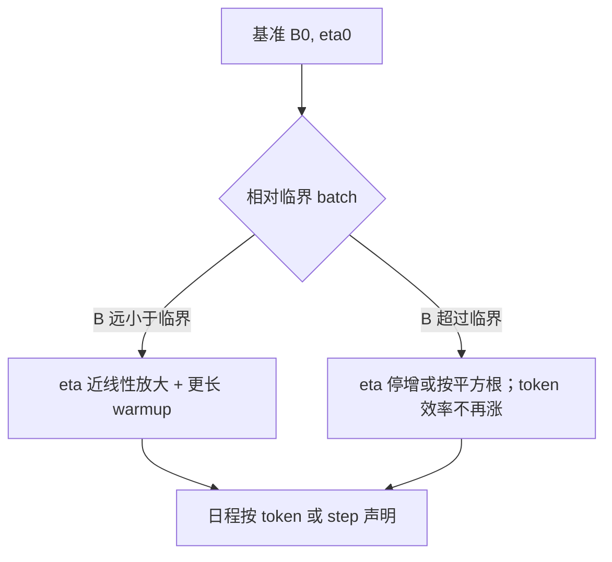

# 批次与学习率

把 batch 加大而不改学习率，等于把噪声尺度与步长错开；线性规则是一条可用的起点，不是在所有临界 batch 之上都成立的定律。

<footer>—— Goyal 等 ImageNet 线性缩放；McCandlish 等的临界 batch；语言模型侧见浅层与大模型预训练配方的 squaring / sqrt 变体</footer>

[NaN skip](/llm/nan-skip-batch) 决定坏 step 要不要走。[学习率日程](/llm/lr-schedule) 已经写了 warmup、余弦、WSD。本课补二者交界处仍空着的轴：**全局 batch（token 数 $B$）变了，$\eta$ 怎么走**。μP 解决宽度；这里解决的是数据并行把 $B$ 从 0.5M token 拉到 4M 时，同一套日程还算不算同一优化过程。后课并行会改 $B$ 的实现（梯度累积、微 batch），但换算公式以本课为准。

## 问题

SGD 下，梯度噪声方差大约按 $1/B$ 降。若把 $\eta$ 按 $B$ 线性放大，小 batch 上学到的超参在大 batch 上每步走得更远，墙钟上可以近似「同等数据量、更少 step」。Goyal 等人在 ResNet 上给出带 warmup 的线性规则。语言模型用 AdamW，噪声结构不同，线性规则会在某个 **临界 batch** $B_{\mathrm{crit}}$ 之上失效：再加大 $B$，只是减少 step 数、不减少达到同等损失所需的 token 数，再线性加 $\eta$ 只会不稳。

McCandlish 等人把 $B_{\mathrm{crit}}$ 写成噪声规模与曲率的比。预训练中 $B_{\mathrm{crit}}$ 随数据与阶段变：训练后期曲率变陡，临界点可能下降。把前期扫到的 $(B,\eta)$ 沿用到后期超大 batch，是尖峰与 [skip](/llm/nan-skip-batch) 的来源之一。问题不是「batch 越大越好」，而是：**当前阶段你在 $B_{\mathrm{crit}}$ 的哪一侧，以及 $\eta$ 该跟 $B$ 还是跟 $\sqrt{B}$ 走**。

### 全局 token batch 才是 $B$

$B=$ 数据并行 × 微 batch × 序列长 × 累积步。改序列长却不改 $\eta$，等于改了 $B$。改累积、改卡数同理。日志若只写「per-GPU batch=2」，无法复现。MoE 的有效更新还受 drop / 负载影响：名义 $B$ 相同，专家侧见过的 token 可以更少，Adam 对专家参数的噪声更大，专家该用的 $\eta$ 与稠密层不必相同。线性规则 $\eta(B)=\eta_0\cdot B/B_0$ 以 $B_0$ 上已经稳的 $\eta_0$ 为原点。没有原点，线性是无量纲的口号。原点必须带数据、模型、优化器版本；从论文抄一个 3e-4 再按你的 4M token 线性放大，没有 $B_0$ 对照。

## 方法

### 按临界 batch 分层换算

实务上的分层：

- **远小于 $B_{\mathrm{crit}}$**：优先线性或接近线性加 $\eta$，并加长 warmup（Goyal：大 $\eta$ 需要更多步把统计跑稳）。
- **接近或超过 $B_{\mathrm{crit}}$**：$\eta$ 改跟 $\sqrt{B}$ 或不随 $B$ 增加；继续加 $B$ 只为墙钟（更少 step、更好的设备利用率），不指望 token 效率。
- **AdamW 经验**：许多 LLM 配方在中等范围用 $\sqrt{B}$ 规则，比纯线性更不容易在 2–4M token 上炸掉。这是经验，不是 μP 定理。

WSD / 余弦的峰值 $\eta$ 按上面换算，最小值与衰减形状按 **step 还是 token** 对齐要事先说清。按 token 对齐时，加大 $B$ 等于高峰更少 step 就走到，衰减变陡；按 step 对齐则同等 step 数下看过更多 token。两种都合法，混用会让「同等计算」对照作废。

## 机制

大 $B$ 降低梯度噪声，使更新更接近真梯度方向，小 $\eta$ 时更稳；但过小的噪声会减少逃出尖鞍的机会，有时最终损失略差。线性加 $\eta$ 是在保持「噪声 × 步长」一类的有效温度。Adam 的二阶矩 $v$ 本身随 $B$ 变：大 batch 的 $v$ 更小更稳，同样 $\eta$ 的有效步长变大，这是再叠一层放大，所以纯线性在 Adam 上比 SGD 更危险。这解释了为何 LLM 常比线性更保守。

[权重衰减](/llm/weight-decay-mup) 的有效率是 $\eta\lambda$。$\eta$ 随 $B$ 变时，$\lambda$ 若不动，衰减强度在变。大 batch 线性加 $\eta$ 等于加强衰减，模型范数被额外压低，可能被误读成「大 batch 泛化更好」。换 $B$ 时应声明 $\lambda$ 是跟着 $\eta$ 补偿还是保持 $\eta\lambda$ 常数。

梯度累积不改变数学上的 $B$，但改变流水线气泡与跳过粒度：NaN skip 一个微 batch 与 skip 整个全局 batch 的数据量不同。把累积当「免费加大 $B$」时，要同步改 skip 与日志里的 $B$ 定义。

### 与 z-loss、clip 的耦合

大 $\eta$ 更容易把 logits 推到 z-loss 正在抵抗的区域，也更容易触发 clip。于是你看到 clip 率飙升、以为模型坏了，其实是 $B$–$\eta$ 换算过冲。调参顺序：先在小 $B$ 上把 clip 率、LSE 分位数调到健康，再按规则放 $B$，观察这两组仪表是否回到同区间；而不是先放 $B$ 再在爆炸上补 $\alpha$。

## 边界与工程取舍

临界 batch 很少被测全：测它需要多条不同 $B$ 的学习曲线。多数团队用「再加 $B$ 损失平台不变」当操作定义。指令微调 $B$ 往往小于预训练，$B_{\mathrm{crit}}$ 也可能更小（数据更同质、曲率不同），把预训练的 4M token 与 3e-4 原样搬到 SFT 会过冲。RL 的「batch」是轨迹条数，噪声来自奖励与长度，换算规则又不同——本课公式只覆盖教师强制的 CE 预训练 / SFT。

多源混数时，全局 $B$ 相同但各域样本数随 packing 变，等于每域有效 $B$ 不同。域相关的 $\eta$ 几乎没人做，于是稀有域更噪。这是数据配比课的接口：想提高稀有域学习，加的是采样率，不是全局 $\eta$。

Goyal 的线性规则来自视觉分类与 SGD/Nesterov 语境。写进 LLM 文档时要降一档确定性：它是起点，失效由 $B_{\mathrm{crit}}$ 与 Adam 的 $v$ 共同决定。不要写成「Transformer 必须线性缩放」。

## 小结

- $B$ 是全局 token batch；改卡数、序列长、累积都是在改 $B$。
- 低于临界 batch 可尝试线性或 $\sqrt{B}$ 放大 $\eta$ 并加长 warmup；超过后 token 效率饱和。
- AdamW 上线性比 SGD 更易过冲；$\eta\lambda$ 会随 $\eta$ 一起变。
- 日程按 token 还是按 step 对齐必须声明；跳过的 token 是否计入同理。
- 用 clip 率与 LSE 分位数验收换算，不要只看损失。
- 出处：Goyal 等线性缩放；McCandlish 等临界 batch；AdamW LLM 配方中的保守变体。
