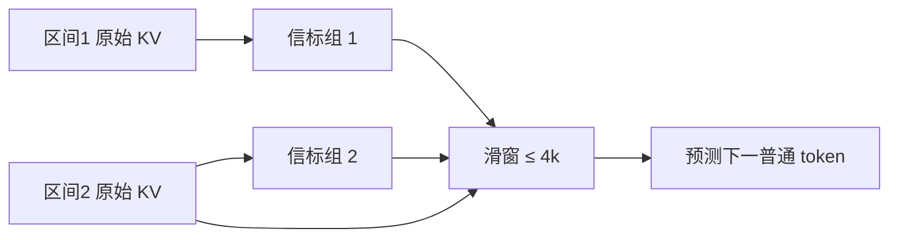

# Activation Beacon 原文

    
激活是冗余的；用插入的信标把它们凝成更短的键值，短滑窗就能条件于长得多的上文，而不必把原模型训成 400k 全注意力。

    <footer>—— Zhang 等，Soaring from 4K to 400K: Extending LLM's Context with Activation Beacon，2024</footer>

北京智源与人大的 Peitian Zhang、Zheng Liu、Shitao Xiao、Ninglu Shao、Qiwei Ye 与 Zhicheng Dou 提出 Activation Beacon：在上下文各区间末尾插入信标 token，用它们查询该区间的原始 KV，写出压缩后的 $K_b,V_b$；后续滑窗把过去的信标与当前普通 token 拼在一起做自回归。Llama-2-7B-chat 的 4k 窗因此可以条件于论文标题所写的 400k 量级上文。信标作为插件学习，主体 LLM 冻结，短序列（多数小于 8k）上 10k 步、单机 8×A800 约 9 小时。本篇按原文的凝缩比、注意力方案与训练协议写；和 Infini-Attention 的矩阵记忆对照见 [Activation Beacon](/llm/activation-beacon)。

## 问题

续训把窗口拉长，二次注意力让训练与推理都变贵，且长数据续训可能伤短窗。PI/NTK 仍是全注意力，只是相位能算。Streaming 丢掉中间。Self-Extend 中间仍二次。能否在**冻结**已有 LLM 的前提下，承认原始激活冗余，把过去区间写成少数向量，使有效上下文 $\approx$ 滑窗长度 × 凝缩比，而位置编码仍用短窗相对下标、永不 OOD？

这要求：信标参数量可接受；掩码允许信标看一块过去；后续 token 主要看信标而不是看全部历史 KV；训练目标仍是普通 next-token，迫使信标携带对预测有用的信息。标题里的 ×100 来自凝缩比可以到 100 量级，不是 RoPE 在 400k 下标上外推成功。

### 插件而不是改底座

信标含 embedding 与每层额外的 $W'_Q,W'_K,W'_V,W'_O$，FFN 与 LayerNorm 复用 LLM。相对 Llama-2-7B，信标侧大约 2.1B、不到三分之一，在插件意义上仍大，但训练只更新 $\theta_b$。普通 token 的短窗路径保持原权重，所以短任务不应被长窗续训拧坏——这是相对「全参 32k 续训」的产品承诺。

400k 是压缩后的条件长度。宣传时应同时报凝缩比 $\alpha=L/k$ 以及该比下的针测与摘要。否则会与原生 400k softmax 混淆。

## 方法

上下文按区间长度 $L$ 切开，每区末放置 $k$ 个信标，$\alpha=L/k$。在每一层，信标隐状态投影为 $Q_b$，去注意本区原始 $K,V$（及信标自己的 KV），写出压缩激活。三种 mask：分段（每信标看一块子区间）；逐步扩张（后一个信标比前一个多看一块，最后一个看全区）；全覆盖（每个信标看全区）。算力相同，逐步扩张最好——信标之间形成由粗到细的摘要金字塔。

### 带信标的滑窗自回归

每个滑窗是 $[\mathrm{bcn}_1,\ldots,\mathrm{bcn}_m, x_{m+1},\ldots,x_n]$，窗长不超过原 $L^*$（Llama-2 为 4096）。过去区间只以信标形式出现。预测

$$
p(x_n\mid \mathrm{bcn}_1,\ldots,\mathrm{bcn}_m,x_{m+1},\ldots,x_{n-1};\theta,\theta_b).
$$

窗内位置用相对下标，不管绝对文档坐标，因此不必改 RoPE 基数。覆盖的过去长度约为 $\alpha(m-1)+n$。生成时流式前进：新区间结束则新信标入队，普通 KV 按窗淘汰。

训练在 RedPajama 与 LongAlpaca 混合上做，实例长度 $1024<|X|<8192$。每一步对区间随机抽 $\alpha\in\{2,4,8,\ldots,128\}$，使自回归条件于**混合凝缩比**的信标，从而泛化到 16k、32k 乃至 100k/400k，尽管训练序列本身不那么长。10k 步即可。

## 机制

信标是插在残差流里的可学习查询：一次注意力池化把 $L$ 个键写成 $k$ 个键。接口是序列中的 token，因此复用 Transformer 层、检查点与 FlashAttention，不必另写 $d\times d$ 记忆核。后续 softmax 仍可解释「这个查询看了第 3 组信标」。逐步扩张优于全覆盖，是因为 $k$ 个信标若总看同一全区，容易学成重复的均值；递进视野迫使它们编码不同粒度。

随机 $\alpha$ 是泛化的核心。只训 $\alpha=2$，推理用 $\alpha=128$ 会失败；只训极大 $\alpha$，短程摘要过糊。混合条件让同一套 $\theta_b$ 服务多种产品档位。块内 RoPE 用窗内相对位置，普通 token 永不进入 400k 角——长程精确距离改由信标**内容**承担，这是与 PI 延窗完全不同的信息通道。

和 Infini-attention 比：摘要是可见 token，可被普通 $q^\top k$ 读。和 DCA 比：DCA 训练免费、看早块原始键；Beacon 付训练成本、看摘要键。需要逐字引用时 DCA 或全注意力更合适；需要极大 $n$ 且接受有损时 Beacon 更合适。

## 边界与工程取舍

必须训练，且 $\alpha$ 采样要够宽。主体冻结不能补偿信标没见过的任务格式——理解任务涨分来自压缩记忆，不是来自新的推理算法。插入信标改变序列长度，分词与 logit 屏蔽必须跳过信标 id，禁止当输出词。KV 要分「普通槽 / 信标槽」两种寿命；把信标当普通 LRU 会先扔掉长程通道。前缀缓存必须在相同切块对齐上命中。

$\alpha$ 太大，一块里的针被平均掉，NIAH 中间深度变红——这是压缩失败，不是 RoPE 失败。信标数随 $n/L$ 线性涨，极长仍可能要「信标的信标」，那一档应单独报表。论文称可与检索、续训互补，叠加时更要拆开消融。

训练全用短于 8k 的数据却声称 400k，靠的是 $\alpha$ 随机与滑窗拼接，而不是见过 400k 文档。评测必须含远超 8k 的 held-out，否则只是在训练分布长度上刷 PPL。

### 原文实验读法

语言建模在 8k/16k/32k 上用滑窗 PPL，可优于若干全注意力微调基线——因为窗短、核更省，且摘要可能滤噪。理解任务含 QA 与 few-shot。100k 与 400k 展示的是「能建立超长条件」，质量应按凝缩比分开，不要用 8k PPL 代替 400k 针测。图 1 把 PI、NTK、LongLlama 放在同一效率–质量平面上，Beacon 的卖点是质量与显存/时间同时更好，前提是接受有损。

## 小结

- Activation Beacon 用可学习信标凝缩区间激活，滑窗读信标链以扩展有效上下文。
- 插件训练、底座冻结；逐步扩张掩码与随机凝缩比是关键配方。
- 4k→400k 依赖 $\alpha$，不是无损全注意力；短窗能力靠不更新原权重来保。
- 10k 步短数据可训；推理要隔离信标 KV 与输出词表。
- 出处：Zhang、Liu 等，*Soaring from 4K to 400K: Extending LLM's Context with Activation Beacon*，2024，arXiv:2401.03462。对照 Rae 等压缩记忆、Munkhdalai 等 Infini-attention、Mohtashami 等 Landmark Attention。
