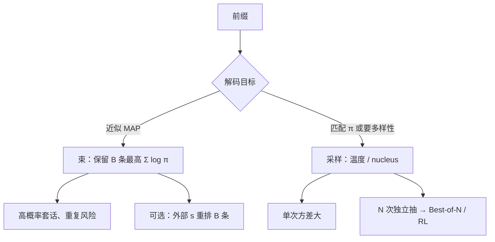

# Beam Search vs Sampling

极大似然解码——包括束搜索——会把文本推向重复、泛化与不自然；从截断的核里采样，才能回到人写的分布附近。

<footer>—— Holtzman et al., The Curious Case of Neural Text Degeneration, ICLR 2020</footer>

解码有两条经常被混为一谈的路。束搜索（beam search）维护 $B$ 条最高 *对数概率和* 的前缀，逐步扩展，近似寻找 $\arg\max_y \log\pi(y\mid x)$。采样从 $\pi$ 或其截断（温度、top-$k$、nucleus）里随机抽下一个 token。机器翻译时代束几乎是默认；对话与开放生成里，Holtzman 等人指出束会退化。推理模型与强化学习又把采样抬成一等公民：没有多样性就没有[Best-of-N](/llm/best-of-n)，也没有组相对训练。本篇对照两种搜索在 *目标函数* 上的差别，而不是罗列解码器 API。

## 问题

自回归把 $p(y\mid x)$ 拆成逐步条件。精确 MAP 是指数级搜索。贪心 $B=1$ 的束每步取最大，局部最优且对早期错误无法回头。加大 $B$ 更接近 MAP，但 MAP 本身未必是人想要的对象：语言模型在「安全的高频续写」上概率质量很高，重复短语、万能套话的联合对数概率可以高过一条具体而正确的推理。

采样的问题相反：一次抽取方差大，短指令上胡话概率不可忽略；温度过高则破坏已经学好的语法。需要分清任务：要 *一个高概率的合法字符串*（格式化代码、受约束模板），束或约束解码更合适；要 *覆盖多种推理路径* 再交给核对器，必须采样。把束的 $B$ 加大当成「也是一种 Best-of-N」，比较的是不同的集合——束里的条高度相关，BoN 里的条在独立采样假设下才近似无关。

### 目标函数先于实现

束优化的是 $\sum_t \log\pi(y_t\mid \mathrm{prefix})$，长度偏置明显：更长的序列对数和更负，实现常除以长度或加长度惩罚，否则束爱提前结束。采样优化的不是一个确定的 $y^\star$，而是从分布取矩。强化学习的期望回报 $\mathbb{E}_{y\sim\pi}[R]$ 与采样同构，与 MAP 不同构。用束生成的轨迹去估 REINFORCE 梯度，等于对错误的分布求期望。

nucleus（top-$p$）不是另一种束。它在每一步把概率质量累计到 $p$ 的最小 token 集上再归一化，然后 *随机* 抽。束在每一步是确定性的保留 Top-$B$ 前缀。一个改支撑集，一个改搜索宽度。

## 方法

束：$t=0$ 从 BOS/提示结束处扩展；每步对每条存活前缀展开词表，按累计对数概率留 $B$ 条。结束条件是全部存活条遇到 EOS 或达到最大长度。最终可取最高分的一条，或把 $B$ 条再交给外部 $s$ 做一次重排——后者已接近「束 + 验证器」，仍不是独立 BoN。

采样：每步从 $\mathrm{softmax}(z/T)$ 抽，可选地先把 logits 截成 top-$k$ 或 nucleus。$T\to 0$ 退化为贪心，与 $B=1$ 的束重合。$T=1$ 且无截断时，抽取的是模型的原始条件分布，这是策略梯度假设的那一个。训练 rollout 应记录当时的 $T$ 与截断，推理若改贪心，行为会偏。

### 与树搜索的位置

束是宽度固定、不回溯的树搜索，打分是模型自身的对数概率。PRM 引导的束把逐步分数换成过程奖励，目标函数已经不是 $\log\pi$，见[过程奖励引导的搜索](/llm/prm-guided-search)。[MCTS](/llm/mcts-llm) 再引入访问次数与探索项，宽度随模拟预算变。三者不要画成一条「B 越大越强」的轴：改的是评分、探索与是否允许降低即时 $\log\pi$ 去换更高的外部 $s$。

## 机制

退化来自概率质量集中在短循环与泛化连接词上。束每步都强化当前最高质量，一旦进入重复圈，圈内续写的条件概率极高，很难被挤出。采样即使支撑集里有重复 token，随机性仍有机会跳出；nucleus 把长尾噪声切掉，避免抽到完全不相关的词，同时保留头部的多模式。开放生成里这通常比加大 $B$ 更有效，Holtzman 等人的人工与自动指标都指向这一点。

在可核对任务上，机制反转：错误推理的 $\log\pi$ 可能低于正确推理（模型「知道」正确格式），束有机会直接找到对的；也可能正确推理更长、对数和更低，束反而选短的错解。长度归一化、覆盖惩罚、外部验证器，都是在承认 **$\log\pi$ 不是任务损失**。RL 训练过的推理模型进一步把质量从「短而常见」推到「长而可验证」，此时再用纯 $\log\pi$ 束，等于用旧目标去搜新策略。

同一条束里的 $B$ 条共享大量前缀，KV 可以一次算完再分叉，prefill 友好；独立采样的 $N$ 条只共享用户提示前缀。服务实现上束未必更贵，但 *有效假设覆盖* 通常远小于独立 $N=B$。比公平应用「外部 $s$ 下的准确率 / 总生成 token」。

## 边界与工程取舍

### 产品默认不要两套解码混用而不声明

聊天助手用 nucleus 采样保持自然；代码补全用贪心或小束保持确定性；竞赛题用采样 + BoN 或思维链。若评测脚本是贪心，用户产品是 $T=0.8$，数字对不上。约束解码（正则、JSON schema）可以叠在束或采样上：约束改的是逐步合法集，不自动消除退化，也不自动给出多样性。

不要用「束宽 32」的准确率去对比「sample 32 + 多数票」而不报相关性。前者是近重复的高似然簇，后者才接近 pass@$N$ 的覆盖。安全过滤应作用在最终字符串上：束可能稳定生成高似然的违规套话，采样可能偶发违规但也可偶发拒绝——两种失败要分开测。训练与推理温度不一致时，先修这个再调 $B$。

出处以 Holtzman et al., ICLR 2020 为主；束搜索本身是经典序列解码，不必给它编造 2024 年的新 arXiv。OpenAI o1 的解码器未公开到束宽这一层，不要写进对照表。

## 小结

- 束近似 MAP（对数概率和），采样实现 $\pi$ 或其截断；目标函数不同，不能只比「宽度」。
- 开放生成里 MAP 导致重复与套话；nucleus 等截断采样是针对退化，不是针对数学准确率。
- 可核对任务上 $\log\pi$ 仍可能与真值冲突，需要长度处理或外部 $s$。
- RL / BoN / 组相对都假设独立采样；用束轨迹去估策略梯度是分布错误。
- 束内条高度相关，独立样本的 $N$ 才对应覆盖 $1-(1-p)^N$。
- 评测解码必须与产品解码一致，温度和截断属于协议的一部分。
- 出处：Holtzman et al., *The Curious Case of Neural Text Degeneration*, ICLR 2020。
