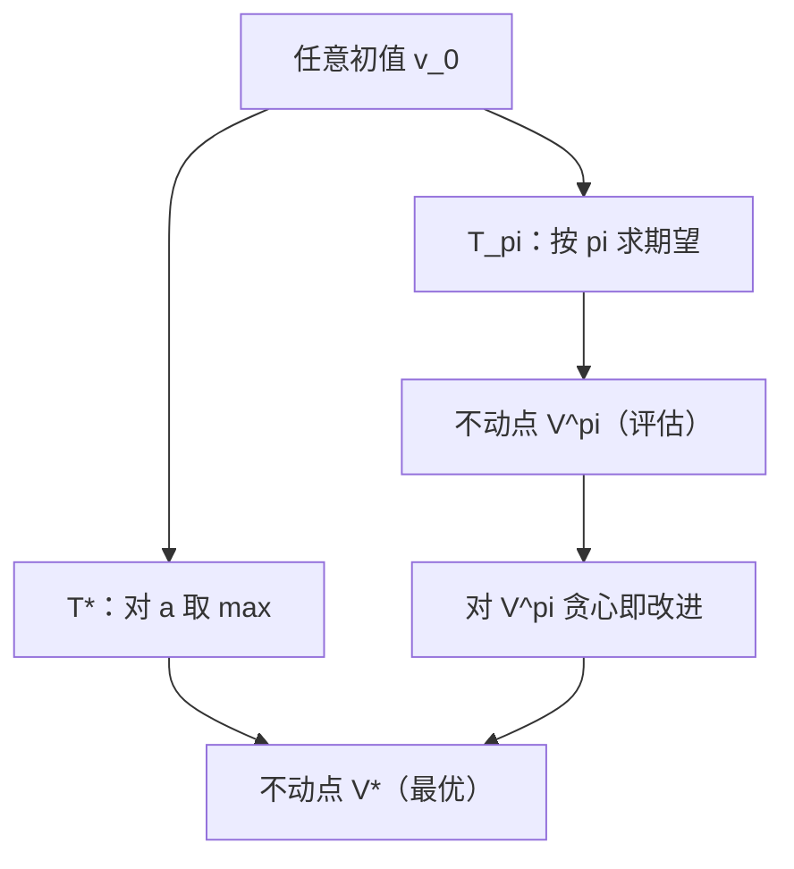

# 贝尔曼期望与最优方程

价值的定义里已经藏着它的算法：今天的价值，等于奖励加折扣后的明天价值；最优性只是把其中一步换成 max。

<footer>—— 据 Bellman, Dynamic Programming, 1957；Sutton &amp; Barto, Reinforcement Learning: An Introduction, 2018, 第 4 章整理</footer>

[上一课](/llm/return-discounting)把回报 $G_t$ 与价值 $V^\pi$、$Q^\pi$ 定义了出来，但按定义算价值要对指数多的轨迹求和，实际不可算。缺口是把定义变成递归：$G_t=r_t+\gamma G_{t+1}$ 这个恒等式取期望后，价值自己满足自己的方程。本课写贝尔曼期望方程（固定 $\pi$）与贝尔曼最优方程（算子形式），并用压缩映射自足地证明解存在且唯一——同一套不动点语言在经济学栏的[贝尔曼方程](/econ/bellman-equation)出现过，本课不预设那边的结论。

## 问题

上一课结束时价值函数只是三个字母。枚举轨迹不可行：状态数大、轨迹长指数级，$V^\pi$ 的定义式 $\mathbb{E}[\sum_k\gamma^k r_{t+k}]$ 里求和跑遍所有未来。需要一个对每个状态逐点成立的方程，让「无穷长的未来」缩成「一步奖励 + 一步递归」；还要回答递归不会循环定义吗——价值右边出现价值，凭什么它有解且只有一个。

## 方法

对期望方程，把回报拆成首项与余项再取条件期望，得**贝尔曼期望方程**：对所有 $s$，

$$V^\pi(s)=\sum_a \pi(a\mid s)\Big[r(s,a)+\gamma\sum_{s'}P(s'\mid s,a)V^\pi(s')\Big]$$

$$Q^\pi(s,a)=r(s,a)+\gamma\sum_{s'}P(s'\mid s,a)V^\pi(s')$$

把逐点的 max 写进去，定义**贝尔曼最优算子** $(T^*v)(s)=\max_a\big[r(s,a)+\gamma\,\mathbb{E}_{s'}v(s')\big]$，最优价值就是它的不动点：

$$V^*(s)=\max_a\Big[r(s,a)+\gamma\sum_{s'}P(s'\mid s,a)V^*(s')\Big]$$

评估与控制各用一支：固定 $\pi$ 的期望方程给出「$\pi$ 有多好」，最优方程给出「最好能多好」；下一课的算法就是这两支方程的交替。

## 机制

递归不是循环定义，因为右边是算子。对任意两个价值表 $v,w$，先估一步：

$$\big|(T^*v)(s)-(T^*w)(s)\big|\le\gamma\max_{s'}|v(s')-w(s')|$$

max 只会把两表的差拉平或缩小（对 $a$ 取 max 满足次可加），折扣再统一乘 $\gamma$。于是 $\|T^*v-T^*w\|_\infty\le\gamma\|v-w\|_\infty$：$T^*$ 是压缩映射。固定 $\pi$ 的期望算子 $T_\pi$ 同理，只是把 max 换成按 $\pi$ 加权，压缩常数不变。Banach 不动点定理随即给出三件事：**不动点存在且唯一**（$V^*$、$V^\pi$ 良定义）；**从任意初值迭代 $v_{k+1}=T^*v_k$ 必收敛**；**误差每轮至少乘 $\gamma$**，压到精度 $\varepsilon$ 需约 $\log(1/\varepsilon)/\log(1/\gamma)$ 轮。

收敛速度由 $\gamma$ 直接定价：$\gamma=0.9$ 时每轮误差至少缩十倍，$\gamma=0.999$ 则一轮只缩千分之一——耐心策略的代价在算法侧原样重现。

最优方程还内含**最优性原理**：不论如何到达 $s$，余下的最优只看 $s$——这正是马尔可夫性（第一课）在方程里的样子，也是「值迭代从任意初始化出发也合法」的原因。

## 边界

以上论证要求 $\gamma\lt 1$（或回合必终止）：无折扣的无限期问题可能没有有限值。逐状态的方程在**表格**上精确成立；换成函数逼近，「每个状态满足方程」退化为「整体误差可压小」，自举的偏差正是从这里进来的——那是本课程后面的致命三要素课的主题。期望方程与最优方程也不能混用：拿 $T^*$ 迭代去评估一个次优 $\pi$，收敛到的是 $V^*$ 而不是 $V^\pi$，评估就错了。

后课默认：$V^\pi$ 是 $T_\pi$ 的不动点，$V^*$ 是 $T^*$ 的不动点，两者都 $\gamma$-压缩。

## 小结

- 贝尔曼期望方程：$V^\pi(s)=\mathbb{E}_\pi[r+\gamma V^\pi(s')]$，评估固定策略。
- 贝尔曼最优方程：$V^*=T^*V^*$，右端多一个 $\max_a$，刻画最优。
- 压缩映射给唯一解：$\gamma\lt 1$ 下迭代收敛，每轮误差乘 $\gamma$。
- 收敛轮数约 $\log(1/\varepsilon)/\log(1/\gamma)$；$\gamma$ 近 1 时方程成立但迭代很慢。
- 表格上逐点精确；函数逼近把精确方程换成可压误差，为后面的发散问题埋线。
- 出处：Bellman, *Dynamic Programming*, 1957；Sutton &amp; Barto, *Reinforcement Learning*, 2018 第 4 章。
