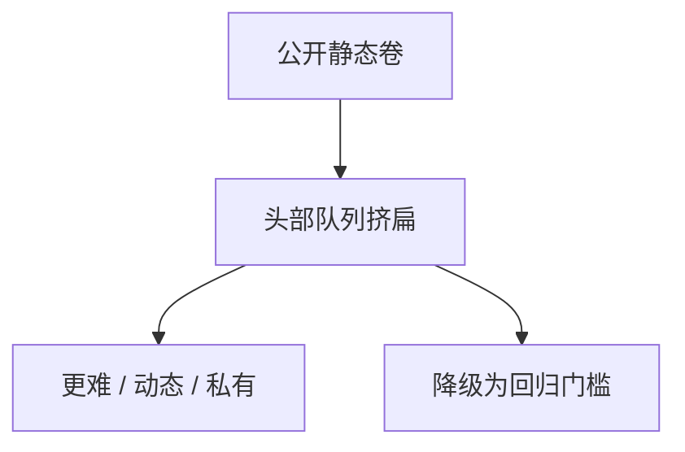

# 基准饱和

准确率靠近标注上限之后，剩余误差是歧义、过时事实与记忆，不是能力差。继续卷总分，信息量按噪声增长。

<footer>—— 对照 [LiveBench](/llm/livebench) 的去饱和设计；Kiela 等 Dynabench 对静态榜的批评</footer>

[上一课](/llm/eval-harness)把仪器冻住。冻住的公开卷会在数年内被做满。本课写饱和。缺口是：SOTA 表上的 0.5 分不再支持「更强」的声明。后课模型卡默认：接近天花板的基准应降级为回归测试，而不是主声明。

## 问题

MMLU 一类四选一有标注错误与过时题。Gema 等对 MMLU 标注的审计说明：高分段的对错混进了金标噪声。模型越大越会拟合题解站，饱和与[污染](/llm/eval-contamination)一起到来。这时平均准确率的方差主要来自题面争议，不是参数量。

第二条路是题太容易：随机基线 25%，从 85% 到 90% 与从 40% 到 45% 的含义不同。第三条路是产品任务已经换了（工具、长上下文、多轮），旧卷还在当门禁，选出「会考试的模型」。

饱和不是「基准无用」。它是「该基准对前沿模型的鉴别力下降」。对小模型与量化回归，同一卷往往仍有刻度。

## 方法

诊断：看分位，不看均值。若多数模型挤在标注一致率附近，换更难的卷（GPQA、FrontierMath、LiveBench 月包）或换私有同分布集。动态基准靠时间戳抵抗记忆，但要版本化，见 [LiveBench](/llm/livebench)。人评与 Arena 在开放任务上不饱和得那么快，但偏风格，后一单元再写。

发布策略：饱和卷改为「不得低于」门槛；主表换成仍有头尾差的卷。不要靠 decile 上的抖动发新闻稿。

## 机制

鉴别力来自误差的系统差。误差若被金标噪声主导，排名变成对噪声的过拟合。污染把「见过的题」从误差里删掉，进一步压扁头部。动态出题恢复误差，但引入窗口不可比；必须报 $\mathrm{Acc}(M,W)$。私有集恢复鉴别力，牺牲外部复现——模型卡里要写清哪些声明可外部复核。

## 边界

本课不点名「某某榜已死」。是否饱和取决于你比较的模型集合。下一课把「测了什么、没测什么、哪张榜已当回归」写进模型卡。

## 小结

- 接近标注上限后，总分差没有能力含义。
- 饱和卷改门槛，主声明换仍有鉴别力的仪器。
- 动态与私有补鉴别力，分别牺牲可比性与公开复现。
- 出处：Kiela 等 Dynabench；LiveBench；GPQA；MMLU 标注审计。
