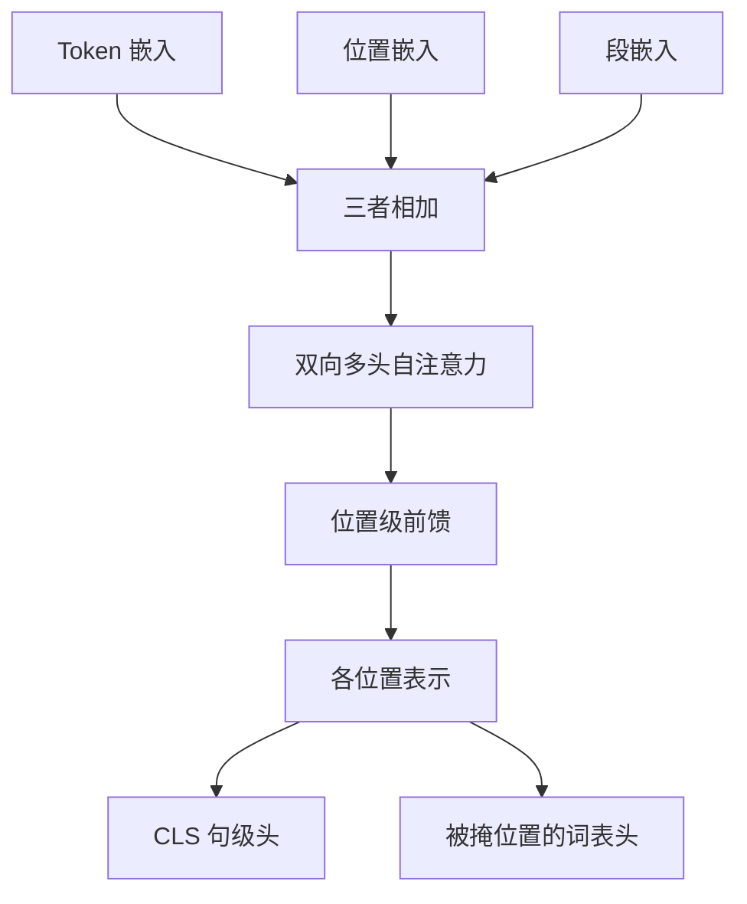

# BERT 编码器结构

我们用掩码语言模型预训练一个深层双向 Transformer 编码器，使每个位置的表示同时条件于左右两侧。

<footer>—— Devlin et al., BERT: Pre-training of Deep Bidirectional Transformers for Language Understanding, NAACL 2019</footer>

[上一课](/llm/task-arithmetic)把权重空间里的任务向量当一等对象：差值可以加减、可以在检查点之间迁移。那一课默认的主干仍是因果解码器。补层「架构进阶」从这里改对象：纯解码器没有把**编码器**和**编解码器**写成可替换的计算图，双向自注意力、段嵌入、`[CLS]` 池化都被当成历史脚注。本课把 BERT 的编码器栈收成后课默认会用的结构；[掩码语言模型](/llm/masked-lm)只讲目标，不讲这块栈。后课的相对偏置、去噪编解码、前缀掩码，都假定你会本课的层序，不再从「什么是双向」讲起。

## 问题

[因果自注意力](/llm/causal-self-attention)强制位置 $t$ 只读 $j\le t$。生成需要这条约束；判别、检索、把整段源句压成记忆，则需要相反的连通性：位置 $i$ 的查询打到整段键。训练基础课把优化、缩放、合并都建在解码器只模型上，留下的缺口是——**同一套** [SDPA](/llm/sdpa) 与 [多头](/llm/mha)，掩码拿掉之后，栈还要哪些槽位才构成一个能微调的编码器。

缺口不是再推一遍缩放点积。缺口是三件解码器里没有或用法不同的东西：全可见自注意力、句对的段嵌入、专供分类的 `[CLS]` 位置。没有它们，后面的嵌入池化、前缀掩码都会没有落点。

BERT 原文的位置编码是可学习绝对位置，最长 512，与正弦位置不是同一课。本课只把位置槽位当成编码器的一部分，不重写外推。

## 方法

一层编码器是：双向多头自注意力，接残差与层归一化，再接位置级前馈，再残差。没有交叉注意力子层，也没有因果上三角。输入是 token 嵌入、位置嵌入、段嵌入三者相加；段嵌入区分句对里的第一句与第二句。序列头部放 `[CLS]`，尾部与句间放 `[SEP]`。

预训练时每个位置仍出隐状态，[MLM](/llm/masked-lm) 头只在被挖位置上分类；NSP 头吃 `[CLS]`。微调时 MLM 头丢掉，分类、抽取接在 `[CLS]` 或各 token 上。后课默认：说「BERT 编码器」就是指这套**无交叉注意力的双向栈**，不是泛指任何 Transformer。

### 与解码器层的槽位差

解码器一层通常是掩码自注意力、可选的读源端注意力、前馈。编码器一层少中间那块，自注意力也不掩未来。参数量按层计会更省，但源端长度 $m$ 上仍是 $\Theta(m^2)$ 的分数矩阵。这不是本课要改的复杂度，只是后课比较编解码与纯解码时要用的事实。

## 机制

双向注意力让位置 $i$ 的表示成为整句的函数。`[MASK]` 占位不泄漏原词，却保留「这里有一个被查询的槽」。段嵌入把句对相对位置写进加法，不必改掩码形状。`[CLS]` 没有语言学身份，它是一个可学习的汇合查询：各层都在读全句，最后一层的该向量被当成句级特征。

深度上 BERT-base 12 层、BERT-large 24 层，头数与隐宽度按 $d_k=64$ 对齐。后课不需要背这些型号，需要记住：**深度用来叠双向交互，宽度用来分头**，没有编码器–解码器之间的交叉对齐。

双向不是「两个单向拼起来」。ELMo 的左右 LSTM 参数不共享、交互只发生在拼接之后。BERT 的每一层里左右已经在同一套 $Q,K,V$ 里相遇。

## 边界

编码器默认假设整段输入在前向开始时已经齐。流式、自回归生成不能直接逐步采样；要生成得改目标或外接解码器。`[CLS]` 作句向量在分类上可用，作语义检索往往不如后课的均值池化。绝对位置 512 把长文档挡在训练分布外，这是结构承诺，不是优化失败。

## 小结

- 本课把 BERT 编码器收成：双向自注意力加前馈的栈，外加段嵌入与 `[CLS]`；后课默认不再解释这套槽位。
- 相对因果解码器，差别不在 SDPA 公式，而在掩码、交叉注意力缺席、句级汇合方式。
- `[CLS]` 是可学习的句级查询，不是语义检索的默认池化。
- 编码器假定源序列一次给齐，不能代替自回归生成。
- 出处：Devlin et al., *BERT*, NAACL 2019。
