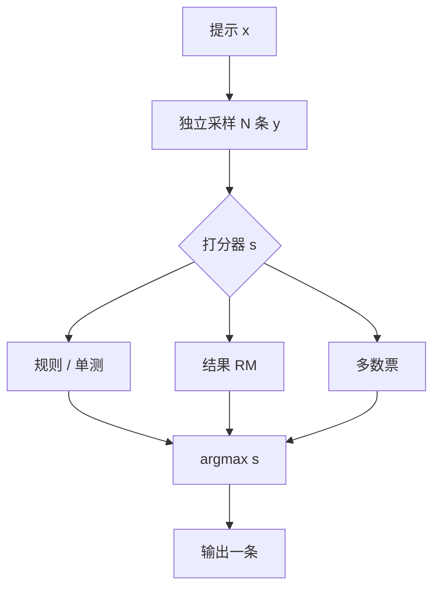

# Best-of-N

从同一问题上抽出许多独立样本，再用一个核对器选出最好的那一条，往往比把同一个模型再做大更立刻见效。

<footer>—— 对照 Cobbe 等用验证器对数学题多候选排序的做法，以及后续奖励模型上的 Best-of-N</footer>

Best-of-N（BoN）不改权重：对同一提示独立采样 $N$ 条，按打分函数 $s(x,y)$ 取 $\arg\max_i s(x,y_i)$。打分可以是规则核对、多数票、过程奖励或偏好模型。它是推理期的[测试时计算](/llm/test-time-scaling)，也是拒绝采样微调的数据过滤器。本篇只写这条「多样本再挑一条」的机制，不把训练期的[群体相对基线](/llm/group-relative-baseline)再讲成同一种算法——后者用相对量更新 $\theta$，BoN 用相对量选择输出。

## 问题

自回归一次解码是对 $\pi(y\mid x)$ 的单次抽取。温度大于 0 时，正确解可能以不大的概率出现，错误解占满质量。若任务可核对（数学最终答案、单测、约束满足），浪费在「再抽几次」上的计算，常常比再训一个更大模型便宜。问题是：打分函数必须比生成器更可靠，否则 $N$ 越大越会选出 *打分器喜欢但任务错误* 的样本；以及 $N$ 条 decode 的 KV 与墙钟按近线性涨，服务上不是免费的搜索。

BoN 要回答的不是「要不要采样」，而是「在固定的 $\pi$ 上，把额外 FLOPs 花在宽度（更多独立候选）还是深度（更长思维链、树搜索）」。Snell 等人 2024 年的测试时计算工作把 Best-of-N 当作一条基线，并表明最优策略随题目难度变；简单题上盲目加大 $N$ 很快饱和。

### 核对器弱于生成器时，$N$ 是放大器

若 $s$ 与真值相关很弱，BoN 放大的是 $s$ 的黑客：更长、更礼貌、更像标准答案格式。$N=1$ 时黑客偶尔出现；$N=64$ 时搜索会稳定找到高 $s$ 的模式。因此 BoN 的极限由 $s$ 的校准决定，不由 $\pi$ 的覆盖决定——$\pi$ 只要还能抽出一条真对的，$s$ 若看不见它，仍选不到。

多数票（self-consistency）是 BoN 的特例：$s$ 等于「同一最终答案出现的次数」，不需要外部模型。它假设错误分散、正确集中。当模型系统性犯同一类错，多数票会把错的选稳。不要把多数票写成「免费的真值」。

## 方法

对 $i=1,\ldots,N$ 独立采样 $y_i\sim\pi(\cdot\mid x)$（通常 $T>0$，可加 nucleus）。计算 $s_i=s(x,y_i)$，输出 $y_{i^\star}$。$s$ 的常见来源：

- **规则 / 执行**：抽出 boxed 答案与标准答案比对；代码跑测试。分数近似 0/1，BoN 退化成「直到抽中对的或用尽 $N$」。
- **结果奖励模型（ORM）**：对完整 $y$ 打一个标量，InstructGPT 对齐流水线里常用。
- **过程奖励模型（PRM）**：对步骤打分再聚合，见[过程奖励引导的搜索](/llm/prm-guided-search)。BoN 仍可以只在完整候选上取 $\min$ 或末步分。
- **多数票**：按解析后的答案分组，取最大桶里任意一条（或桶内再按 $\log\pi$ 打破平局）。

与束搜索的差别：BoN 的 $N$ 条是独立的完整路径，靠采样多样性覆盖模式；束是共享前缀的局部扩展，见[Beam vs Sampling](/llm/beam-vs-sample)。BoN 不需要逐步打分也能工作；有逐步打分时，通常改走束或 MCTS，而不是把 $N$ 条完整链全部生成后再扔掉 $N-1$ 条——后者浪费前缀计算。

### 训练侧：拒绝采样而不是只在推理挑

用 $s$ 滤出高分样本再 SFT，是拒绝采样 / RFT 一类工序：BoN 的「选」发生在造数据时，部署仍可以 $N=1$。DeepSeek-R1 报告里的拒绝采样再 SFT，用的就是这类过滤，而不是让每个用户请求都跑 $N=64$。推理 BoN 与数据 BoN 不要共用一个 SLA：前者直接打在用户延迟上，后者打在离线算力上。

## 机制

在 $\pi$ 能以概率 $p$ 抽出可被 $s$ 判对的样本、且 $s$ 近似无假阳性时，失败概率大约 $(1-p)^N$，随 $N$ 指数下降。$p$ 很小（难题）时需要巨大的 $N$ 才看得到曲线抬头；$p$ 已经接近 1 时，$N>4$ 几乎无收益。这就是难度分桶的来源：BoN 的最优 $N$ 不是全局常数。

若 $s$ 有假阳性率 $q$，则 $N\to\infty$ 时输出分布收敛到 $s$ 的模式，而不是真值的模式。相关文献里把「对奖励模型做 Best-of-N」当作衡量 RM 过优化的探针：质量先升后降。工程上要同时报两条曲线：对真值的准确率，和对 $s$ 的分数。只报分数，BoN 永远看起来更好。

独立采样才能把覆盖写成 $(1-p)^N$。若 $N$ 条共享 KV 前缀却在中途用同一束、同一随机种子，有效多样性远小于 $N$。日志里应记下温度、是否独立 RNG、是否共享前缀缓存——共享前缀省[Prefill](/llm/prefill-compute)，但会降低样本独立性。

## 边界与工程取舍

### $N$ 线性买的是 decode，不是免费质量

$N$ 条并发生成时，KV 与显存按 $N$ 涨，受[Decode 显存墙](/llm/decode-memory-wall)约束；串行则延迟按 $N$ 涨。前缀相同时应做前缀缓存，只付一次 prefill。产品上 BoN 适合离线判题、竞赛、或「用户愿意等」的思考模式，不适合把每一个短指令都乘 16。与其全局 $N=32$，不如按题目难度或模型自洽不确定性调节 $N$，这正是计算最优测试时缩放的思路。

不要把 BoN 的准确率曲线直接写成模型能力。同一 $\pi$，换一个更强的 $s$，曲线会整体平移。比较两个基座时必须固定 $s$、固定 $N$、固定采样温度。开放式写作几乎没有无争议的 $s$，BoN 会把文风推向 RM 的偏好，而不是「客观上更好」。许可证与评测集泄漏：用测试集规则当 $s$ 去挑，报的是作弊后的 pass@N，应明确标注。

Cobbe 等 2021 年的数学验证器、Ouyang 等 2022 年 InstructGPT 里对 RM 排序的采样，以及 Snell 等 2024 年把 Best-of-N 当测试时基线，是公开出处。不要给 o1 编造一篇「Best-of-N 论文」或虚构 arXiv。

## 小结

- Best-of-N：同一提示采 $N$ 条，用 $s$ 选一条；改的是推理（或造数据），不改 $\pi$ 的梯度。
- $s$ 可以是规则、ORM、PRM 聚合或多数票；上限由 $s$ 的校准决定。
- 真值覆盖随 $N$ 近似 $1-(1-p)^N$，但假阳性会把极限拉向 $s$ 的模式。
- 训练期过滤与推理期 BoN 成本落在不同账单上，不要共用延迟 SLA。
- 独立采样、温度、前缀共享都会改变有效 $N$；要写进实验记录。
- 难度分桶：简单题 $N$ 很快饱和，难题 $N$ 可能不如改搜索结构或改训练。
- 出处：Cobbe et al., *Training Verifiers to Solve Math Word Problems*, 2021；Ouyang et al., *InstructGPT*, 2022；Snell et al., *Scaling LLM Test-Time Compute Optimally…*, 2024。
