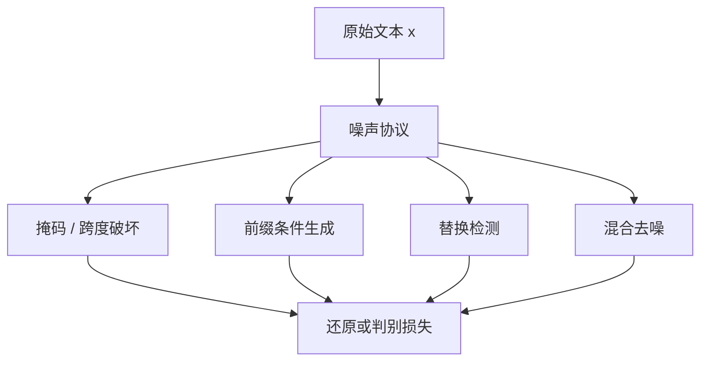

# 下一 token 之外的预训练目标

把所有 NLP 任务收成「把一段文本变成另一段文本」，预训练目标就不必绑死在从左到右的下一个词上。

<footer>—— Raffel et al., Exploring the Limits of Transfer Learning with a Unified Text-to-Text Transformer, JMLR 2020</footer>

因果语言模型把预训练写成 $p(x_t \mid x_{<t})$，实现简单、与解码对齐，因此成为今日解码器的默认。它不是唯一能从无标注文本里榨出表征的目标。掩码还原、跨度破坏、替换检测、前缀条件生成，都在同一份语料上问不同的问题：有的强迫模型填洞，有的强迫模型判别「这个词是不是被换过」，有的在双向上下文里做条件生成。本篇把「下一 token 预测」（NTP）放在一边，看这些替代目标各自约束什么、和 NTP 差在信息流，以及为何大规模解码器最终仍常回到 NTP，却把别的目标留在编码器、再训练与混合去噪里。

## 问题

NTP 的梯度只来自已经出现的左侧上下文。右侧信息、文档级主题、以及「某个位置被挖掉之后如何重建」这类完形填空信号，都不会直接进入损失。对要做分类、抽取、跨句对齐的编码器，这是结构性缺陷：训练时永远看不到未来，推理时却常常需要双向。对生成模型，NTP 也有代价——每个 token 只被预测一次，低频模式与难跨度得不到额外监督，模型容易学会局部流畅而不是文档级一致。

替代目标要回答的是：在不引入人工标注的前提下，能否换一种噪声与还原协议，让同一段文本产生更密或方向不同的学习信号。Raffel 等人把这个问题收成 T5 的统一框架：输入是带噪声的文本，输出是要还原的片段。噪声怎么造，就是目标怎么定义。

### 信息流与损失密度

NTP 对长度为 $n$ 的序列给出 $n$ 个条件分布，损失密度高，但每个位置的条件集是真前缀。掩码语言模型一次只还原被挖掉的位置，双向可见，损失更稀。ELECTRA 一类替换检测把每个位置都变成判别问题，密度回到全序列，却把生成改成了真假分类。选择目标，本质是在「条件方向、监督密度、与下游接口是否同构」之间做取舍。「与下游同构」经常被高估。编码器预训练用掩码、微调做分类，接口并不同构，却长期有效；解码器用 NTP 预训练再做对话，接口更近，也不保证数据与对齐阶段不出问题。同构是工程便利，不是充分条件。

## 方法

把一段文本 $x$ 经噪声函数变成 $\tilde x$，再要求模型预测某个目标 $y$。NTP 是噪声为空、$\tilde x = x_{<t}$、$y=x_t$ 的特例。常见非 NTP 协议如下。

掩码还原：按比例把 token 换成 `[MASK]`，预测被掩位置的原词。跨度破坏（T5）：连续跨度被哨兵替换，解码器只生成被抹掉的片段，而不是整句重写。前缀语言建模：前缀段双向可见，后缀段因果生成。替换检测：用一个生成器提议替换，判别器判断每个位置是否被改过。混合去噪（UL2 一类）把多种噪声半径与方向打成任务混合物，用一个哨兵告诉模型当前是哪一种。

$$
\mathcal{L} = \mathbb{E}_{(x, \tilde x, y)}\bigl[-\log p_\theta(y \mid \tilde x)\bigr]
$$

$y$ 可以是被掩 token、被破坏跨度、整段原文，或每个位置上的真/假标签。目标一旦改变，$y$ 的支撑与 $\tilde x$ 的可见性一起变，优化景观与可并行度也一起变。

### T5 跨度破坏在问什么

C4 上的 T5 并不做 BERT 式单 token 掩码。它采样若干连续跨度，用哨兵替换，解码器按顺序吐出各跨度原文。模型必须：在编码器侧用双向上下文定位缺口，在解码器侧按 NTP 把缺口写出来。这比「只预测一个被掩词」更接近生成，又比纯 NTP 多了「先看全句再写局部」的编码阶段。Raffel 等人同时比较了 BERT 风格掩码、前缀 LM 与跨度破坏，跨度破坏在他们的文本生成设定里更划算——不是因为 NTP 失败，而是因为编码器-解码器加上缺口还原，把双向编码和自回归写出接到了同一套参数上。

跨度长度是超参，不是理论常数。太短接近 BERT；太长接近整句重写，计算浪费在已经可见的 token 上。T5 用平均跨度与掩码率来折中，后续 UL2 把「短缺口 / 长缺口 / 因果」显式分成几种噪声，避免只盯一个半径。

## 机制

非 NTP 目标改的是计算图里的可见性掩码，以及损失写在哪些位置上。双向掩码让位置 $i$ 的表示可以读 $j>i$，前提是 $j$ 未被当成要预测的洞，或洞被哨兵占住。前缀 LM 把可见性切成两段：前缀全连接，后缀三角。替换检测不还原词表分布，只输出一个伯努利，梯度来自「像不像真词」，对生成解码没有直接接口，却对判别式下游很顺。

### 监督密度与假阴性

掩码率 15% 意味着 85% 的 token 没有直接损失。提高掩码率能加密监督，但上下文被破坏得太狠，条件分布与真实语言渐行渐远。替换检测把每个位置都变成标签，密度高，可是生成器若太弱，替换一眼假，判别器学不到难例；生成器若太强，替换接近真分布，判别信号又变稀。这是对抗式目标在预训练里的老问题：密度与难度不能靠单一超参同时拉满。

NTP 没有这个问题：每个位置都有真下一词，难度由数据本身提供。这也是它在超大规模解码器上难被替换的原因——实现、吞吐、与采样接口三者对齐，替代目标必须在别处把账补回来，例如更好的双向表征，或同样算力下更快的下游迁移。

## 边界与工程取舍

今日主流生成模型预训练仍以 NTP 为主，并不等于其他目标被证伪。编码器、检索器、重排器仍大量使用掩码或对比；指令微调与思维链则是在 NTP 接口上换数据，不是换目标。把「超越 NTP」写成必须换损失，会漏掉更常见的做法：数据、配比、合成改写，损失仍是下一 token。

工程上，非 NTP 目标往往更难与因果推理栈共用内核。双向注意力不能直接套 KV 缓存；替换检测的判别头在生成时无用，要另接解码器；混合去噪需要任务哨兵，数据管道与打包格式都变。若最终产品是自回归聊天，为预训练换一套目标，必须能在迁移阶段把双向或判别能力转化成生成质量，否则多出来的实现复杂度没有回报。

不要把「下一 token 之外」理解成必须抛弃似然。跨度破坏的解码器端仍是 NTP；UL2 的因果模式就是 NTP。真正换掉的常常是编码器可见性与噪声半径，而不是 softmax 交叉熵本身。

对照实验还应避免把架构差异算进目标差异：BERT 是编码器，GPT 是解码器，T5 是编码器-解码器。Raffel 等人在同一 T5 骨架上扫过多种噪声，才有资格谈目标；拿 BERT 分数和 GPT 分数直接比，比的是整条系统。本篇只讨论目标协议，不把某一架构写成唯一正确的预训练方式。

## 小结

- NTP 以外的预训练目标，核心是换噪声与可见性：掩码、跨度破坏、前缀条件、替换检测、混合去噪。
- 损失密度、条件方向、与下游接口是否同构，三者通常不能同时最优。
- T5 把任务统一成文本到文本，跨度破坏是其中在生成设定下较划算的一种噪声，而不是对 NTP 的否定。
- 替换检测加密监督，但把生成改成判别，和自回归解码不对齐。
- 大规模解码器仍常回到 NTP，是因为实现、吞吐与采样接口一致；其他目标更多留在编码器与混合去噪里。
- 换目标不等于换似然：许多「非 NTP」协议在解码器端仍用下一 token 交叉熵。
- 出处：Raffel et al.，*Exploring the Limits of Transfer Learning with a Unified Text-to-Text Transformer*，JMLR 2020；对照 BERT 式掩码、前缀 LM 与后续混合去噪工作。
