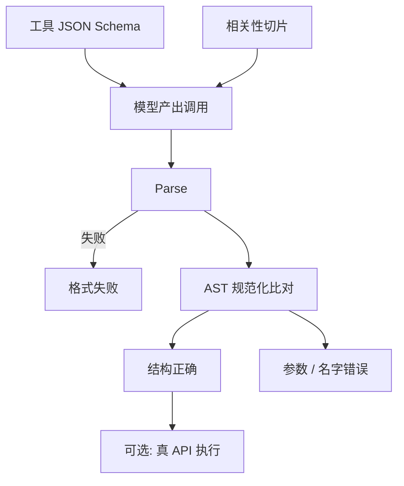

# BFCL 工具调用评测

工具用得好不好，不能只看最终回答像不像人话；要把函数名、参数树和「此时该不该调用」收成可核对的抽象语法，必要时再在真 API 上跑一遍。

<footer>—— Berkeley Function Calling Leaderboard（Gorilla 团队）；对照 OpenAI 式 tools 协议</footer>

[Function calling](/llm/function-calling) 把副作用写成带 JSON Schema 的声明，模型输出名字与参数，宿主执行。产品上这条链路的失败是结构化的：编造不存在的函数、漏必填项、类型错、该并行时串行、不该调用时硬调、该调时却用散文假装查过。Berkeley Function Calling Leaderboard（BFCL）把这些失败写成一张分项表：简单单调用、多函数选择、并行调用、并行加多函数，以及相关性（何时不调）。计分主路径是 AST / 结构匹配，辅以可执行子集上的真调用。它测的是工具协议能力，不是 [ReAct](/llm/react) 散文里偶发的 `Action:` 字符串，也不是 τ-bench 那种带用户与政策的长期代理。本篇写 BFCL 的任务切片、匹配规则，以及为什么「JSON 能 parse」远不够。

## 问题

自由格式工具使用把评测推回字符串相似度：模型写了 `search[` 还是 `Search(`，正则一会儿过一会儿不过。Schema 出现之后，契约变硬了，评测却长期缺公共卷——各家用各家的函数清单和「看起来对」的人工抽查。需要一份冻结的工具集、一份按调用模式分层的题、一套不靠文风的核对。

另一半问题是**负例**。只会调、不会拒绝，在真实系统里是乱写库、乱扣费。只考正例调用，模型可以学成「看见 tools 字段就调一个」，相关性和用户体验一起坏。BFCL 把 irrelevance / relevance 单列，就是为了不让正例准确率代表整条协议。

### 最终自然语言对了，工具轨迹仍可能错

模型可以编造天气数字、不调 `get_weather`，回答仍像那么回事；也可以调对函数、参数错城市，再用一段流畅道歉盖过去。面向用户的 BLEU 或 LLM 法官会奖前者的文风。BFCL 只在调用层计分：名字对不对、参数树是否与金标等价、类型是否可执行。最终答复的有用性交给其他表。

`tool_choice` 是评测的隐形条件。`required` 下的「会不会调」和 `auto` 下的「该不该调」不是同一题。报告必须写明这一字段，否则在比两套产品封装。

## 方法

题按调用模式切片，常见包括：

- **Simple：** 工具清单里一个函数，一次调用。
- **Multiple：** 多个候选函数，选对那个。
- **Parallel：** 同一轮发出多次调用（可同一函数不同参数）。
- **Parallel multiple：** 多函数且并行。
- **Relevance / irrelevance：** 不应调用时保持文本回答；或应调用时不得空转。

后续版本补了多轮（根据工具观察改参数、补调）、REST / SQL 等非 Python 形态、以及 live API。切片必须分列：把并行失败平均进 simple，会让「会写单个 JSON」的模型看起来全面。

核对以 AST 等价为主：把模型输出 parse 成调用树，与金标比函数名、比参数值（允许给定的等价规则，如整数与浮点、同义枚举）。这比字符串全等宽容，比 LLM 法官严。可执行子集把调用真的跑掉，用返回值或副作用判定——能抓住「结构对、语义在 API 上非法」的题，但受网络、鉴权、时间波动影响，不适合当唯一 CI。

$$
\mathrm{Acc}_{\mathrm{AST}}=\frac{1}{N}\sum_i\mathbf{1}\bigl[\mathrm{canon}(\hat{c}_i)=\mathrm{canon}(c_i^\star)\bigr]
$$

$\mathrm{canon}$ 包含参数排序、默认值填充、类型规范化。私自改 canon，分数不可比。

### 语言与 schema 细节是一等公民

同一题在 Python、Java、JavaScript 里的类型字面量不同；REST 还要把参数拆进 path / query / body。只报 Python 子集，不能签发「工具调用 SOTA」。schema 里 `required`、枚举、嵌套 object 的深度，决定失败是「没选对函数」还是「嵌套树塌了」。应保留按语言、按 schema 深度的分项。

## 机制

Simple 成功，说明模型能把自然语言槽位填进一张已知卡片。Multiple 成功，还要在描述文本上做工具检索——描述写得含糊时，失败是文档问题也是模型问题。Parallel 要求一次解码产出列表，而不是「先调一个、等观察」；许多只在单调用数据上对齐的模型会把并行拆成多轮，或漏第二次。这与聊天模板如何渲染 `tool_calls` 数组强相关：训练时没见过数组，推理时就不会写。

相关性是另一条决策边界。提示里有工具，并不意味着本轮的用户话需要副作用。模型要把「问天气」和「问天气 API 怎么设计的」分开。过调往往来自对齐数据里工具示范过多；欠调来自安全拒答或「先口头答」的先验。BFCL 的负例把这条边界变成准确率，而不是产品日志里的轶事。

### 幻觉函数名是检索失败，不是 JSON 失败

输出能 `json.loads`、名字却不在清单里，约束解码按 schema 本可禁止。BFCL 在纯采样设定下仍应保留这类题，用来测模型自己的清单服从；开约束解码后，这类错误会消失，分应记在系统列。参数类型错误类似：字符串对数字、缺嵌套字段，文法能挡一部分，业务合法值挡不住。评测分层与 [JSON Schema 解码](/llm/json-schema-decode) 的边界要写清。

AST 匹配对参数的字符串级金标敏感。同一城市 `NYC` 与 `New York` 可能一个算对一个算错。等价规则必须公开，否则是在考是否撞上标注习惯。

## 边界与工程取舍

BFCL 不测长期用户博弈、不测政策文档冲突、不测工具失败后的恢复是否符合业务规则——那些是 [τ-bench / AgentBench](/llm/taubench-agentbench)。它也不测工具执行是否安全：白名单、鉴权、注入是宿主的事。高 AST 分只说明协议层像金标。

题库公开后，函数名与示范会被指令数据模仿。live / 多轮版本缓解一部分静态背题，但不能消除针对 leaderboard 的微调。内部应另备私有 schema 与私有话术。可执行评测要处理非确定性 API：时间、库存，金标不能是唯一死值，应用不变量（类型、字段存在、幂等错误码）。

费用上，完整切片加多语言加 live 很贵。CI 可用 Python simple + multiple + irrelevance；发布再跑并行与多轮。不要用 simple 一项代表 BFCL。

把 ReAct 轨迹用正则抽成伪 function call 再送进 BFCL 脚本，测的是转换器，不是原生 tools 协议。模板必须与训练一致。

## 小结

- BFCL 按调用模式与相关性切片，用 AST 等价（及可选真执行）测工具协议，而不是最终口播质量。
- Simple、多函数、并行、负例必须分列；`tool_choice` 与约束解码要写入协议。
- 能 parse 不等于名字在清单里、参数业务合法。
- 多语言与嵌套 schema 是一等分项；只报 Python 单调用会偏乐观。
- 它不替代带用户模拟与政策的代理基准，也不替代安全审计。
- 出处：Berkeley Function Calling Leaderboard（Patil / Yan 等，Gorilla）；工具信封见 OpenAI 兼容 `tools` 字段。
