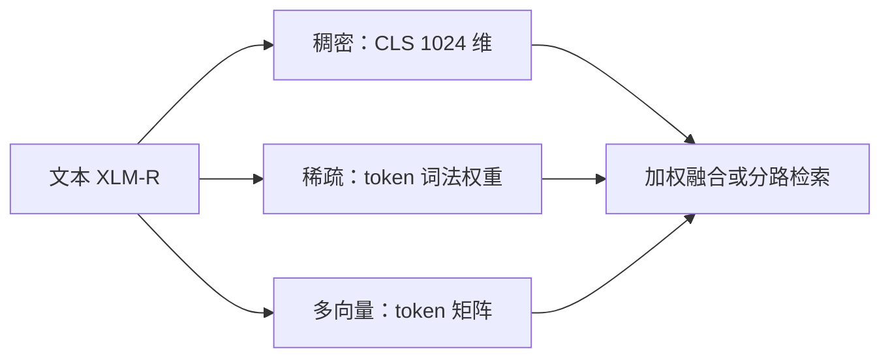

# BGE-M3

    
同一个编码器同时给出稠密向量、词法稀疏权重和 ColBERT 式多向量，并在百余语种与最长 8192 token 的粒度上工作。

    <footer>—— Chen 等，BGE M3-Embedding: Multi-Lingual, Multi-Functionality, Multi-Granularity Text Embeddings Through Self-Knowledge Distillation，arXiv:2402.03216</footer>

北京智源与中国科学技术大学的 Jianlv Chen、Shitao Xiao、Peitian Zhang、Kun Luo、Defu Lian、Zheng Liu 发布 **M3-Embedding**（开源检查点 `BAAI/bge-m3`）：宣称同时满足多语（100+）、多功能（稠密 / 稀疏 / 多向量）、多粒度（短句到 8192 token）。骨干是把 XLM-RoBERTa-large 经 RetroMAE 加长再对比学习、再统一微调。训练上用**自知识蒸馏**：把三种打分集成当教师，缓解多目标互斥；并用按长度分桶的高效 batch，使 8192 长度下也能维持大批次。本篇写三个头如何共用一个编码器，以及 MIRACL / MKQA / MLDR 上该引用哪些行。

## 问题

英文嵌入模型不能直接当世界检索器：低资源语种、跨语检索、中文语料各自为政。功能上，IR 系统往往同时要双塔 ANN、词法匹配（罕见标识符）、以及细粒度交互；分别训三个模型则三次编码、三次版本漂移。粒度上，多数对比学习把序列截到 512，长文档只能靠切块，块向量看不到文档级主题。M3 把这三件事收进一个前向：`[CLS]`（或等价池化）走稠密；token 隐状态经线性 + ReLU 得到词表上的稀疏权重；全体 token 向量走 MaxSim 式多向量。

数据是另一半问题。论文分三阶段源：从维基、S2ORC、mC4、NLLB、CCMatrix 等抽出的 12 亿级无监督对（含跨语平行）；MS MARCO、HotpotQA、DuReader、MIRACL、Mr. TyDi 等有监督；以及稀缺方向的合成。无监督只训稠密；微调阶段才上三种功能与难负例（ANCE 风格）。不要把 12 亿对理解成 12 亿人工标注相关。

### 三种分数可以融合，但不能假装同构

稠密是单向量点积，适合 ANN。稀疏是共现词权重之和，像可学习的词法检索。多向量是 $\sum_i \max_j q_i^\top p_j$，存储与计算最重，通常只对召回短名单重算。融合 $s = w_1 s_{\text{dense}} + w_2 s_{\text{lex}} + w_3 s_{\text{mul}}$ 的权重随任务变，论文里均分只是示例。生产上常见「稠密或稀疏召回，多向量只用于重排前 100」，否则索引体积回到 ColBERT 量级。

检查点 `bge-m3` 稠密维 1024、最大长度 8192。`bge-m3-unsupervised` 与 `bge-m3-retromae` 是中间阶段，不是同一评测行。英文专用 `bge-large-en-v1.5` 窗口 512，不要用 M3 的 MIRACL 分去描述它。

## 方法

自蒸馏：三种异质预测器按集成学习做成更准的相关分，再蒸馏回各头，损失为原对比损失与蒸馏项之和。这样稀疏头不会在联合训练里被稠密头完全压掉——消融表显示关掉蒸馏后各头都掉，稀疏更明显。Batch：按长度分组采样，减少 padding；长序列再切成子 batch，梯度检查点后拼嵌入，8192 长度下 batch 可增大二十倍以上；跨 GPU 广播嵌入以扩大 in-batch 负例。另提出推理期 MCLS（多 CLS）补丁，给没资源训长文本的用户，效果弱于真训长序列，见论文 Dense-w.o.long 行。

MIRACL 开发集 18 语种 nDCG@10：稠密平均 67.8，稀疏 53.9，多向量 69.0，稠密+稀疏 68.9，三路全开 **70.0**；对照 mE5-large 65.4、E5-mistral-7B 62.2、OpenAI text-embedding-3-large 平均 54.9（该行部分语种未报）。MKQA 跨语 Recall@100 上，稠密已强，全开再边际提升，低资源语种稳定性好于若干只在高资源语种领先的基线。MLDR 多语长文档与 NarrativeQA：稀疏与融合往往明显高于只密；NarrativeQA 上 All 的 nDCG@10 为 61.7，对照 text-embedding-3-large 的 51.6。引用时写「MIRACL 18 语平均、nDCG@10、dev」，不要把单语峰值当成模型常数。

### 索引与混合检索

落地通常：文档侧预计算稠密与稀疏，多向量按存储预算可选。查询侧一次前向出三路。融合可在分数域或 RRF 域；与 BM25 再混时，M3 稀疏已是神经词法，注意不要与 BM25 双计同一信号而不做校准。切分策略仍独立：8192 是上限不是「永不切」。超长库仍要块，只是块可以更大。见 [混合检索](/llm/hybrid-retrieval) 与 [向量检索与切分](/llm/rag-chunking)。

## 机制

自蒸馏的机制假设是：稠密擅长改写，稀疏擅长精确词，多向量擅长对齐局部短语；教师比任一学生更稳，学生再各自逼近教师，避免直接多损失加权时某一头塌缩。长度分桶的机制是减少 padding 浪费的 FLOPs，并把负例规模保住——对比学习的判别力强烈依赖 batch 内负例数。RetroMAE 加长预训练让 8k 位置上仍有可用表示，微调才能在 MLDR 上不崩。

跨语靠平行句把不同语言拉到同一空间；这不是翻译系统，低资源语种的 MIRACL 分仍可能低于芬兰语、泰卢固语那种「训练集友好」的语种。代码检索只含 CodeSearchNet 量级的弱信号，不能当专用代码嵌入宣传。

「All = 70.0」是三路都算进去的 MIRACL 平均。线上若关闭多向量，应引用 Dense 67.8 或 Dense+Sparse 68.9，不要继续写 70.0。

## 边界与工程取舍

### 一个模型三路，不等于一路免费

多向量索引按 token 存向量，压缩前体积远大于 1024 维稠密。不需要细粒度时关掉。稀疏维与词表相关（实践中可达数十万维稀疏），要用真正的稀疏倒排或混合引擎，不要当稠密向量存。重排仍应用交叉编码器，M3 的多向量是延迟交互检索，不是 [BGE Reranker v2](/llm/bge-reranker-v2) 那种拼接 Transformer。

许可与检查点以 FlagEmbedding / Hugging Face 卡为准。C-Pack（Xiao 等，arXiv:2309.07597）是 BGE 中文嵌入资源包，M3 是后续多语多功能模型；引用任务时分开。英文为主且要极致延迟时，专用小模型可能更合适。需要词级延迟交互且已有英文 ColBERT 索引时，对照 [ColBERTv2](/llm/colbert-v2) 的残差压缩，而不是假定 M3 多向量已经同样压缩。

无监督 12 亿对与微调百万级标注不是同一分布：前者学对齐与语言覆盖，后者学「何谓相关」。只拿 MS MARCO 微调一个多语编码器，低资源 MIRACL 行通常撑不住。合成数据补的是缺口语种与长文档，质量取决于教师与过滤，不能写成「人工百万长文」。部署时把模型版本、切分、三路开关写进检索日志，否则线上 nDCG 掉了无法归因。

出处：Chen, Xiao, Zhang, Luo, Lian, Liu，*BGE M3-Embedding...*，arXiv:2402.03216。代码 FlagOpen/FlagEmbedding。MIRACL：Zhang 等；MKQA：Longpre 等。骨干叙述含 Conneau 等 XLM-R 与 Xiao 等 BGE 前作。

## 小结

- BGE-M3 一个编码器出稠密、稀疏、多向量，覆盖 100+ 语种与 8192 长度。
- 自知识蒸馏联合三头；长度分桶 + 检查点维持大批次。
- MIRACL nDCG@10：Dense 67.8，Multi-vec 69.0，All 70.0（18 语平均，dev）。
- 生产上多向量常只用于短名单；融合权重要按任务验证。
- 出处：Chen et al.，arXiv:2402.03216。
