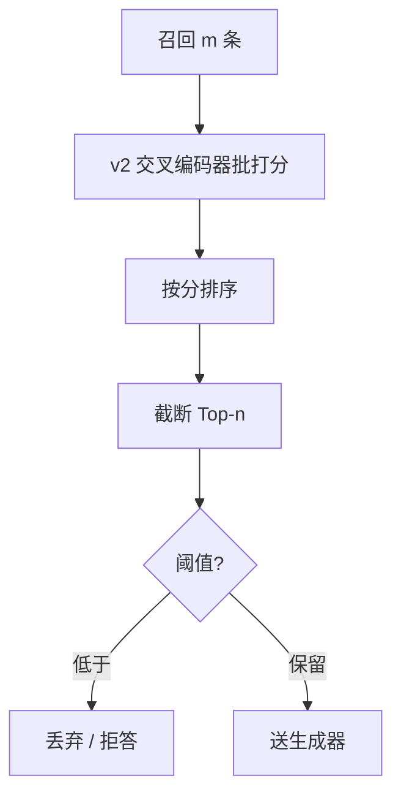

# BGE Reranker v2

    
召回之后，用交叉编码器看查询与候选的拼接，直接打相关分；v2 把这条第二段做成多语可选层数的一组检查点，而不是再训一个双塔。

    <footer>—— 对照 FlagEmbedding 的 BGE Reranker v2 模型卡；骨干与多语能力接 Chen 等 BGE-M3（arXiv:2402.03216）与 Xiao 等 C-Pack（arXiv:2309.07597）</footer>

智源 FlagEmbedding 在双塔 BGE 之后提供交叉编码器重排器。第一代 `bge-reranker-base/large` 基于 XLM-RoBERTa，主打中英、部署简单。**v2** 把家族拆成多条：`bge-reranker-v2-m3`（基于 [BGE-M3](/llm/bge-m3)，约 568M，多语、推理快）、`bge-reranker-v2-gemma`（Gemma 2B 级，多语更强更贵）、`bge-reranker-v2-minicpm-layerwise`（MiniCPM，可选输出层以换速度）。本篇写交叉编码作为第二段的合同、v2 各检查点如何选，以及分数为什么不能跨模型比阈值。它接在 [重排序](/llm/rerank) 的一般原理之后，专写 BGE 这一族。

## 问题

双塔把查询与文档分开编码，看不到否定、数字约束、句内对齐。召回 50–200 条之后，需要一个吃 `[CLS] query [SEP] doc` 的模型逐条打分再截断给生成器。通用英文交叉编码器在中文、多语查询上会把「像官方文档的散文」打高。v1 reranker 覆盖中英；v2-m3 把 M3 的多语表示接到交叉编码目标上，使同一条热路径服务多语 RAG，而不为每个语种维护 reranker。

交叉编码器无法离线索引：每个（查询，候选）一次前向。于是 $m$（重排窗口）由延迟预算倒推。v2 用「同一 API、不同骨干」把精度—延迟做成可选检查点，而不是一个永远的 large。Layerwise 变体允许取中间层 logits 提前退出，等于在深度维买延迟，质量通常单调于层数，但不是物理定律，要在自己的验证集上画曲线。

### 点式打分与归一化

FlagReranker 的 `compute_score` 默认给出未校准 logits；`normalize=True` 时经 sigmoid 压到 0–1。不同检查点、不同长度、不同语种的绝对分不可比。不要把 v2-m3 上的 0.3 阈值抄到 v2-gemma 上。点式分数便于「低于阈值则不送生成器」；这比让 LLM 自己在 50 块里做列表排序更便宜，见重排序文对 Nogueira & Cho BERT 重排路线的对照。

v2-m3 的「m3」指接 BGE-M3 多语骨干，不是「只支持 3 种语言」。Gemma / MiniCPM 变体参数到 2.5B–2.7B 量级，内存与 batch 策略完全不同。模型卡把 v2-m3 标成轻量默认。

## 方法

流水线：第一段用 BM25、BGE 双塔或 M3 稠密/稀疏取 $m$ 条 → v2 交叉编码器批打分 → 稳态排序截 Top-$n$ → 可选阈值。训练数据应含难负例（双塔排高但不相关），否则 reranker 学会模仿第一段偏见。领域切换要微调：代码、工单、法律条款的「相关」与网页搜索不同。FlagEmbedding 提供 `FlagReranker` 与 LLM 式 `LLMReranker` 接口，v2-gemma / MiniCPM 走更重的序列分类或生成式打分实现，集成时按该检查点文档，不要假设与 `bge-reranker-base` 同一头结构。

公开比较应使用同一召回集。模型卡与文档给出选模型启发式：多语用 v2-m3 或 v2-gemma；中英可用 v2-m3 或 MiniCPM-layerwise；极致速度用 v2-m3 或 layerwise 浅层；冲精度用 MiniCPM-layerwise 深层或 v2-gemma。这些是作者建议，不是 MIRACL 官方表。若要引用多语检索数字，应回到 M3 论文的双塔表，或自己在同一 MIRACL 候选上重排后报 nDCG——**不要把 M3 的 70.0 All 写成 reranker 的分数**。

### Layerwise 与蒸馏不是同一件事

MiniCPM-layerwise 在推理时选层，用深度换时间，权重仍是交叉编码。另有 v2.5 Gemma2-lightweight 一类在层与压缩比上做文章，属于后续检查点，不要写进「v2 三件套」的默认表。蒸馏交叉编码器（如 ColBERTv2 所用的 MiniLM 教师）是训练技术；BGE v2 是可部署教师本身。线上热路径用 568M 的 v2-m3 往往比用 7B LLM 列表排序更可控，延迟与费用差一个数量级。

## 机制

自注意力让查询 token 直接看见文档 token，这是 nDCG@10 在重排后上升、召回@200 几乎不变的原因。多语 v2-m3 共享 M3 / XLM-R 词表与表示，对跨语查询—文档对比「英文 reranker + 翻译」少一跳误差。代价是拼接长度：长文档必须截断或再切，重排器看见的可能只是块首，与 M3 8192 双塔不对齐——块边界要与召回切分一致。

分数校准：同一查询下候选分可比；跨查询不可比。拒答规则用分差、名次，少用全局绝对阈。换第一段模型后必须重评 reranker：难负例分布变了，旧阈值会把新召回的真值砍掉。批内 padding 到最长候选，过长尾巴会浪费计算，应对候选做长度分桶。

生成器不是免费 reranker。位置偏差与中间丢失会让 LLM「重排」很差。v2 的工作是专门的相关分；生成器负责引用与冲突说明。高分块仍可能过时。

## 边界与工程取舍

### 第一段没有真值时，重排会更自信地排错

阈值拒答比硬塞三条更安全。多跳 RAG 每跳都跑 gemma-2B 重排会打爆延迟，可只在最后一跳用 v2-m3。不要对重叠切块分别打分却不去重。版权与许可以 BAAI 模型卡为准；Gemma 衍生检查点还受 Gemma 条款约束，与 Apache 风格的部分 BGE 权重可能不同，部署前读卡。

与 ColBERTv2：后者是检索期延迟交互，索引是压缩 token 向量；v2 reranker 是第二段交叉编码，无文档侧离线交互矩阵。与 M3 多向量：M3 MaxSim 仍是双塔族的细粒度，比交叉编码器便宜、比 CLS 点积贵。典型栈：M3 稠密召回 → v2-m3 重排 → LLM。需要通用原理解释时读 [重排序](/llm/rerank)；需要第一段多语时读 [BGE-M3](/llm/bge-m3)。

fp16 推理是模型卡默认加速，分数会相对 fp32 微漂，A/B 必须同一精度。候选过长时应在召回切分边界截断，而不是从块尾切一刀，以免答案跨度落在 reranker 看不见的后半。日志里同时记下召回排名与重排排名，生成器引用的 ID 以重排后为准，避免排障时对上错误的一块。

出处：FlagOpen/FlagEmbedding 与 Hugging Face `BAAI/bge-reranker-v2-m3` 等模型卡；多语骨干 Chen et al. arXiv:2402.03216；BGE 资源包 Xiao et al. *C-Pack* arXiv:2309.07597。交叉编码重排传统见 Nogueira & Cho。不要把未发表的内部 nDCG 写成论文表。

## 小结

- BGE Reranker v2 是多语交叉编码器族：v2-m3 轻量默认，Gemma / MiniCPM 换精度与层数。
- 只重排已召回集合；绝对分不可跨检查点当阈值。
- $m$ 由延迟倒推；layerwise 用深度换时间，要在自己的集上验证。
- 与 M3 双塔、ColBERT 延迟交互、LLM 列表排序是不同系统，分数分列。
- 出处：FlagEmbedding v2 模型卡；Chen et al. arXiv:2402.03216；Xiao et al. arXiv:2309.07597。
