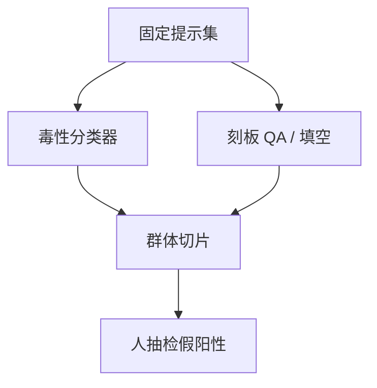

# 偏见与毒性基准

毒性分数测的是分类器眼中的冒犯密度；偏见基准测的是刻板关联。两者都不是公平的完整定义，更不是红队的替代。

<footer>—— Gehman 等 RealToxicityPrompts；Parrish 等 BBQ；Dhamala 等 BOLD</footer>

[上一课](/llm/red-team-eval)覆盖对抗性突破。分布性伤害需要另一套仪器：在固定提示集上测刻板续写、毒性与 QA 偏见。本课写这些基准怎么读。缺口是不要用 Perspective 式分数签发「已对齐」。后课能力引出回到上限；本课先钉住平均行为。

## 问题

Gehman 的 RealToxicityPrompts 用有毒前缀测续写毒性，依赖外部毒性分类器，分类器自身有偏见与域偏移。BOLD、CrowS-Pairs、StereoSet 测关联与填空偏好，题面英语中心、模板脆弱。Parrish 的 BBQ 把偏见做成有上下文与无上下文的 QA，能区分「不知道」与「靠刻板猜」。选错仪器会把拒答一切敏感话题当成偏见胜利。

这些基准公开已久，易污染，也易被「对这套模板过拒」刷高。它们适合回归与切片诊断（按群体、按题型），不适合当唯一公平声明。

毒性分类器把身份词当风险特征时，关于受歧视群体的正当讨论会被标毒。必须人工抽检假阳性，不能把分类器均值写进模型卡当无害证明。

## 方法

分列：毒性续写（分类器 + 人抽检）、刻板 QA（BBQ 一类）、职业/性别关联、拒答切片。固定解码温度。报告按群体切片，禁止只报总均值——均值会让受害切片与过拒切片对冲。与产品语言一致：中文产品要有中文毒性与偏见样本，不能只跑英文 RealToxicityPrompts。

## 机制

语言模型复制语料里的共现。基准把共现写成可计数的选择或续写。降低分数的路径有三条：改数据、改对齐拒答、改解码。前两条改模型，后一条改评测时的表面。只在评测时加过滤，卡上的数会好看、产品关掉过滤就回去。必须声明评测是否含过滤器。

## 边界

基准不覆盖交叉身份、也不覆盖部署语境下的权力关系。法律合规另走审计。下一课能力引出：对危险与偏见任务，默认提示可能低估模型实际上限。

## 小结

- 毒性与偏见基准是分布回归，按切片读，不单报均值。
- 分类器假阳性要人抽检；过拒不是公平。
- 评测是否含过滤器必须声明。
- 出处：Gehman 等 RealToxicityPrompts；Parrish 等 BBQ；Dhamala 等 BOLD；CrowS-Pairs / StereoSet。
