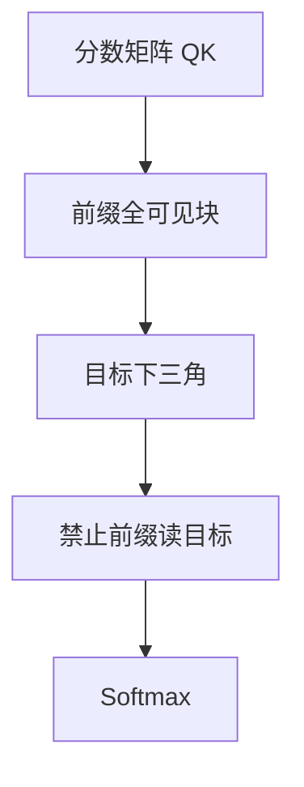

# 双向注意力与前缀掩码

前缀语言模型让编码段内部全可见，解码段仍保持因果；一张掩码矩阵同时承担双向与单向。

<footer>—— Raffel et al., T5, JMLR 2020（Prefix LM）；Dong et al., Unified Language Model Pre-training, NeurIPS 2019</footer>

[上一课](/llm/encdec-vs-decoder-only)把两套栈分开：要么交叉注意力读双向记忆，要么整段下三角。实践里人们常想要第三种——**还是一条栈**，但源前缀内部允许互相看见。本课补前缀掩码：分数矩阵不再是严格下三角，而是「前缀块全 1、目标块下三角、目标不得读未来、前缀不得读目标」。后课的嵌入池化有时就建在这种前缀或全双向段上。

## 问题

纯解码器的因果掩码让源前缀位置 $i$ 看不见源位置 $j>i$，即便 $j$ 在推理时已经齐。这是上一课留下的表示损失。若为这点损失单独训一个编码器，又回到两套权重。缺口是：在同一套 $Q,K,V$ 投影上，用掩码形状模拟「源双向、目标因果」，而不引入[编码器–解码器注意力](/llm/encoder-decoder-attention)子层。

UniLM 用不同掩码把 BERT 栈复用成单向、双向、序列到序列；T5 的 Prefix LM 把输入段当全可见前缀。本课只收掩码图案，不把 UniLM 的全部目标展开。

padding 掩码仍要叠加上去。前缀掩码管的是合法上下文集合，不是变长 batch 的填充。

## 方法

设序列为前缀 $p_{1:m}$ 接目标 $x_{1:n}$。掩码 $M\in\mathbb{R}^{(m+n)\times(m+n)}$ 在 softmax 之前加到 [SDPA](/llm/sdpa) 分数上：

- 前缀行、前缀列：全部允许（含自己）；
- 目标行、前缀列：全部允许（每个目标位置可读完整前缀）；
- 目标行、目标列：仅 $j\le i$；
- 前缀行、目标列：全部禁止（前缀表示不得依赖尚未生成或不应泄漏的目标）。

训练时目标段教师强制，与推理逐步展开一致。前缀在训练与推理都完整给出。实现上常把 $M$ 写成加性的 $0/-\infty$ 矩阵，与因果下三角核融合，而不是真的分两次注意力。

### 和交叉注意力的代数差别

交叉注意力里源键值来自另一栈的输出，查询来自目标层。前缀掩码里源与目标的表示在同一残差流、同一层投影里混合：目标位置读到的「源」是当前层已经与更浅层目标混合过的前缀，而不是独立编码器的记忆。层越深，前缀表示越被目标段的梯度塑造——这是单栈的代价与好处。

## 机制

前缀块的全可见恢复了源内双向：指代、后置约束可以进前缀每个位置的键。目标段仍满足自回归分解。信息流的不对称由掩码保证：目标可以读前缀，前缀不能读目标，避免训练时用未来摘要来编码文章。

相对两套栈，参数少、实现与解码器只检查点兼容，前缀 KV 仍可缓存。相对严格因果，源侧表示质量上升，代价是前缀长度 $m$ 上出现 $m^2$ 项，且自定义掩码不一定走满优化过的因果核。

GLM 一类「空白填入」会把被预测的片段放到后面、前面当双向前缀，掩码图案随任务变。本课的矩形前缀是最简图案；变体只改哪些下标算前缀，不改「块状允许」这一方法。

## 边界

前缀掩码不是免费的编码器。前缀与目标共享层归一化与前馈，源表示会被生成损失拉偏；纯判别任务仍可能更适合冻结的双向编码器。FlashAttention 一类核默认因果或全注意力，任意块状掩码要走灵活注意力或拆成两次计算。分隔符必须让模型分清 $m$ 的边界，否则块状掩码与内容分界会对不齐。

## 小结

- 前缀掩码在单栈上模拟「源双向、目标因果」：前缀块全可见，目标可读前缀，前缀不可读目标。
- 与交叉注意力不同，源键值与目标查询同层、同残差流，源表示会被生成损失塑造。
- 它补上纯解码器源内看不见右边的缺口，但不等于独立编码器记忆。
- 自定义掩码与高效因果核之间有实现摩擦。
- 出处：Raffel et al., *T5* 中的 Prefix LM；Dong et al., *UniLM*, NeurIPS 2019。
