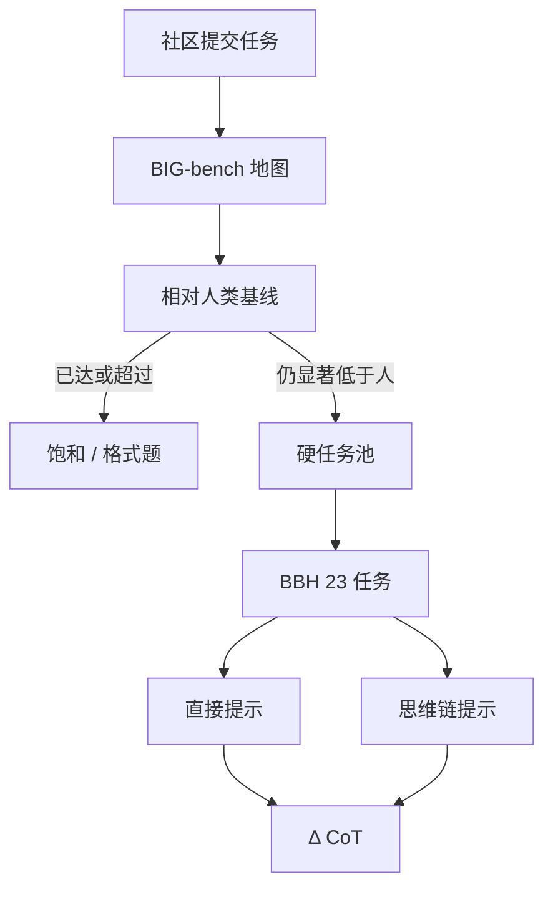

# BIG-bench / BBH

模仿游戏的边界不在下一道阅读理解，而在数百个社区提交的古怪任务上；其中人类仍稳赢的那一小撮，后来被单独拎出来，叫做 BIG-bench Hard。

<footer>—— Srivastava et al., BIG-bench；Suzgun et al., BBH</footer>

2022 年前后，单一 GLUE 式总分已经无法描述大模型会什么、不会什么。Srivastava 等人组织 Beyond the Imitation Game Benchmark（BIG-bench）：向社区征集任务，覆盖语言学、常识、数学、社会偏见、程序合成等，规模到两百以上。它的产品不是一个排行榜数字，而是一张能力地图，并附带公开 Canary，提醒整库不该进训练集。Suzgun 等人随后从中挑出当时模型仍明显弱于平均人类标注者的 23 个任务，做成 BIG-bench Hard（BBH），并系统比较思维链提示。BBH 后来成为「测一下推理」的快捷方式，但这恰恰是原项目想避免的压缩。本篇把地图和那 23 个硬点分开读。

## 问题

若评测只有学科选择题，模型改进会朝题海与检索倾斜，任务多样性被吃掉。BIG-bench 要对抗的是基准狭窄化：谁能提交一份格式合规、有自动或半自动评分的任务，谁就能把一种能力写进公共地图。这带来方法学问题——任务质量不齐、样本量从几十到上千、有的是多选题有的是生成、有的测的是真正的泛化有的测的是格式服从。

另一个问题是尺度。早期模型在许多 BIG-bench 任务上接近随机，随着参数与数据上升，一部分任务迅速饱和，另一部分仍然接近随机。若继续报全库平均，饱和任务会把平均分托起，看起来像全面进步，其实是「简单的更简单了」。需要一种事后筛选：在固定的模型集合上，找出人类仍显著领先的任务，形成后续研究的应力集。BBH 就是这次筛选的结果，不是一组新命题。

### 全库平均会掩盖失败模式

一个任务上从 20% 到 80%、另一个从 5% 到 6%，算术平均说「进步了」。对安全、逻辑、多步符号操作，第二种才是产品风险。BIG-bench 论文强调按任务看曲线，并引入与人类基线的比较。BBH 把「曲线仍压在人下面」的任务冻结成套件，方便别人复现 CoT 实验，但也把其余一百多项（含偏见、方言、低资源）挤出了默认表格。引用 BBH 时，应记住自己在看硬推理切片，不是在看 BIG-bench 的社会技术全貌。BIG-bench 文件里的公开 Canary GUID 是给爬虫看的。若模型能补全它，整库很可能进了预训练，BBH 分数的污染解释空间会陡然变大。见 [Canary 字符串](/llm/canary-strings)。

## 方法

### BIG-bench：征集、元数据、人类基线

任务以 JSON 与评分函数提交，带上领域标签、作者、是否需要工具等元数据。评测方用统一接口跑一组当时的模型（含不同规模的稠密 LM 与稀疏专家），并收集人类作答作为参照。输出是每任务的分数曲线，而不是强制的加权总分。这种结构接近 [HELM](/llm/helm) 的「多场景」，但 HELM 强调同一场景上的多指标，BIG-bench 强调场景本身的多样性。

评分函数五花八门：精确匹配、多选准确率、BLEU 式重叠、程序执行。跨任务不可比是特性，不是缺陷。可比的是：在同一任务上，规模、提示、是否允许中间推理，如何移动分数相对人类的位置。项目同时鼓励报告校准与偏见类任务，以免地图只剩智力竞赛。

### BBH：23 个当时未饱和的硬任务

Suzgun 等人的筛选标准大致是：在 BIG-bench 的公开结果里，当时最强的模型仍低于平均人类。留下的任务包括多步算术、逻辑网格、指代、形式语法、物体跟踪、日期理解等，许多对思维链友好——中间符号可以写出来再落到答案。BBH 的标准用法是：3-shot，对比标准提示与 CoT 提示，看后者能否把模型从低于人拉到接近人。

$$
\Delta_{\mathrm{CoT}}=\mathrm{Acc}_{\mathrm{CoT}}-\mathrm{Acc}_{\mathrm{direct}}
$$

$\Delta_{\mathrm{CoT}}$ 大，说明失败主要在「不写草稿就跳答案」，而不是缺少参数。$\Delta_{\mathrm{CoT}}$ 接近零且分数仍低，说明缺的是该任务族的能力或数据，加提示补不回来。这与后来 GPQA、竞赛数学上的长推理是同一条谱，只是 BBH 更早、更杂、更短。

## 机制

BIG-bench 能画出地图，是因为任务生成过程是分布式的：不同作者引入不同的失败假设——有人信模型不会计数，有人信模型不会讽刺，有人信模型不会下棋。聚合之后，规模定律不再是单条损失曲线，而是一束：有的任务随宽度平滑上升，有的突然涌现，有的几乎不动。涌现在这里是评测现象——离散指标在某规模越过阈值——不等于内部算法突然换了一种。

BBH 上 CoT 有效的机制，是把多跳约束外化为可检查的中间 token。网格世界、跟踪、算术都允许逐步状态更新；直接提示逼模型在一个答案槽里同时完成跟踪与格式。当模型已有局部运算能力，但缺乏把它们串起来的控制，CoT 等于提供了一种廉价的测试时算法。这解释了为什么 BBH 后来会被当成 CoT 消融的默认集，也解释了它的过时方式：一旦模型默认就会先写推理，BBH 的 $\Delta_{\mathrm{CoT}}$ 会缩小，绝对分进入饱和，区分力转移到 [MMLU-Pro / GPQA](/llm/mmlu-pro-gpqa) 和 [AIME](/llm/aime-contest-math)。

### 任务异质性使「BBH 平均分」含义稀薄

23 个任务的评分尺度、随机基线、对格式错误的惩罚都不统一。简单平均会让高方差小样本任务支配叙事。更诚实的报告是：按任务列出、标出人类分、标出是否允许工具。若必须给门禁一个数，应预先钉死任务权重，并在模型改进后定期重审哪些任务已饱和该退役——这已经接近[题库轮换](/llm/live-benchmarks)，只是轮换的原因是饱和而不是日历。BBH 的 few-shot 样例本身会泄漏解题格式。把官方 3-shot 写进系统提示再宣称零样本，是协议污染。比较 CoT 增益时，演示里有没有推理步骤必须对齐，否则比的是「会不会抄演示结构」。

## 边界与工程取舍

BIG-bench 全量对现代模型过重也过时：大量任务已饱和，跑一遍的解码成本高，论文读者也不再看 200 张图。合理用法是：研究某种失败模式时回到原任务定义与评分脚本，而不是把全库平均写进摘要。BBH 作为快捷套件仍然有用，但应视为 2022–2023 年的硬点快照。引用时写清版本与提示，避免与 BIG-bench Lite 或其他子集混名。

污染风险双向存在。任务仓库公开，含 Canary；若 Canary 被过滤而题面留下，扫描会给出虚假清洁。若干任务来自早已流传的谜题，预训练可能见过同构题而不见原 JSON。对这类任务，动态新题或内部同构生成比反复刷 BBH 更有信息量。

社会与安全类任务被 BBH 丢掉后，容易从默认评测消失。它们往往没有干净的「准确率」，却对部署更关键。HELM 式多指标、红队、或单独的偏见基准应并行，而不是用 BBH 代替「我们测过 BIG-bench」。生成式任务的评分函数（匹配、BLEU）对释义不公平，强模型可能因措辞丢分；需要时改用执行或人工核对。

与代码、智能体基准相比，BBH 几乎不测工具使用与环境交互。它停在「提示进、文本出」。能力地图若只留 BBH，会高估聊天模型、低估需要解释器与仓库的系统。部分 BBH 任务对标点、大小写和「答案是」这类包装极其敏感。分数跳变若来自解析器而不是推理，应先修抽取规则再改模型。报 BBH 时附带解析失败率，避免把格式服从写成涌现。

## 小结

- BIG-bench 用社区征集画出多任务地图，对抗单一总分带来的基准狭窄化。
- 全库平均会被饱和任务抬起；BBH 冻结当时仍低于人类的 23 个硬点。
- BBH 上 CoT 增益大，说明许多失败是控制与草稿问题，不是单跳知识。
- BBH 平均分跨任务不可比，应读任务剖面，并防止 few-shot 协议污染。
- 公开仓库有 Canary；题面仍可能以同构谜题进入预训练。
- 社会与安全任务、工具使用不在 BBH 默认切片里，需并行评测。
- 出处：Srivastava et al., *BIG-bench*；Suzgun et al., *BIG-bench Hard*。
