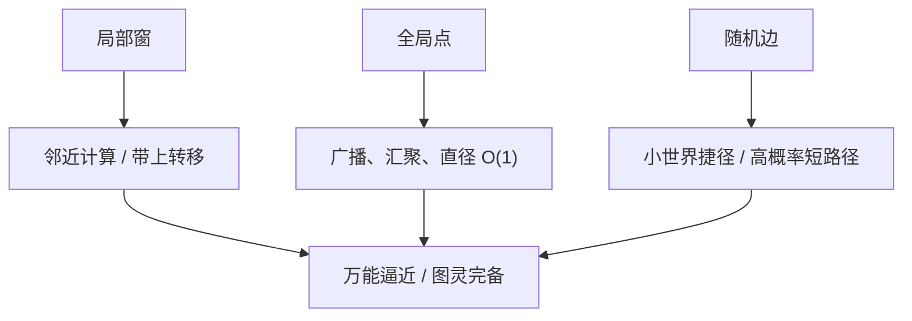

# BigBird 理论

    
随机边、局部窗与少量全局点合在一起，稀疏注意力在适当条件下仍是序列函数的万能逼近器，并且可以模拟通用计算。

    <footer>—— Zaheer et al., Big Bird: Transformers for Longer Sequences，NeurIPS 2020</footer>

Longformer 把长文档做成可训练的确定图。Zaheer 等人同年的 BigBird 在图上多加一类随机边，并拿出相当篇幅证明：这种稀疏注意力**不会立刻失去**稠密 Transformer 被赋予的两类存在性结果——对序列到序列连续函数的万能逼近，以及图灵完备。本篇读定理在说什么、三种边各自扮演哪条充分条件、量词开到哪一步为止。实验场与实现见 [BigBird](/llm/bigbird)；画边见 [稀疏模式](/llm/sparse-attention-patterns)。把「稀疏会废掉 Transformer」当成必须挡住的质疑，是这篇 NeurIPS 论文的理论动机。

## 问题

任意删边之后，一层内的 token 图可能不连通，或直径随 $n$ 线性变长。远距离依赖就要穿过许多有损跳，函数类是否仍能逼近「任意」序列映射，并不显然。经验上窗加全局点已经能跑 QA 与摘要；理论上仍缺一句：稀疏后的注意力是否仍是万能逼近器，是否仍能模拟图灵机。若答案是否定的，长序列工作就只是启发式；若肯定，随机边就不仅是又一种打分技巧，而是连通性与小世界直径的保险。

Pérez 等人已经讨论过稠密 Transformer 的图灵完备性（在适当的精度与位置假设下）。BigBird 要补的是：**把注意力限制在一类稀疏图上之后，这些性质是否还在**。证明必须指明图的生成过程——窗的宽度、全局点数、随机度数——因为不是任何稀疏图都够。应用里可以少用随机，但那就离开了定理的假设，应改回经验论证。

### 存在性不是有限模型的误差界

万能逼近说的是：对适当的函数类，存在足够宽、足够深的网络，使逼近误差任意小。图灵完备说的是：存在参数与精度设定，使架构能模拟通用计算的逐步转移。两者的量词都是「存在足够资源」，不是「这个 12 层、头数固定、因果掩码的检查点已经等价于满注意力」。读 BigBird 理论，要把「不会因为稀疏而立刻失去」与「你们的实现已经够用」分开。

图灵完备极易被写成「BigBird 能算一切」。稠密 Transformer 也曾被做同类表述。有意义的对照只有一句：稀疏之后是否立刻失去这些性质。论文给的是充分条件，不是复杂度意义上的高效通用机，更不是针测准确率。

## 方法

注意力图取三类边的并。**窗**：每个位置连接半径 $w$ 内的邻居，保证局部计算与序列顺序。**全局点**：少量 token（含可学习的「记忆」位置）与全体互连，提供广播与汇聚，把直径压下来。**随机边**：每个位置再连到 $r$ 个远距离位置，常按块采样以便内核连续读 KV。每层边数 $O(n(w+r+G))$，$w,r,G$ 当常数时对 $n$ 线性。softmax 仍在各自邻接集上做缩放点积，不改核函数。

### 万能逼近的充分图

证明策略大致是：先说明稀疏注意力可以模拟若干基础运算（局部卷积式混合、经全局点的全对全通信、对值的选择），再说明足够多层之后可以逼近序列上的连续函数。全局点扮演可读写的公共工作带：任意位置最多两跳到达另一位置。窗保证邻近 token 的精细交互不必绕道枢纽、以免被压缩。随机边处理枢纽未覆盖的远程对，并以高概率提供短路径，使图具有小世界性质。缺任意一类，论证都要改写：无全局则直径与广播难办；无窗则局部函数要靠随机边碰巧连上；无随机则确定图可能留下盲区——尽管应用里确定图常常已经够用。

### 图灵完备的构造性含义

图灵完备的叙述依赖：离散状态可被嵌入到注意力与 FFN 的连续计算里；全局或记忆 token 充当带子与磁头之间的通信通道；层或递推步对应计算步。稀疏图必须允许磁头位置与带上符号交换信息，窗提供带上的局部转移，全局点提供非局部跳转的可能。这是构造性存在：写出一种用 BigBird 块模拟转移函数的方式，而不是测量某个训练好的模型在算法任务上的准确率。精度、位置编码、是否允许额外的全局记忆 token，都属于假设清单；砍掉其中一条，证明不自动迁移。

## 机制

随机边的机制是小世界网络：规则格子（窗）上加少量随机捷径，任意两点的期望路径长度急剧下降。信息仍可能在枢纽或捷径上被压缩，定理不管压缩质量——它不管有限宽度下「两跳经过 CLS」是否丢失比特。训练时随机图是离散的，梯度只沿被采样的边走；未选中的边当步为零。每步重采相当于正则，也相当于噪声。这是生成任务后来很少逐步重采随机注意力的原因之一，与硬件 gather 同样重要，但属于经验，不属于定理。

与低秩、随机特征路线的差别必须写进理论边界。Linformer、Performer 改的是矩阵秩或核展开，函数类已经不是「稀疏 softmax 注意力」。BigBird 的定理针对的是**仍在原始 token 上做 softmax、只是删边**的那一类算子。不能拿万能逼近去给线性核背书，也不能反过来用 Nyström 误差界来限制 BigBird。三条线共享「亚二次」的工程目标，不共享同一套函数类陈述。

块随机是工程对理论的翻译。证明里可以是任意随机正则图；内核必须连续读块。块太大，随机退化成粗窗；块太小，又回到碎片 gather。块大小是实现超参，不是定理陈述的一部分。复现时「随机」必须和代码里的采样一致，否则验证的不是同一张图。

### 定理到因果解码器的距离

证明默认双向注意力：全局点可被所有位置读写，随机边可以连向未来。因果语言模型砍掉 $j\gt i$ 的边，广播不再对称；「两跳经 CLS」在纯 LM 里也不自然——没有一个被任务标出来的枢纽 token。有限层、有限头、有限精度下，存在性结果不给出外推长度或针测分数。因此不能把 NeurIPS 2020 的定理直接标在 LLaMA 长上下文上。当代解码器也很少采用逐步随机稀疏：硬件更吃得下窗、混合层或分块可学习选择。遗产是设计稀疏图时必须谈连通性与直径，以及「随机捷径」这一思想。

## 边界与工程取舍

不要用万能逼近代替长上下文评测。针测、多跳 QA、代码仓库检验的是有限资源下的检索，不是存在性。应用里删掉随机边、只留窗与全局，是回到 Longformer 式确定图，应改用经验论证，不要继续引用 BigBird 的充分条件。全局点数若随 $n$ 涨，线性复杂度的常数假设先破；用稠密核加掩码假装线性，显存仍平方，定理假设的「稀疏计算」与代码不是同一对象。

与 ETC 的关系：ETC 强调全局记忆 token 与局部，BigBird 强调随机边对小世界与证明的作用。写相关工作时按各自边集合引用，不要把全局记忆与随机度混成一种边。基因组等长模态上的实验说明函数类不限于自然语言，但不说明同一套 $w,r,G$ 可以跨模态照搬——定理不管碱基对，超参仍要扫。

媒体句「BigBird 与满注意力一样强」是错的。论文说的是：在充分宽深与特定图族下，稀疏注意力的函数类足够丰富。有限检查点上稀疏几乎总是对某些依赖更差，换来的是可处理的 $n$。理论挡住的是「稀疏必然表达力崩溃」，不是「稀疏无代价」。

### 三种边不是可勾选的 UI

把随机、窗、全局做成配置开关，然后在消融里删掉其中一类仍报「BigBird」，会让表格与定理错位。删随机之后，若任务仍好，说明该任务不需要定理里随机边所补的那类路径，不能倒过来证明随机边无用——也可能是评测对直径不敏感。理论论文的消融应服务「哪条假设在用」，而不是只服务分数。

## 小结

- BigBird 理论贡献是：窗+随机+全局的稀疏 softmax 注意力，在适当条件下万能逼近且图灵完备。
- 三种边是充分条件清单：窗做局部，全局压直径，随机提供小世界捷径。
- 量词是存在足够资源，不是有限因果 LLM 已等价于满注意力。
- 定理针对删边后的 softmax，不覆盖低秩投影或核随机特征。
- 因果、有限层、逐步重采噪声，都使定理到服务解码器还有一段距离。
- 出处：Zaheer et al.，*Big Bird: Transformers for Longer Sequences*，NeurIPS 2020，arXiv:2007.14062。
