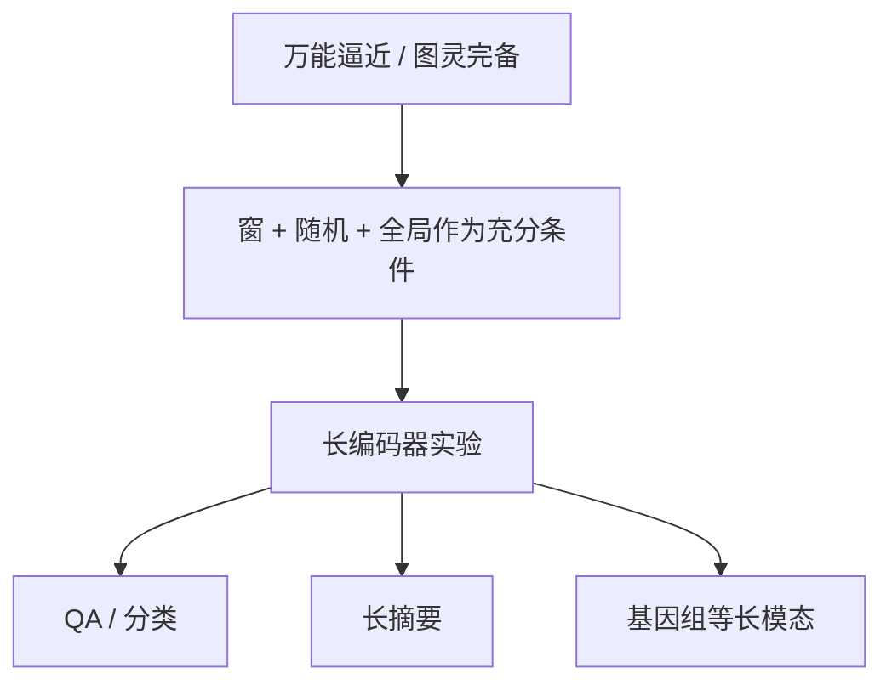

# BigBird

随机边、局部窗和少量全局点合在一起，稀疏注意力在理论上仍可以逼近全注意力，并保留通用计算能力。

<footer>—— Zaheer et al., Big Bird: Transformers for Longer Sequences, NeurIPS 2020</footer>

Longformer 把长文档做成可训练的确定图。Zaheer 等人同年的 BigBird 在图上多加一类**随机（常按块）边**，并花了相当篇幅证明：这类稀疏注意力是万能逼近器，且在适当条件下图灵完备。图怎么画、直径为什么小，见 [稀疏模式](/llm/sparse-attention-patterns)；与窗、全局的工程对照见 [局部–全局](/llm/local-global-attention)。本篇写原文作为理论加实验论文的贡献：它要挡住「稀疏会废掉 Transformer」这一质疑，实验场开到哪里，以及定理离因果解码器有多远。

## 问题

任意删边之后，一层内的 token 图可能不连通，或直径随 $n$ 线性变长，于是远距离依赖要穿过许多有损跳。经验上可以靠窗和全局点「看起来能跑」；理论上仍缺一句：稀疏后的函数类是否仍能逼近序列上的连续函数，是否仍能模拟通用计算。若答案是否定的，长序列工作就只是启发式；若答案是肯定的，就可以把随机边当成连通性的保险，而不仅仅是又一种经验技巧。

Zaheer 等人同时面对 ETC、Longformer 已经占住的应用位置：需要在 QA、摘要、基因组等超长序列上给出可运行的模型，证明才不会停在附录。论文因此有两条必须一起读的线——充分条件图 + 长序列实验——而不是只有一张随机注意力示意图。

### 要证明稀疏不会废掉 Transformer

万能逼近针对的是「足够宽、足够深的网络能逼近良好函数类」。图灵完备针对的是「能否模拟图灵机的逐步计算」。两者都是存在性结果：在足够资源与适当的全局/随机配额下，稀疏注意力 *可以* 不弱于稠密。它们不给出有限层、有限头、因果掩码下的误差界，更不给出针测准确率。读定理时要把量词读全：不是「你们这个 12 层模型已经等价于满注意力」。

图灵完备很容易被媒体写成「BigBird 能算一切」。Transformer 在稠密时也常被做类似表述。有意义的对照是：*稀疏之后是否立刻失去* 这些性质。论文给的是「不会立刻失去」的充分条件，不是复杂度意义上的高效通用计算机。

## 方法

注意力模式取窗 + 随机 + 全局的并集，实现上随机边常按块抽取以减少碎片化 gather。全局点数量固定或按任务设置，窗口宽度与每点随机度数是线性复杂度的常数。编码器用于理解任务；生成任务用编码器–解码器，源侧可以很长。论文还讨论与 ETC 的关系：ETC 用全局记忆与局部，BigBird 强调随机边对理论与小世界直径的作用。

实验覆盖：自然语言 QA 与文档分类把长度开到 4096 量级；长文档摘要；基因组序列作为「真正很长、局部+长程都重要」的模态。与满注意力的短上下文模型比的是「同样骨干、更长输入」的公平性，而不是与 2024 年 Flash 内核比吞吐。随机边在训练期如何采样（每步重采还是固定）会影响稳定性，复现必须写明。

### 窗、随机、全局作为充分条件

理论叙述的结构大致是：局部窗保证邻近计算；全局点把直径压下来，提供广播与汇聚；随机边处理「枢纽没覆盖到的远程对」，并以高概率提供短路径。缺少随机边，仍可能有确定图的盲区；缺少全局点，直径论证更难看。因此 BigBird 的「三种边」不是菜单上的可选项，而是证明里的一组假设。应用里可以少用随机——那就离开了定理的假设，回到 Longformer 式确定图，应改用经验论证。

### 长序列实验场

基因组与长摘要用来展示 $n$ 大到满注意力不现实时，稀疏仍能训。这与「在 GLUE 上逼近 BERT」互补：短任务上稀疏往往略亏或持平，价值不在短句。原文若在短 GLUE 上轻微掉点，并不自动否定长任务收益。对照基线应包括截断模型与当时其他稀疏/层次方法；用今天的长 RoPE 解码器去打 2020 年表格没有历史意义。

## 机制

随机边的机制是小世界：少量随机捷径让任意两点的期望路径变短。信息仍可能在枢纽或捷径上被压缩，定理不管压缩质量。训练时，随机图是离散的，梯度只沿被选中的边走；未选中的边当步是零。重采随机边相当于正则，也相当于噪声。生成任务对噪声更敏感，这是后来因果 LLM 很少采用逐步重采随机注意力的原因之一——与硬件 gather 同样重要。

与 Linformer、Performer 的分工：BigBird 仍在被选中的原始 token 上做 softmax，保留尖峰；低秩与随机特征路线改的是核或矩阵秩，不选边。原文理论针对的是 *稀疏 softmax 注意力* 这一函数类，不能拿去给线性核背书。

块随机是工程对理论的翻译：证明里可以是任意随机正则图，内核里必须连续读 KV 块。块太大，随机退化成粗粒度窗；块太小，又回到碎片 gather。论文实现选择应视为超参，不是定理的一部分。

### 定理到因果解码器的距离

证明默认双向、足够的宽度与层数、以及全局点可被所有位置读写。因果 LM 砍掉未来边，全局广播不再对称；有限层数下「两跳经过 CLS」的故事还在，但 CLS 在纯 LM 里并不自然存在。因此不能把 NeurIPS 2020 的定理直接标在 LLaMA 长上下文上。经验上，随机稀疏也没成为服务默认，硬件更吃得下窗、混合层或分块可学习选择。BigBird 的当代遗产主要是：稀疏设计必须谈连通性，以及「随机捷径」这一思想，而不是一份现成的 LLM 配置文件。

## 边界与工程取舍

不要用万能逼近代替长上下文评测。针测、多跳 QA、代码仓库，检验的是有限资源下的检索，不是存在性。随机边每步重采、全局点数随 $n$ 涨、用稠密核假装线性，是复现表格对不上的三种常见坑——稀疏模式专文也强调过，论文侧的教训是：定理假设的图必须和代码里的图是同一张。

与 Longformer 并列引用时，应分开：应用配方与确定图归 Longformer；随机边加理论归 BigBird。两者共享窗与全局，不是互为别名。ETC 的全局记忆机制也不等于 BigBird 的随机度；写相关工作时按论文各自的边集合来。

基因组结果说明模态不限于自然语言，但不说明 DNA tokenizer 与英文 BPE 可以共用同一套 $w$ 与随机度。换模态必须重扫图超参，定理只管函数类，不管碱基对。

## 小结

- BigBird 原文贡献是：给出窗+随机+全局的稀疏注意力，并证明该类在适当条件下万能逼近且图灵完备，同时在长序列任务上给出可训练模型。
- 三种边是理论充分条件，不是可随意删减的 UI 选项。
- 图的画法见稀疏模式专文；本文强调存在性结果与实验场，不重复画边。
- 定理假设双向与足够资源，不能直接贴到因果 LLM。
- 随机边对硬件与生成稳定性不友好，这是它未成为服务默认的主因之一。
- 短句 GLUE 不是它的价值所在；价值在满注意力不可行的长度。
- 出处：Zaheer et al., *Big Bird: Transformers for Longer Sequences*, NeurIPS 2020。
