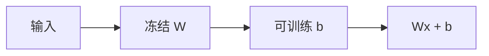

# BitFit

只更新偏置项，可训练参数小到可以忽略，却仍能在不少分类式适应上移动决策面；它改的是每层的偏移，不是子空间。

<footer>—— Ben Zaken、Goldberg、Ravfogel，BitFit: Simple Parameter-efficient Fine-tuning for Transformer，ACL 2022</footer>

[ReLoRA](/llm/relora) 仍在玩矩阵增量。[LoRA](/llm/lora) / VeRA 也是。BitFit 把问题拧到另一端：Transformer 里的偏置 $b$ 本来几乎不被讨论，却是每层仿射 $Wx+b$ 的平移。Ben Zaken 等人 2022 年表明，冻结 $W$、只训 $b$（及可选的任务头），在若干 GLUE 式任务上可接近全参。本课的缺口是：指令生成是否还买账；以及偏置适应在解码器 LLM 上能走多远。不把前缀调参（[下一课 P-tuning v2](/llm/p-tuning-v2)）写成「也是只训一点点」。

## 问题

适配器与 LoRA 引入新矩阵，改变或旁路计算图。若适应只需要把已有特征的阈值挪一挪——情感、蕴含、是否拒答——平移激活可能够用。偏置恰好是按通道的平移。问题：生成式 SFT 要改的是整段条件分布，不是单一 logit 阈值。只动 $b$，表达力是否够把[谱系](/llm/instruction-data-lineage)里的助手口吻写进去？

第二条：许多 LLM 实现把偏置从线性层拿掉（Llama 风格），BitFit 无对象可训，只能动 LayerNorm 的 $\beta$、或词表偏置。配方必须先清点「哪些 $b$ 存在」。

### 偏置不是低秩矩阵的特例

LoRA 的 $r=1$ 仍在改 $W$ 的一个方向。BitFit 完全不改 $W$ 的列空间，只加与输入无关的向量。不能把 BitFit 当成 $r=0$ 的 LoRA。几何不同，失败模式也不同：特征方向错了，平移救不了。

原文实验以编码器分类为主。迁移到解码器指令微调时，应当作弱基线：先看格式能否学会，再谈知识。

## 方法

冻结所有 $W$ 与嵌入（除非任务加了新特殊 token），打开：注意力与 FFN 线性层的 bias（若有）、LayerNorm/RMSNorm 的仿射、LM head 的 bias（若有）。学习率可大于全参——参数极少——但仍远小于会打爆范数的值；按[适配器侧](/llm/lora-vs-full-lr)的「大胆、但监控源域」来扫。SFT 用[仅回复](/llm/response-only-loss)与同一[模板](/llm/chat-template)。

若架构无 bias，BitFit 退化成「只训范数仿射」，能力更弱，应在报告里改名，不要冒充原文设定。可与 LoRA 比：同一数据上 BitFit 作为下限，LoRA $r=8$ 作为常规。

## 机制

$y=Wx+b$ 里，$b$ 不随 token 变。它能改变每个通道的触发点，从而改变后续非线性的工作区，间接改变注意力分数的分布。这对于「把某类特征推过阈值」有效。它不能增加新的特征组合方向——那需要改 $W$ 或加秩。指令遵循若主要是「看到特殊 token 后切换说话方式」，而该切换已在预训练特征里，偏置或许能放大；若需要新的工具 JSON 语法，通常不够。

遗忘：几乎不动 $W$，源域特征保持最好，与 Biderman 等人对 LoRA 的「忘得少」同方向、更极端。学得也更少。

NEFTune 动嵌入表示；BitFit 动偏置。二者可叠，但都是弱干预。脏数据上 BitFit 过拟合偏置，表现为所有回复加上固定腔调偏移。

## 边界与工程取舍

生成任务、工具调用、领域术语内化，默认不要只靠 BitFit。分类、校准、轻度风格、作为消融基线，值得跑。服务期 BitFit 的检查点极小，可按用户存一份 $\Delta b$，合并是向量加，无秩冲突——这比后课[LoRA 合并](/llm/lora-merge-conflict)干净，前提是任务够简单。

无 bias 的 Llama 族上，优先 LoRA 而不是硬上 BitFit。P-tuning 走另一条「不改 $W$」：改前缀嵌入，下一课。

## 小结

- BitFit 只训偏置（及范数仿射），不改 $W$ 的列空间。
- 对阈值型适应有效，对需要新方向的生成 SFT 通常不够。
- 许多解码器没有线性偏置，必须先清点参数。
- 遗忘极少、表达力天花板极低；适合当弱基线。
- 学习率按少量可训练参数取，仍须监控源域。
- 出处：Ben Zaken 等，BitFit，ACL 2022。
