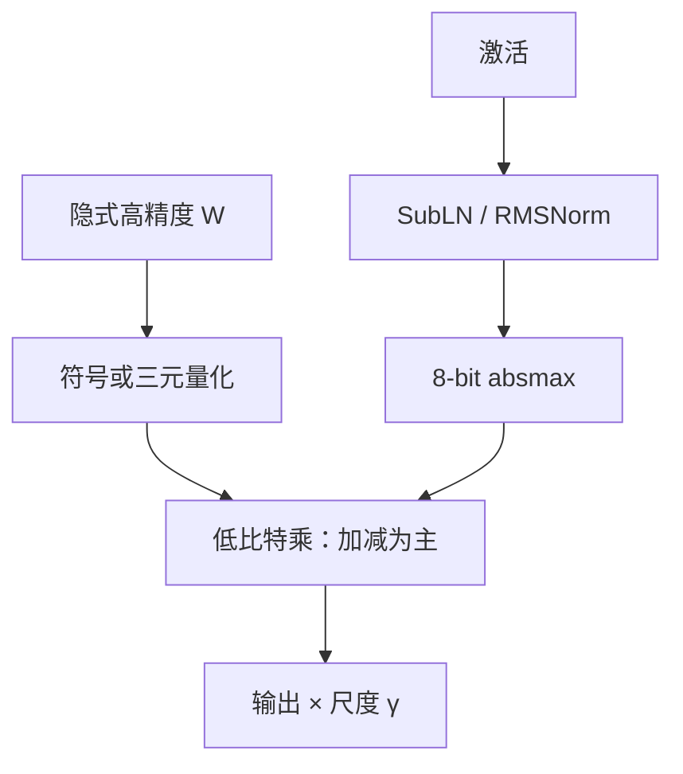

# BitNet / BitNet b1.58

    
把线性层换成 BitLinear，权重量成符号、激活走 8-bit，从零训出来的 1-bit Transformer 仍能画出与全精度相近的缩放律；再给权重加上 0，三元格子大约 1.58 bit，同规模同 token 时困惑度可以贴上 FP16。

    <footer>—— Wang 等，BitNet，arXiv:2310.11453；Ma 等，The Era of 1-bit LLMs，arXiv:2402.17764</footer>

Hongyu Wang、Shuming Ma、Li Dong、Furu Wei 等人在微软亚洲研究院给出的 **BitNet**（arXiv:2310.11453）不是又一种把已训好的 FP16 检查点压到 4-bit 的 [GPTQ](/llm/gptq) 或 [AWQ](/llm/awq)。它把 `nn.Linear` 换成 **BitLinear**：前向里权重只有 $\{+1,-1\}$，激活量化到 8-bit，优化器状态与隐式全精度权重仍用高精度，用直通估计（STE）把梯度送回。续作 **BitNet b1.58**（Ma、Wang、Wei 等，arXiv:2402.17764）把格子扩成 $\{-1,0,+1\}$，$\log_2 3\approx 1.58$ bit，并改用接近 LLaMA 的 RMSNorm、SwiGLU、RoPE。本篇写这两份合同：从零训 1-bit / 1.58-bit 骨干，矩阵乘几乎退化成整数加减。把预训练模型压到 1-bit 的 QAT，见 [OneBit / 1.58-bit 训练](/llm/onebit-train)。

## 问题

推理时线性层占参数与访存的大头。decode 小 batch 是带宽墙，见 [Decode 的显存墙](/llm/decode-memory-wall)：把权重从 16-bit 降到 1-bit，理论上带宽与容量都能掉一个数量级。PTQ 在 4-bit 附近已经能用，再往 2-bit、1-bit，均匀格子装不下权重里的相干结构，困惑度塌掉——这是 [QuIP](/llm/quip)、[AQLM](/llm/aqlm) 要在码本与旋转上补的缝。BitNet 换命题：不要事后取整，而让模型在二值（或三元）约束下**从零学习**，使前向所需的乘法几乎消失。

第二条约束是训练稳定性。朴素二值化会让激活方差随层漂移，梯度穿过 STE 之后尺度不对。作者要同时给出：可替换的线性层、能放大到十亿参数的归一化，以及「仍服从缩放律」的经验曲线，而不是单点刷一个 125M 的玩具。

### 1-bit 与 PTQ 的合同不同

GPTQ / AWQ / [LLM.int8()](/llm/llm-int8) 的输入是已经训好的全精度权重，输出是部署格式。BitNet 的输入是随机初始化，输出是一张在 1-bit 前向下长大的网。比较「BitNet 3B 对 LLaMA 3B」必须冻结训练 token 与数据配方；拿一份 RedPajama 上训 100B token 的 BitNet 去打公开 LLaMA-2 检查点，是在比数据而不是比比特。b1.58 原文把这一点写进表注：对照是作者复现的同配置 FP16 LLaMA LLM。

嵌入、残差、层归一化在原文里保持较高精度。1-bit 合同绑在投影矩阵上。把「整个 Transformer 都是 1-bit」写成定理，过读了词表与采样仍需要的高精度 logits。

## 方法

BitLinear 的前向可以收成三步。对隐式全精度权重 $W$：先减均值再取符号，得到 $W_b\in\{+1,-1\}^{n\times m}$；尺度取 absmean $\gamma=\mathrm{mean}(|W-\mathrm{mean}(W)|)$。对激活：先做 **SubLN**（把子层输入的方差钉住，使量化后的 $y$ 与全精度方差同量级），再按 absmax 量化到 8-bit。输出是 $\gamma$ 乘上低比特矩阵乘。注意力与 FFN 的布局不变，只是矩阵乘换成 BitLinear。

b1.58 把符号函数换成 absmean 三元量化：

$$
\widetilde{W}=\mathrm{RoundClip}\!\left(\frac{W}{\gamma+\varepsilon},-1,1\right),\qquad \gamma=\frac{1}{nm}\sum_{ij}|W_{ij}|.
$$

$0$ 显式出现，相当于允许权重做特征筛选，而不是每个位置都必须加减。激活改为按 token 对称量化到 $[-Q_b,Q_b]$，去掉 zero-point，便于核融合。骨干对齐开源 LLaMA：无偏置、RMSNorm、SwiGLU、旋转位置编码，以便接到 Hugging Face / llama.cpp 一类栈。

主实验：BitNet 在语言建模上对照 FP16 与当时的 8-bit 量化，给出内存与估算能耗；并画参数量从约 1e8 到数十亿的损失曲线，形状接近全精度缩放律。b1.58 在 RedPajama 上训 100B token，700M / 1.3B / 3B 对照同配置 LLaMA LLM：3B 起 Wiki/C4 困惑度与零样本均值贴上或略超 FP16，同时报告 FasterTransformer + Ladder 2-bit 核上的显存与每 token 延迟。70B 档用流水线并行在两张 80GB A100 上量吞吐：三元权重允许更大 batch，表中给出约 11× 最大 batch、约 8.9× tokens/s。另有一份按 StableLM-3B 数据配方训 2T token 的 3B，零样本均值略高于报告中的 StableLM-3B。

### 从二值到三元改了什么

二值没有 $0$，每个连接都必须对激活做一次加或减，表达力绑在符号模式上。三元多一个「这条边关掉」，对稀疏特征更友好。代价是存储从严格 1-bit 变成 packing 后的 2-bit 容器（实现常用 2-bit 核承载 1.58），平均信息量仍按 $\log_2 3$ 计。原文的 Pareto 句——「13B b1.58 比 3B FP16 更省、30B 比 7B 更省、70B 比 13B 更省」——绑定的是他们的延迟/显存/能耗模型，不是任意服务引擎上的 SLA。

## 机制

STE 把 $\partial\widetilde{W}/\partial W$ 当成 1（或 clip 区间内为 1），让优化器更新的是**潜伏权重**，前向看到的才是离散格子。训练显存并不自动变成 1-bit：Adam 一阶二阶、梯度、主权重副本仍是高精度。省下的是推理时的权重带宽与乘法能量。Horowitz 的 7nm 算术能量模型被用来估算：矩阵乘从 FP16 乘加换成 INT8 加法，算术能量可低一到两个数量级；端到端还要算进归一化、注意力与 DRAM。

SubLN 的作用是方差匹配。二值权重的前向若不对输入做稳定归一化，量化噪声会沿残差放大，学习率稍大就发散。消融里 absmax 优于带可学习尺度的 elastic 量化，SubLN 优于 Pre-LN 与当时的二值稳定变体 BMT。机制上这是在说：1-bit 能训，首先是激活尺度被钉住，其次才是格子本身。

「匹配 FP16」在 b1.58 里从约 3B、同 token 开始成立。700M 仍有可见 PPL 缺口。不要把 3B 的结论写到所有宽度上，也不要把 100B token 的曲线写成 Chinchilla 最优。

### 新计算范式依赖核，不依赖口号

三元乘 $x\widetilde{W}$ 在数学上是对 $x$ 的加减与跳过。没有加法器阵列或至少 2-bit 查表核，GPU 仍会先解回 FP16 再走 Tensor Core，带宽红利在，算力红利没有。原文用 2-bit Ladder 核量延迟，并呼吁为 1-bit 设计专用硬件。后来的 bitnet.cpp 与 BitNet b1.58 2B4T 技术报告（arXiv:2504.12285）是这条工程链的后续，不要写进 2023–2024 两篇主文的表。

## 边界与工程取舍

BitNet 不量化 KV 到 1-bit；b1.58 讨论里只把激活 8-bit 当成「上下文长度可加倍」的一步，更低比特 KV 留作未来。注意力分数仍是较高精度。词表、lm_head、采样温度与全精度模型同一套问题。从零训的数据配方、token 数、学习率必须与对照模型对齐，否则「1.58-bit 不掉点」无法引用。

与 PTQ 的选型：已有强 FP16 检查点、只想 4-bit 部署，走 GPTQ / AWQ 更便宜。要从头训一个推理极便宜的骨干，或接受专用核，才轮到 BitNet 家族。与 [QLoRA](/llm/qlora) 也不是同一件事：QLoRA 把冻结基座存成 4-bit 再训适配器；BitNet 没有这份冻结的全精度老师（除非另做蒸馏，那是 OneBit 的命题）。

出处：Wang, Ma, Dong, Huang, Wang, Ma, Yang, Wang, Wu, Wei，*BitNet: Scaling 1-bit Transformers for Large Language Models*，arXiv:2310.11453；Ma, Wang, Ma, Wang, Wang, Huang, Dong, Wang, Xue, Wei，*The Era of 1-bit LLMs: All Large Language Models are in 1.58 Bits*，arXiv:2402.17764。训练配方对照见 [OneBit / 1.58-bit 训练](/llm/onebit-train)。

## 小结

- BitNet 用 BitLinear 从零训 1-bit 权重、8-bit 激活的 Transformer，目标是推理访存与乘法能量，不是 PTQ。
- b1.58 把权重改为 $\{-1,0,1\}$，同规模同 token 时约从 3B 起贴上 FP16 困惑度与零样本。
- 训练更新潜伏高精度权重，前向走 STE；推理红利取决于低比特核。
- 嵌入与归一化保持较高精度；「1-bit LLM」不包含词表与 KV 的同等压缩。
- 出处：Wang et al.，arXiv:2310.11453；Ma et al.，arXiv:2402.17764。
