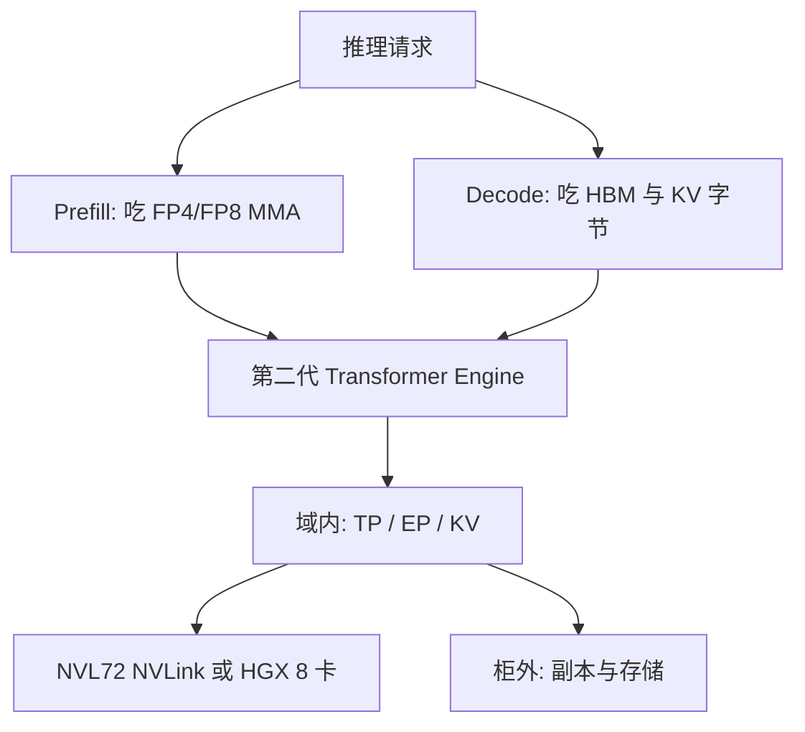

# Blackwell 对推理的含义

第五代 Tensor Core 把 FP4 / FP6 与微缩放推进 MMA，第二代 Transformer Engine 与 72 GPU 的 NVLink 域一起，改变的是推理的工作点，而不只是训练的 MFU。

<footer>—— NVIDIA Blackwell / GB200 NVL72 产品页与 Transformer Engine 对 NVFP4、MXFP8 的公开说明</footer>

[A100 / H100 / Blackwell](/llm/nvidia-gpu-gen) 已经按训练与系统形态对齐过三代。推理的屋顶线与训练不同：prefill 仍近计算墙，decode 近 [显存墙](/llm/decode-memory-wall)，MoE 还要在专家权重与路由之间置换。Blackwell 对推理有意义的公开变化是三条：更窄的推理精度（NVFP4 / FP6、微缩放）、更大更宽的 HBM3e、以及 GB200 NVL72 把 NVLink 域从 8 拉到 72。厂商写过相对 H100 的「实时万亿参数推理约 30×」一类数字，对象是指定的 1.8T MoE 等配置，本篇不把它写成一般定律。

## 问题

Hopper 上推理的主流窄精度是 FP8。权重与 KV 相对 FP16 减半流量，decode 仍要每步扫参数与缓存；专家多的模型在 8 卡域内铺不开，decode 的 All-to-All 会漏到节点间网络，逐步延迟被放大。问题不是「再买一张更快的 H100」，而是：能否把权重、激活、KV 再压一档而不把质量打穿；能否把宽专家或宽张量并行留在同一互连域里。

Blackwell 产品叙事把 FP4 明确偏推理与 test-time scaling。训练仍可走 FP8 第二代引擎，但规划推理集群时，若只按 H100 FP8 的字节/参数去估 HBM，会低估同容量能驻留的并发与上下文，也会低估「必须有 TE / TensorRT-LLM 路径才能吃到 MMA」的软件依赖。

### 精度轴：从每张量 FP8 到微缩放 FP4

Hopper TE 的典型 FP8 是每张量一个 FP32 scale。Blackwell 的 NVFP4 把值写成 E2M1 一类四比特格子（TE 文档写幅度大约到 ±6），再配块级微缩放：公开技术说明里常见 16 元素一块、块用 FP8(E4M3) 尺度，另可有张量级 FP32 尺度。MXFP8 是同代的另一种微缩放 FP8。块尺度让局部动态范围分开，避免一张量一个 amax 把多数值挤进少数格子——这对 decode 里逐 token 激活、以及 KV 量化尤其重要。没有块尺度的「裸 INT4 / 裸 FP4」不是同一条硬件路径。

TE 在 Blackwell 上提供 `NVFP4BlockScaling`、`MXFP8BlockScaling` 等配方；推理栈（TensorRT-LLM、Model Optimizer）另有权重量化与 KV 量化入口。训练配方与推理校准不要混用。H100 没有原生 NVFP4 MMA。

## 方法

按工作点选轴，而不是按最高 PFLOPS 选卡。

Prefill / 大 batch：看 FP4/FP8 Tensor Core 的 $P$。NVL72 产品表把整柜 NVFP4 与 FP8 峰值分栏列出（稠密、是否含稀疏以脚注为准）。软件必须真正发出第五代 MMA，并带上微缩放元数据；只把权重存成 4 bit、计算升回 FP16，只得到容量。

Decode / 小 batch：看 HBM 带宽与容量。公开材料把 Blackwell 单卡 HBM3e 写到约 8 TB/s、容量到 192 GB 量级（具体 SKU 以产品页为准）；GB200 NVL72 整柜 GPU 显存与 CPU LPDDR 是相加关系，不是自动统一寻址。KV 与权重能留在近端 HBM，TPOT 才跟带宽走；卸到主机要付 C2C 或更慢的路径。

宽模型 / 宽 MoE：看 NVLink 域。第五代 NVLink 每 GPU 公开 1.8 TB/s；NVL72 域内集合约 130 TB/s 量级的产品表述。专家并行与张量并行优先画在这 72 卡内，柜外仍走 InfiniBand 或以太网做多副本与存储。这与 [GB200 NVL72 超节点](/llm/gb200-nvl72) 的形态一致，本篇只强调它对 **decode 逐步通信** 的含义：域内 All-to-All 的延迟尺度不同于跨机。

### 第二代引擎与软件栈

第二代 Transformer Engine 在 Blackwell 上除 FP8 外接管 NVFP4 / MXFP8 的量化、缩放与 GEMM。注意力路径上的加速（产品页对 GB300 一类还有相对上一代注意力的倍数）依赖 cuDNN / 框架是否打开对应核，不是改 GPU 名字即生效。TensorRT-LLM、SGLang、vLLM 要各自声明 Blackwell / FP4 支持版本；同一份 NVFP4 权重在只认 FP8 的运行时里会反量化，回到带宽墙。

KV 缓存用 FP8 或 FP4 是推理侧最直接的容量杠杆：上下文长度与并发近似与字节成反比。质量损失取决于校准与块尺度，不是硬件保证「FP4 KV 无损」。投机解码、MTP 等 test-time scaling 增加的是 decode 步数与草稿核，Blackwell 的算术密度让草稿与验证核都更便宜，但调度复杂度仍在软件。

## 机制

推理为什么对窄精度比训练更敏感：训练可以把误差平均进大 batch 的梯度；decode 每一步的 logits 都直接进采样。微缩放是在「更少比特」和「局部范围」之间折中，使 E2M1 的粗格子仍能表示一层里不同通道的幅度。元数据流量必须算进屋顶线：块尺度太细，scale 本身变成带宽；太粗，退化成每张量 FP8。公开块大小以 TE / 白皮书为准，不要发明另一种块长。

72 卡域改变的是通信的**几何**，不是取消切分。CUDA 仍见 72 个 device。一层 72 路 TP 把 GEMM 切得很瘦，MMA 形状可能填不满，decode 更糟。合理用法往往是：中等 TP × 宽 EP，或整柜一份 MoE 副本。把 72 卡当成 9 个互不往来的 8 卡副本，等于买了域却按 Hopper HGX 调度——这是推理集群最常见的浪费，而不是芯片的问题。

GB200 Superchip 的 NVLink-C2C 公开双向 900 GB/s，CPU 内存可参与 KV 或权重的第二层。这比 PCIe 卸主机快，仍远慢于 HBM。规划「统一内存」时以编程指南为准，不要假设任意 kernel 都能以 HBM 速率扫 CPU DRAM。

### 不要把柜级峰值当成单核 decode

整柜 NVFP4 PFLOPS 是所有 GPU、理想形状、对应精度（常含稀疏脚注）的加总。单请求 decode 的 $M=1$，能用到的是一张或数张卡上、受 HBM 约束的一小段。并发上去之后，prefill 批处理与 decode 批处理才开始靠近表头。PD 分离、连续批、分页 KV 仍然决定你能不能把 Blackwell 的 $P$ 与 $B$ 同时用上。换代而不改调度，只会得到「卡更贵、SLO 依旧」。

## 边界与工程取舍

不要用 A100 的 INT8 或 H100 的 FP8 校准表直接当 NVFP4 质量验收。不要在非 Blackwell 的卡上用软件模拟 FP4 报吞吐。不要把 30×、10× MoE 等营销倍数写进容量规划的分母；规划用字节、带宽、域大小、以及自己的 TTFT/TPOT。不要混用 HGX Blackwell 8 卡域与 NVL72 的并行度配置。GB300 / Blackwell Ultra 是同代内的容量与注意力步进，域规模仍是 72，见 NVL72 专文。

功耗与液冷是推理机房的硬边界：NVL72 是液冷超节点，不是把八张风冷卡换 SKU。MIG 等多实例能力以该代用户指南为准，不要抄 H100 的 7×10GB 切片表。

出处：NVIDIA GB200 NVL72 产品页（72 GPU / 36 Grace、NVLink 域、精度分栏）；开发者博客 *GB200 NVL72 Delivers Trillion-Parameter LLM Training and Real-Time Inference*；Transformer Engine 文档中 NVFP4 / MXFP8 配方。未出现在这些材料里的背板单通道速率不写。

## 小结

- Blackwell 推理的三条公开杠杆是 NVFP4/微缩放、$B$ 与 HBM 容量、以及最大 72 的 NVLink 域。
- 第二代 Transformer Engine 是吃到 FP4 MMA 的软件合同；无路径则只剩存储压缩。
- Decode 仍受显存墙约束；整柜 PFLOPS 不等于单请求 TPOT。
- 宽 EP / 宽 TP 应留在域内；按 8 卡副本调度会浪费 Superchip 互连。
- 厂商加速比绑定指定模型与精度，不能当普遍定律。
- 出处：NVIDIA Blackwell / GB200 公开材料与 TE 文档；代际对照见 [A100 / H100 / Blackwell](/llm/nvidia-gpu-gen)。
