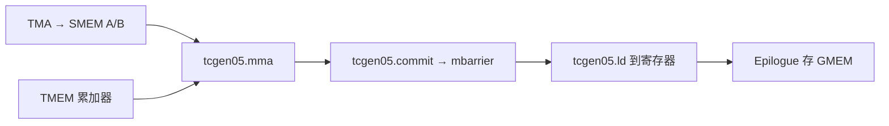

# Blackwell SM100 MMA

Blackwell（SM100）引入 tcgen05 族 PTX：第五代 Tensor Core 的 MMA。按数据类型，吞吐可达 Hopper WGMMA 的 2×–4×。累加器放进专用的 Tensor Memory，把寄存器文件留给别的工作。

<footer>—— NVIDIA CUTLASS 文档，tcgen05 MMA Programming Guide</footer>

Ampere 的 `mma.sync` 从寄存器吃 A/B、把 C 写回寄存器，形状小到 $16\times 8\times 16$。Hopper 的 `wgmma.mma_async` 从 shared memory 吃操作数，累加仍在寄存器，单 CTA 可达 $64\times 256\times 16$ 量级。Blackwell 数据中心 GPU（计算能力 10.0，SM100）把累加器搬进 **Tensor Memory（TMEM）**，MMA 指令换成 `tcgen05.mma`：A/B 来自 SMEM（A 也可来自 TMEM），C/D 永远在 TMEM。CUTLASS 文档写单 CTA 形状可到 $128\times 256\times 16$ 量级，CTA pair 更大。编程模型因此从「每个线程一份 fragment」变成「一个线程发射异步 MMA，用 mbarrier 等 TMEM 写完，再 `tcgen05.ld` 拉回寄存器做 epilogue」。本篇只写这条 MMA 路径，不写整柜 NVL72 的产品叙事。

## 问题

Hopper 已经把 A/B 的寄存器带宽省掉了（WGMMA 读 SMEM），但大瓦片的累加器仍占寄存器。占用率、epilogue 融合、与 TMA 流水抢寄存器，都卡在 RF。下一代若继续放大 MMA 形状，寄存器放不下 $128\times 256$ 的 FP32 累加。NVIDIA 的选择是增加一块 CTA 作用域的二维片上存储：公开描述里 SM100A 上每 CTA **128 lane × 512 col**，每格 32 bit，正好放下 FP32 / INT32 累加。MMA 直接读写这块，RF 只在 epilogue 出现。

指令发射也改了。WGMMA 仍是 warp-group 协作；`tcgen05.mma` 由 **单线程** 发出，硬件对整个 CTA（或 CTA pair）做一次瓦片级乘加。完成不体现在该线程的下一条指令，而体现在 `tcgen05.commit` 打到的 mbarrier 上。把 Hopper 的「wait 某个 wgmma group」脑补成 SM100 会漏掉 commit。

### SM100 与 SM120 不是同一条 MMA 路

数据中心 Blackwell 是 SM100，`tcgen05` 与 TMEM 是一等公民。工作站 / 消费级 Blackwell（SM120 一类）公开材料写明：不支持大于 1 的 cluster，因而没有 CTA-pair 的 `tcgen05`，常常只能走 `mma.sync` / 兼容路径，累加仍在寄存器。峰值 FP4 若按 SM100 的 MMA 形状去估 GeForce，会高估一个代际。写核必须看 `sm_100a` 还是 `sm_120`。

PTX ISA 8.4 引入 tcgen05，8.5 有修订。目标计算能力是 10.0。不要在 H100（9.0）上用软件模拟这条指令报吞吐。CUTLASS 的 Python DSL 指南是当前第一方写法；裸 PTX 能写，但描述符与 TMEM 分配容易错。

## 方法

一次合法的 SM100 MMA 循环大致是：

1. `tcgen05.alloc` 在 TMEM 里划出累加器（及可选的 A 或尺度）。
2. TMA 或 `cp.async.bulk` 把 A/B 瓦片搬进 SMEM；块缩放路径还要把 SFA/SFB 拷进 TMEM（`tcgen05.cp`）。
3. 单线程发 `tcgen05.mma`，带上 SMEM 描述符、TMEM 地址、形状、`cta_group`、dtype、`kind`（含 `nvf4` 等）。
4. `tcgen05.commit` 把这批异步 MMA 与某个 mbarrier arrive 绑定。
5. 消费者 `mbarrier` wait 之后，用 `tcgen05.ld` 把累加器片段装入寄存器，做 epilogue，存 GMEM。
6. `tcgen05.dealloc` 释放 TMEM。

CUTLASS 把「哪条硬件指令」收成 MMA op 对象：元素类型、`M,N,K`、CTA group、A 的来源（SMEM 或 TMEM）、K/MN major。用户核不再手写 `ldmatrix`——第五代 MMA 不从寄存器吃 A/B。

### CTA pair 与块缩放

`cta_group::2` 让一对 CTA 合做更大的 $M$。TMEM / SMEM 资源按 pair 划分，A/B 各 CTA 要装自己那一份。工作站无 cluster 时这条路直接不存在。块缩放 MMA 在乘加时从 TMEM 读 SFA（沿 M）、SFB（沿 N），与 NVFP4 / MXFP 的微缩放是同一条硬件路径：尺度不是 epilogue 里事后乘，而是 MMA 的一等操作数。实现上常先把 SFB multicast 进 pair 的 SMEM，再 `tcgen05.cp.cta_group::2` 进 TMEM。

形状选择必须对齐指令表。CUTLASS 指南强调先把本地瓦片切成「每条 MMA 指令的形状」，fragment 是 SMEM 描述符或 TMEM 地址，不是 Ampere 那种每线程寄存器列表。用错 major（K 还是 MN）表现为静默错数，因为描述符仍能发。

## 机制

吞吐数字「相对 WGMMA 的 2×–4×」绑定数据类型与是否走稀疏 / 窄精度。BF16 与 NVFP4 不在同一档。屋顶线仍分计算墙与带宽墙：decode GEMV 填不满 $128\times 256$ 的 MMA，TMEM 帮不上忙，瓶颈仍是 HBM。SM100 MMA 的客户首先是预填、训练、大 $M$ 的专家 GEMM，以及能把 $K$ 做深的权重量化乘。

异步握手与 TMA 同构：发出不等于数据就绪。TMA 填 SMEM 要用带字节计数的 mbarrier；MMA 写 TMEM 要用 `tcgen05.commit` 的 arrive。Epilogue 在 wait 之前 `tcgen05.ld` 会读到半成品。Hopper 程序员若只把 `wgmma.wait_group` 换成某种 fence，而不发 commit，会卡住或读脏。

TMEM 容量是硬约束。128×512×4B ≈ 256 KiB 量级的累加空间要在多级流水、多块缩放、可选 A 暂存之间分配。双缓冲累加器会立刻把列方向切窄，从而限制 $N$。调度是容量规划，不是「再加一层 pipeline 注解」。

### 和 Hopper WGMMA 的迁移清单

- 累加器：寄存器 → TMEM，多了 alloc/ld/dealloc。
- 发射：warp-group → 单线程 + commit。
- 操作数 A：SMEM 描述符，可选 TMEM；不再 `ldmatrix`。
- 完成：wait group → mbarrier 由 commit 绑定。
- 形状：更大，且有 CTA pair。
- 窄精度：`kind::nvf4` 等块缩放是新轴，Hopper 没有原生等价物。

CUTLASS 的 SM90 核不能通过改 `arch::Sm100` 三个字符就变合法。TMEM 布局、描述符编码、barrier 相位都要按指南重写。社区博客里「98% cuBLAS」一类数字绑定特定 $M=N=K=4096$ 与作者的手工核，不能当所有形状的保证。

## 边界与工程取舍

不要在 SM120 上承诺 SM100 的 CTA-pair 吞吐。不要用整柜 NVFP4 PFLOPS 去除以 SM 数再当成单核 decode 的可达峰值。不要把 `tcgen05` 与 CUDA `mma` 内联汇编混在同一流水而不统一 barrier 语义。

Epilogue 仍是融合点：门控乘、量化、偏置要在 `tcgen05.ld` 之后的寄存器里做，或由 cuDNN 融合核代劳。自己写 `ld` 再另启一个逐元素核，会把 TMEM 的好处吐回 HBM。MoE grouped 调度器必须按 SM100 的瓦片形状改 visitor，否则 round-robin 的「瓦片」与硬件 MMA 对不齐。

集群 / thread block cluster 是 CTA pair 的前置。启动配置、共享内存与 TMEM 的对称性，要以 PTX 与 CUTLASS 当前版本为准。MIG 切片是否暴露完整 TMEM，查该代用户指南，不要抄 Hopper 的 7 实例表。

出处：NVIDIA CUTLASS *tcgen05 MMA Programming Guide*；PTX ISA 中 tcgen05 章节（8.4/8.5）；Blackwell 架构公开说明。产品级吞吐见 GB200 NVL72 产品页，与单指令形状不是同一层。NVFP4 的格式细节见 NVFP4 Tensor Core 专文。

工具链版本是隐式依赖。过旧的 nvcc / CUTLASS 会把 `tcgen05` 降成合法但极慢的模拟，基准看起来「Blackwell 还不如 Hopper」。验收应读 SASS 是否真有第五代 MMA，而不是只看 `torch.cuda.get_device_capability()` 返回 (10, 0)。

同一份 CUTLASS 源码按 `sm_90a` 与 `sm_100a` 各编译一次，不能假设形状参数可抄。Hopper 上合法的 $64\times 256$ WGMMA 流水，在 SM100 上可能浪费 TMEM 列，或根本对不上 `tcgen05` 的指令表。调核时应先固定 dtype 与 `cta_group`，再扫 $M,N,K$ 瓦片；把 Hopper 的最优块直接当 Blackwell 默认，是最常见的占用率回退。注意力核还要额外考虑：softmax 仍在寄存器或 SMEM 里做，TMEM 只承接 GEMM 型累加，Flash 式在线归一化不会因为换了 MMA 而自动搬进 TMEM。

## 小结

- SM100 的 MMA 是 `tcgen05.mma`：A/B 在 SMEM（或 A 在 TMEM），累加在 TMEM，单线程发射，commit 到 mbarrier。
- TMEM 约 128×512 个 32-bit 格，用来放下更大瓦片的 FP32 累加，减轻寄存器压力。
- CTA pair 与块缩放是可选但关键的能力；SM120 不共享完整路径。
- 相对 WGMMA 的倍数绑定精度与形状；decode 小 $M$ 仍可能吃不满。
- 迁移必须重写完成语义与 fragment 模型，不能只改架构号。
- 出处：NVIDIA CUTLASS tcgen05 指南；PTX ISA 8.4+。
