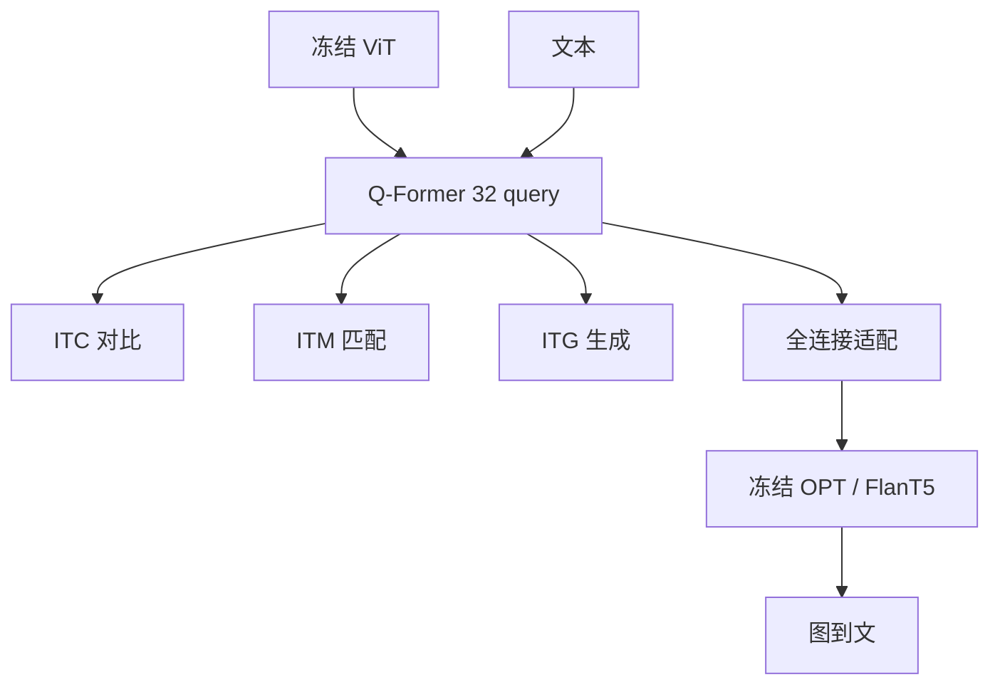

# BLIP-2

两端的单模态模型已经很贵；用一个可查询的轻量 Transformer 分两阶段先对齐再接到冻结 LLM，可训练参数可以比 Flamingo-80B 少两个数量级。

<footer>—— Li 等，BLIP-2: Bootstrapping Language-Image Pre-training with Frozen Image Encoders and Large Language Models，ICML 2023</footer>

Salesforce 的 BLIP-2 把视觉–语言预训练写成**引导（bootstrap）**：图像编码器（CLIP / EVA-CLIP 一类 ViT）与 LLM（OPT 或 FlanT5）都冻结，只训中间的 **Q-Former**。Q-Former 从 BERT-base 初始化，带 32 个可学习 query，约 **188M** 参数，交叉注意力每隔一层插入，把冻结 ViT 的成百上千 patch 收成固定 32 个向量。第一阶段在冻结视觉塔上做图文表示学习；第二阶段经一层全连接把这 32 个向量映到冻结 LLM 的输入槽，做图到文的语言建模。论文数字：在零样本 VQAv2 上超过 [Flamingo](/llm/flamingo)-80B 约 8.7 个点，可训练参数约少 **54×**。本篇按 arXiv:2301.12597 写方法；指令感知的 Q-Former 留给 [InstructBLIP](/llm/instructblip)。

## 问题

端到端 VLP 要把视觉塔和语言塔一起更新，规模一涨，预训练账单先炸。更糟的是：直接拿冻结 LLM 做图条件语言建模，视觉特征与词嵌入不在同一流形上，只靠 LM 损失往往对不齐——Flamingo 用插入交叉注意力和海量交错数据硬打通，可训练体积仍然大。Frozen 把整图当软提示，信息瓶颈更窄。

BLIP-2 问的是：能否让**同一个**轻量模块先学会「从冻结 ViT 里抽出与文本相关的视觉证据」，再学会「把这些证据说成冻结 LLM 听得懂的前缀」，从而复用两个社区已经付过钱的单模态检查点。

### 信息瓶颈是 32 个 query，不是全部 patch

ViT-L/14 特征大约 $257\times 1024$，Q-Former 输出 $32\times 768$。query 必须经过第一阶段的三个目标，才会把容量用在「文本需要的视觉」而不是平均池化。没有第一阶段、直接接 LLM，论文认为模态缺口太大。Q-Former 内部其实是两个共享自注意力的子模块：图像侧 query 对 ViT 做交叉注意；文本侧可以当编码器或解码器。通过**不同的自注意力掩码**，同一套权重完成对比、匹配与生成。

32 与隐维 768 是原文配置。换成 16 或 64 会改瓶颈宽窄，不能默认开源二次实现仍是 32。交叉注意力随机初始化，BERT 权重只覆盖自注意力与文本侧。

## 方法

### 第一阶段：ITC、ITM、ITG 共用 Q-Former

**ITC**（图文对比）：query 与文本互不可见（单模态掩码），每个 query 与文本 `[CLS]` 算相似度，取最大者当图–文分，批次内交叉熵。冻结 ViT 使单卡能塞更多图，故用 in-batch 负例，不再用 BLIP 的动量队列。**ITG**（图条件文本生成）：多模态因果掩码——query 互看、不看文本；文本看所有 query 与其左侧词。视觉信息必须先进入 query 再传到词，否则解不出标题。`[CLS]` 换成 `[DEC]` 作为解码起始。**ITM**（图文匹配）：双向掩码，query 与文本全可见，每个 query 出二分类 logit 再平均；难负例挖掘来自 BLIP。三目标同一前向骨架、同一套参数，只换掩码。

第二阶段：冻结 LLM。解码器型（OPT）把投影后的 query 当软提示，前缀语言建模。编码器–解码器型（FlanT5）把 query 与可选文本送进编码器。可训练的是 Q-Former 与那一层维数适配的全连接。图像编码器仍冻。数据仍是图文对，不是视觉指令；零样本「按自然语言指令看图说话」是接上 FlanT5 / OPT 之后的涌现，论文用定性例子展示，不是 InstructBLIP 那种系统指令微调。

## 机制

三掩码把 query 训练成可切换的接口。对比时 query 必须在没有看见词的情况下仍能与句向量对齐，得到可检索的全局证据。生成时 query 必须负担标题里所有信息，否则 ITG 解不出词——这比对比更「完整」。匹配时 query 与词细交互，学到对错配对的细粒度线索。第二阶段并没有新的视觉计算：它只要求这 32 个向量落在 LLM 前缀能续写的区域。FlanT5 经过指令预训练，比 OPT 更容易把「Question: ... Answer:」当零样本格式；论文把 OPT 与 FlanT5 都报，是为了说明方法不绑死一种 LM 形状。

相对 Flamingo，BLIP-2 **不改** LLM 层内结构，因此不能在深度上反复交叉注意视觉。表达力上限在 32 个前缀槽。换更强的冻结 ViT 或更强的冻结 LLM，Q-Former 可以热插拔——这是 bootstrap 的含义：单模态社区进步可以直接灌进来。

「54× 更少可训练参数」比较的是相对 Flamingo-80B 要更新的桥，不是总参数。推理时仍要加载 ViT + Q-Former + 70 亿级 LLM。不要把可训练参数写成显存占用。

### 和 CLIP 双塔、和 LLaVA 浅投影

[CLIP](/llm/radford-clip) 双塔没有 query 瓶颈，输出是一条全局向量，不能当 LLM 前缀讲细节。LLaVA 把全部 patch 线性映进词空间，没有 Q-Former 这一段检索式抽取，细节保留多、窗口占用也多。BLIP-2 站在中间：固定长度、与分辨率解耦，适合当时把 OPT-2.7B/6.7B 或 FlanT5-XL/XXL 当生成器、又不想改 LM 注意力核的设定。

## 边界与工程取舍

冻结 ViT 则分辨率与领域都被锁在对比预训练：文档细字、医学图不会因为 Q-Former 变深而出现。32 query 对计数、多物体关系、读整表是硬瓶颈。第二阶段若 LLM 从未见过图，前缀只能「翻译」Q-Former 已经抽出的东西，抽不出的物体会直接幻觉。零样本指令跟随弱于后来的 InstructBLIP：BLIP-2 没有在 26 个指令数据集上系统微调。

工程上，第一阶段三个损失的权重与掩码实现必须一致，否则 ITC 与 ITG 会抢 query。接不同 LLM 要换那一层 FC，Q-Former 可以共用第一阶段检查点。不要把 BLIP（编码器–解码器、CapFilt）与 BLIP-2（冻结两端 + Q-Former）写成同一架构。评测表含 COCO 描述、VQAv2、NLVR2、检索；引用 VQAv2 对 Flamingo 的 8.7 点时要写零样本设定。

Q-Former 的文本侧在第二阶段接到解码器 LLM 时，生成已交给 LLM，ITG 那条 BERT 式解码不再是主路径。部署聊天时若仍用第一阶段的 ITG 头，得到的是短标题模型，不是 OPT 对话。

## 小结

- BLIP-2 冻 ViT 与 LLM，用 32-query 的 Q-Former 分两阶段引导图文预训练。
- 第一阶段 ITC/ITM/ITG 靠三种自注意力掩码共用权重；第二阶段 FC 前缀接入 OPT 或 FlanT5。
- 可训练参数远小于在 LM 里密插交叉注意力的 Flamingo，但视觉长度被钉死在 32。
- 零样本看图说话是接上 LLM 后的能力，系统指令微调是 InstructBLIP 的工作。
- 出处：Li 等，*BLIP-2*，ICML 2023，arXiv:2301.12597。
