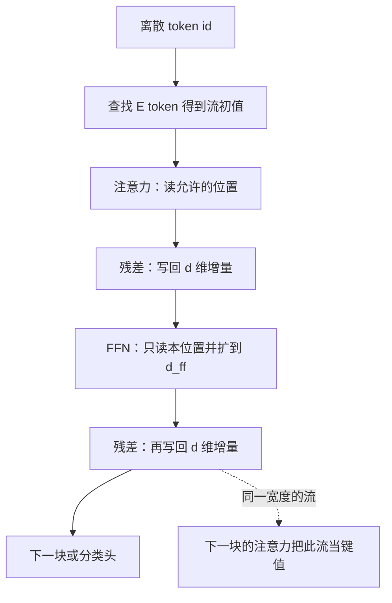

# 块内信息路径

位置之间的混合只发生在注意力子层；前馈子层即使中间扩得很宽，也只加工已经写在该位置上的流。

<footer>—— 据 Vaswani 对两子层定义域的划分，以及残差流上读写顺序整理</footer>

[上一课](/llm/ffn-expansion-ratio)补完了 FFN 的中间宽度。本课是「表示与 Transformer 块」课程的最后一课：分词、嵌入、残差、块的组成、扩展比都已经在位，缺的是一张「一块之内，信息实际跳了哪些步」的路径。不重讲 $x+F(x)$ 的动机，不重讲四倍怎么记账，也不推导缩放点积——那是下一课程第一课 [SDPA](/llm/sdpa) 的内核。本课只把已经引入的插件按读写顺序串起来，并标明哪些张量互相看得见。

## 问题

[FFN 扩展比](/llm/ffn-expansion-ratio)之后，读者有足够的零件：离散 id、查找得到的 $d$ 维向量、贯穿的流、注意力与 FFN 两种 $F$、FFN 内部的暂扩。零件若不上路径图，仍会把「层」理解成黑盒，或误以为 FFN 也能看见邻居，或误以为嵌入身份在第一块之后就消失。缺口是信息的跳转：从符号身份出发，经过一次块，哪些位置的哪些方向被读、被写、被压缩。

路径必须回答三个具体问题。第一，跨位置的边在哪里发生、发生几次。第二，位置内部的高维工作区在哪里出现、是否回流。第三，一块结束时，流上叠加了什么，下一块的注意力将把什么当成键值。答完这三者，「表示与块」作为课程可以收束；模型架构课程从注意力内核重新起笔，不再从词表讲起。

### 路径不是实现调度

融合核可能把归一化、投影和残差加在一个 CUDA 核里完成。那不改变逻辑路径：仍是先（默认串行）写注意力增量，再写 FFN 增量。本课画的是张量依赖，不是 kernel 边界。并行块会改依赖——两种 $F$ 读同一快照——若你用了并行变体，路径图上的串行边要改成并列边；主干默认串行。

位置编码若以加法形式出现，发生在进入第一块之前，本课把它算进「流的初值」，不在块内再跳一次。RoPE 改的是注意力内部的查询键，属于 SDPA 之后的位置课序，本课路径里只标「注意力可读其他位置」。

## 方法

一块的逻辑路径如下。输入是流 $x\in\mathbb{R}^{n\times d}$，来自嵌入（及可选的位置加法）或上一块输出。注意力子层从每个位置读当前流，按允许的位置集合混合，写出 $d$ 维增量，加回 $x$。此时位置 $i$ 的流第一次（在本块内）含有其他位置的内容。FFN 子层只读位置 $i$ 自己的新流，升到 $d_{\mathrm{ff}}$，激活，投回 $d$，再加一次。块输出仍是 $n\times d$，没有第三条通道。

允许的位置集合由掩码决定。双向编码器里是全体位置；自回归解码器里是 $i$ 及以左。掩码的实现与缩放点积绑在一起，本课只把它当成注意力边上的过滤器。padding 位置通常既不被读也不被写有效增量。特殊符号行（BOS、分隔符）走与内容 token 同一条路径，没有旁路。

### 把已经学过的接口标到边上

嵌入查找是块外的入口：id $\to E[t]$。Tying 影响的是块栈之后的出口，不是块内路径。扩展比只出现在 FFN 那条升维边上。残差是两条写回边。画路径时若把这些再展开成百科，就违反课程序列；这里只做引用：入口见 [查找](/llm/embedding-lookup)，加法见 [残差流](/llm/residual-stream)，两种 $F$ 见 [块的组成](/llm/transformer-block-compose)，升维见 [扩展比](/llm/ffn-expansion-ratio)。

下一块的注意力读的是本块 FFN 写完之后的流，不是「纯注意力输出」。解释某头在第 $\ell$ 层看什么，要记住键值已经含有 $\ell-1$ 块的 FFN 增量。

## 机制

跨位置跳跃的次数，每块恰好一次（默认串行、无交叉注意力）。深度 $N$ 意味着一条从位置 $j$ 到位置 $i$ 的消息，最多经过 $N$ 次注意力跳——中间还可以在每次跳之后被各位置的 FFN 改写。这与循环网络「每步传给下一时刻」不同：一次注意力就可以直接读远距离位置，不必沿序列逐步走。远距离仍然可能失败，那是容量、掩码与分数的问题，不是路径上缺少边。

位置内的跳跃是升维-激活-降维。信息可以在 $d_{\mathrm{ff}}$ 里被拆开，但只有投影回去的分量进入流，供本块之后以及下一块使用。中间激活不直接给其他位置看：邻居要等到下一次注意力，才能读到你写回流的那些方向。因此「FFN 记忆」是私有工作区加一次公开写回，不是全图广播。

### 一块之内谁看不见谁

FFN 看不见其他位置的中间激活，也看不见其他位置尚未加注意力增量之前的私有状态——它只看见加完注意力之后、本位置的流。注意力看不见 FFN 的中间激活，只看见进入本子层时的流（串行时即块输入）。两子层不共享除流之外的缓冲区。这是设计，不是实现疏忽：共享中间激活会破坏「逐位置 / 跨位置」的定义域划分。

交叉注意力一旦插入，路径上多一条「读另一条序列的流」的边。那是另一课程的对象。本课默认仅自注意力加 FFN 的语言模型块。

## 边界

并行块让注意力与 FFN 都读块输入，两条增量相加；跨位置跳跃仍只有注意力那一条，但 FFN 加工的是「尚未混合本块邻居」的流，语义与串行不同。MoE 只替换 FFN 那一段路径上的矩阵，不增加跨位置边。规范化插在读之前或写之后，会缩放路径上的数，不改变边的有无。这些变体在后课出现时，应回来改这张图的边，而不是重写嵌入。

「表示与 Transformer 块」到此结束。下一课是整个「模型架构」课程、注意力课序的起点：[SDPA](/llm/sdpa)。它假定你会本课的路径：残差流上先混合、后逐位置加工；不再从离散符号或词表讲起。若路径图与实现不符，先查是否用了并行块、交叉注意力或把 FFN 放到了注意力前面，再去改内核公式。

## 小结

- 一块之内，跨位置边只出现在注意力；FFN 只加工本位置、经 $d_{\mathrm{ff}}$ 再写回流。
- 残差把两次增量沉积在同一条 $d$ 维流上；下一块的键值含有本块 FFN 的写入。
- 中间激活不广播；邻居只能读到写回后的方向。
- 本课收束表示与块；注意力如何打分由 [SDPA](/llm/sdpa) 开始的课序补上。
- 并行、MoE、交叉注意力只改路径图上的边，不推翻已经钉死的接口。
- 出处：Vaswani et al., NeurIPS 2017；路径说法建立在本课程已引入的残差流与两子层分工之上。
