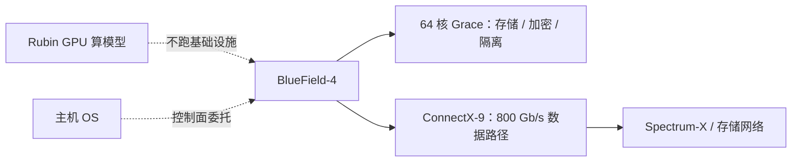

# BlueField-4：Grace + 网卡卸载基础设施

GPU 应当算模型；网络、存储、加密和多租户隔离不该再跟训练步抢同一颗主机核。

<footer>—— NVIDIA 对 BlueField-4 的公开表述：把基础设施服务卸载、加速并隔离，作为 AI 工厂的控制平面</footer>

ConnectX-9 解决的是「数据包怎么尽快进出 GPU」。工厂还要回答另一件事：谁来跑存储协议、谁来做加解密、谁来把多租户的虚拟网与安全策略从宿主机操作系统里拿开。NVIDIA 在 GTC Washington 公开的 BlueField-4 DPU，把一颗 64 核 Grace CPU 与 ConnectX-9 网络做进同一套封装，吞吐写成 800 Gb/s，并给出相对 BlueField-3「约 6 倍算力、可支撑约 4 倍规模 AI 工厂」的平台对比。它属于 Vera Rubin 公开的六芯片之一，早可用窗口被写成 2026 年随 Vera Rubin 平台。本篇只谈**基础设施卸载**，不把 DPU 写成另一张推理 GPU。

## 问题

AI 机柜的主机 CPU 已经很忙：驱动、遥测、容器、存储客户端、加密、虚拟交换。这些工作一旦和训练或 decode 抢缓存与中断，会出现两种坏结果。一是 GPU 等 I/O：检查点、KV 外置、数据加载变成步时间的一部分。二是安全面与租户面粘在宿主机上：裸金属多租户要求把基础设施控制从客户工作负载里切开。BlueField-3 已经用 Arm 核加 400 Gb/s 级网卡做这件事；工厂规模再往上，存储 IOPS、在线加密带宽、可管理的主机数都要加一档，否则「加速卡很快、数据平面仍是 CPU」。

NVIDIA 把 BlueField-4 写成：用 Grace 做可编程基础设施，用 ConnectX-9 做高速数据路径，用 DOCA 微服务把网络、存储、安全编成容器化服务。问题是职责边界：哪些必须留在 DPU 上（否则 GPU 或主机被拖死），哪些仍该是机柜管理面或独立存储集群。

### DPU 与 SuperNIC 不要混着用

同一代材料里，ConnectX-9 以 SuperNIC 出现，BlueField-4 以 DPU 出现。公开技术博文把 BlueField-4 写成双芯片封装：64 核 Grace 负责卸载与安全，集成的 ConnectX-9 负责紧耦合的数据搬移。SuperNIC 可以不带那颗大 CPU；DPU 则明确要跑操作系统级服务。运维上，SuperNIC 更像高速网卡，DPU 更像「一台插在 PCIe 上的基础设施服务器」。把两者的镜像、内核与 DOCA 服务当成同一套镜像分发，会在现场制造无法解释的 CPU 空闲或过热。

NVIDIA 后续 POD 材料还提到 BlueField-4 STX 存储机柜，并把处理器描述成 Vera CPU 与 ConnectX-9 的组合。公开命名上「BlueField-4」覆盖不止一种主机侧 CPU 搭配。规划时以当时数据手册的具体 SKU 为准，不要把 Grace 版与 Vera 版的核数、内存表混抄成一张。

## 方法

把 BlueField-4 当成机柜的基础设施平面来部署，而不是当成第 73 张 GPU。NVIDIA 技术博文给出过与 BlueField-3 的对照表，公开数字包括：带宽从 400 Gb/s 到 800 Gb/s；计算从 16 个 Arm A78 到 64 个 Arm Neoverse V2 级核；内存容量从 32 GB 到 128 GB；内存带宽从约 75 GB/s 到约 250 GB/s；云网络可管理主机规模从约 32K 到约 128K；4K NVMe 分发从约 10M IOPS 到约 20M IOPS。这些是厂商规格，用来理解「卸载平面加了一档」，不是本博客的测量。

软件走 DOCA：把网络、存储加速、运行时安全做成微服务，并支持服务功能链（service function chaining），让多段网络/安全/存储处理在 DPU 上串起来，而不回到主机。安全侧公开了 ASTRA（Advanced Secure Trusted Resource Architecture），用于在选定的 Rubin 平台上配合 ConnectX-9，给裸金属实例做零信任租户隔离。存储侧，BlueField-4 被明确写成 AI 数据存储加速与 KV / 上下文外置路径的引擎之一——这与 [PD 分离里的 KV 搬运](/llm/pd-kv-transfer) 是同一类流量，只是落点从「另一组 GPU」变成「DPU 后面的存储层」。

### 让 GPU 只看见「已经准备好的字节」

训练要的是稳定的数据管道：从并行文件系统或对象存储到 HBM，中间的 CRC、加密、RDMA、NVMe-oF 都应尽量停在 DPU。推理要的是上下文命中：前缀 KV 若外置，命中路径的 IOPS 与带宽由 DPU 而不是由 GPU 核来伺候。NVIDIA 公开材料把 NVMe 分发 IOPS 翻倍写成这一代的存储故事；是否值得外置，仍取决于你的 [前缀缓存](/llm/prefix-caching) 命中率——命中率低时，外置只是把带宽墙从 HBM 挪到网络。

编排上，Kubernetes 应把 DPU 看成独立的加速器资源（DOCA 服务、VF、代表网卡），不要把基础设施 Pod 调度到训练 GPU 上「顺便跑」。多租户云要把虚拟交换与 ACL 放到 DPU，让客户虚拟机看不到宿主机的网栈。

## 机制

卸载成立，是因为数据面与控制面被拆开。ConnectX-9 路径负责线速转发与 RDMA；Grace 核负责那些不规则、有状态、但必须靠近网卡的工作：连接跟踪、存储协议、遥测聚合、策略。相对 BlueField-3，核数与内存带宽一起加，才能在 800 Gb/s 上仍留出可编程余量——否则线速加密会把 Arm 核打满，DPU 退化成一块不会编程的网卡。

对 LLM 工厂，这意味着三件具体的事。网络：多租户与东向流量的隔离不经过 GPU。存储：检查点与 KV 外置的协议处理不经过训练进程。安全：运行时策略可以在数据路径上执行，而不在模型进程里插钩子。DOCA 的兼容叙述是：现有 BlueField 上的加速应用应能迁到 BlueField-4 并吃到性能；这是软件平台承诺，具体微服务目录以当时 DOCA 发行说明为准。

800 Gb/s 是 DPU 的网络吞吐规格，与 SuperNIC 页上「每 GPU 1.6 Tb/s」不是同一口径。一块 DPU 服务的是节点或托盘的基础设施平面；每 GPU 的 scale-out 带宽仍看 ConnectX-9 SuperNIC 的配置数量。不要把一张表的数字填进另一张表。

### 和主机 CPU、Vera CPU 机柜的分工

Grace 在 BlueField-4 里是基础设施 CPU，不是把 Vera CPU 机柜替代掉。NVIDIA 另有密集体液冷的 Vera CPU 机柜，用来跑智能体沙箱与强化学习环境。DPU 上的 64 核用来靠近数据包；机柜里的 Vera 用来靠近智能体进程。两者都是 Arm 服务器类核心，工作负载不同。不要因为「都是 NVIDIA 的 CPU」就把沙箱调度到 DPU 上。

## 边界与工程取舍

不要指望 BlueField-4 加速 Transformer 核：它没有被公开写成推理加速器。不要在未部署 DOCA 服务时宣称「已经卸载」——插上 DPU 而流量仍走主机内核，只是多了一颗闲着的 Grace。不要把未出现在数据手册里的频率、缓存容量、未发布的加密算法列表写进容量规划。Hot Chips 报道里出现过频率与 LPDDR 带宽的现场数字，若与数据手册不一致，以 NVIDIA 自己的数据表为准，现场笔记只作参考。

爆炸半径：DPU 固件或 DOCA 服务故障会影响该节点的网络与存储，而不一定让 GPU 计算核立刻停止；但训练作业会表现为 I/O hang。SLA 要把 DPU 当成数据路径的一部分来监控，而不是当可选的管理卡。

出处：NVIDIA《Launches BlueField-4》博客、Inside Vera Rubin 平台技术博文中的 DPU 对照表与 800 Gb/s / 64 核 Grace 描述、BlueField-4 数据手册摘要，以及 DOCA / ASTRA 的公开定位。不编造未公开的单核频率表。

## 小结

- BlueField-4 公开形态是 Grace 级 CPU 加 ConnectX-9 网络，用于卸载网络、存储与安全，不是推理 GPU。
- 相对 BlueField-3，公开对照包括 800 Gb/s、64 核、更大内存与更高 NVMe IOPS。
- 软件面是 DOCA 微服务与服务链；安全面公开了 ASTRA 的裸金属隔离叙事。
- SuperNIC 管 scale-out 带宽，DPU 管基础设施平面，两者不要混成同一运维对象。
- KV 外置与检查点能否受益，取决于命中率与网络，而不是 DPU 的存在本身。
- 出处：NVIDIA BlueField-4 / Vera Rubin 公开博客与数据手册。
