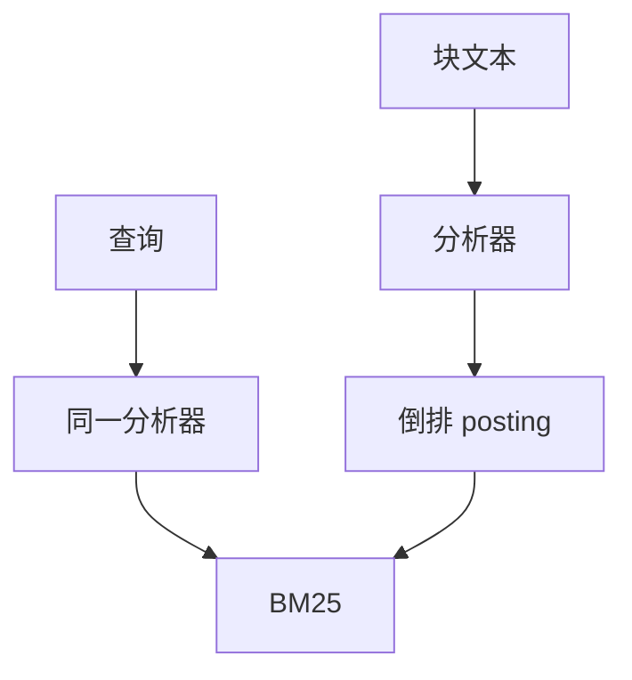

# BM25 与稀疏检索

词法通道精确匹配高 IDF 的标识符。在订单号、报错码、函数名上，它经常是主通道，而不是「稠密之前的基线」。

<footer>—— Robertson 等 BM25；倒排索引传统</footer>

[上一课](/llm/multi-vector-late-interaction)用多向量补语义对齐。标识符仍常输给「语义流畅但不含该字符串」的段落。主干[混合检索](/llm/hybrid-retrieval)已把 BM25 与稠密融合；本课在补层把稀疏检索本身写清，作为后课 SPLADE 的词法起点。缺口是：稀疏不是过时点缀。

## 问题

BM25 把文档当词袋：词频饱和、IDF、长度归一。它对恰好出现的词极强，对同义与改写弱。稠密相反。真实查询常在一句自然语言里夹一个 `ECONNRESET`。只做向量，标识符被周围虚词带走；只做 BM25，换一种说法会零召回。本课钉稀疏这一侧的定义与实现陷阱，融合细节仍指向混合检索课。

分词必须与查询一致。中文分析器、代码 keyword 字段、是否 stemming，都是协议。换分析器等于换索引。

$k_1,b$ 有默认值，字段加权（标题大于正文）通常比微调 $k_1$ 更有效。先加权，再谈超参。

## 方法

倒排：词 → 文档列表 + 词频。查询时取各词 posting 求 BM25 分，可加字段权。过滤（租户、语言、版本）在倒排里做，与向量侧同一元数据，否则融合会抬出无权限文档。新文档先写倒排再写向量，稀疏可立即服务。

与切分的关系见 [RAG 切分](/llm/rag-chunking)：块是倒排的文档单位，切太碎则 IDF 统计不稳，切太整则词袋平均掉小节。

## 机制

IDF 把常见词压下去，罕见标识符权重大。饱和函数避免重复堆砌同一词无限加分。这是计数模型，没有同义。同义要靠查询扩展、同义词表，或后课学习到的稀疏表示（SPLADE）把隐含词写进扩展维度。

## 边界

BM25 不理解否定与语序。「不含超时」仍会命中含「超时」的段落。语义约束交给稠密或阅读器。下一课 SPLADE：用神经网络预测稀疏词权重，让词法通道也能「扩写」同义。

## 小结

- BM25 是高 IDF 标识符的主通道；分析器属于协议。
- 权限过滤与切分单位必须与向量侧对齐。
- 词袋无同义、无语序；同义交给扩展或 SPLADE。
- 出处：Robertson BM25；混合检索课的融合。
