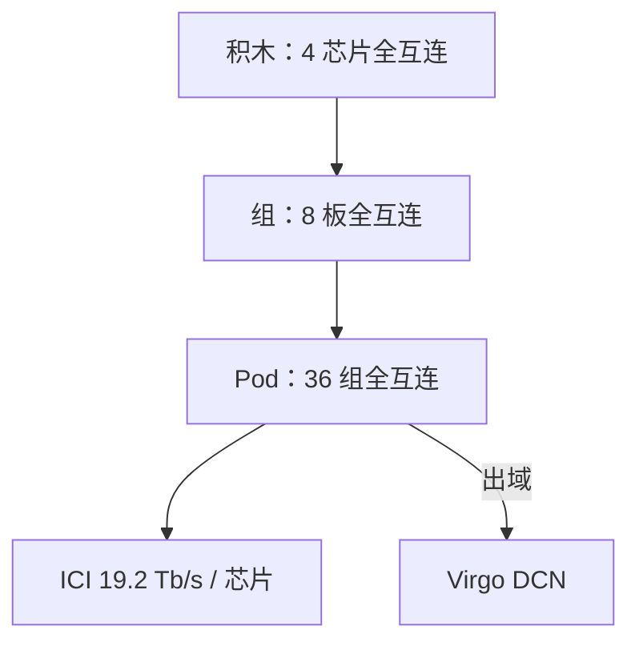

# Boardfly 芯片间互连

    
四颗全互连芯片做积木，八块板成一组，三十六组收成 Pod：把 ICI 直径砍半，是为了 MoE 逐步 All-to-all，不是为了再塞九千颗训练芯片。

    <footer>—— Google 第八代 TPU 博文：TPU 8i 的 Boardfly 层次与直径</footer>

Boardfly 是 TPU **8i** 的 Inter-Chip Interconnect 拓扑名。8t 训练 superpod 仍用 3D torus；推理芯片换图，因为服务关心的是任意两芯片之间的跳数，而不是环面上沿轴的带宽。官方给出的层次：四颗全互连芯片为积木（building block），再全互连成「八块板」一组，然后 **36** 个这样的组全互连成一个 8i Pod。直径相对原 ICI 方案降 **50% 以上**。ICI 带宽与 8t 同档公开为每芯片 **19.2 Tb/s**。跳数表、铜缆/OCS 的端口合同、Pod 内准确芯片数，未出现在该博文——**公开信息有限**，本篇不把第三方的 7 hop / 1,152 写成 Google 合同。

## 问题

MoE 推理每步把 token 送到被选中的专家。专家铺在多芯片上时，这是 All-to-all：延迟由最慢那对决定。3D torus 在规模上去之后直径随维数增长，训练可以用大 batch 把通信藏进计算；decode 的 batch 是并发请求数，藏不住。Google 写 Boardfly 是按当代推理模型的通信需求设计的，和 8i SRAM 按 KV 占用标定是同一套 co-design。问题不是「要不要 ICI」，而是 **ICI 的图该为谁的尾延迟负责**。

第二约束是物理：全互连不能无代价扩到 9600 芯片。Boardfly 用层次全互连换直径，Pod 必然小于 8t superpod。大模型超出 8i Pod 就要上 [Virgo](/llm/virgo-ici)，那一步从专用 ICI 变成数据中心织物。

### 直径为什么是推理一等公民

集合算法的延迟 ≈ 跳数 × 每跳时间 + 尾部排队。训练 AllReduce 可以选环或树，把带宽用满；推理 All-to-all 几乎是完全交换。直径减半，最坏跳数减半，尾延迟才有「官方称通信密集负载上改善」的物理空间。博文配图说明写的是层次全互连，不是「还是 torus 但更密」。

行业稿件常把 Boardfly 写成 Dragonfly 启发、积木为四芯片环、组间 OCS、1,024 活跃芯片。这些细节有助于直觉，但不是本篇所引官方博文的句子。工程文档对外只引用：四芯片积木、八板成组、36 组、直径 −50%+、19.2 Tb/s。

## 方法

把延迟敏感的并行轴画在 Boardfly Pod 内：专家并行、张量并行、decode 需要的短 AllGather。数据并行、跨 Pod 的 KV 池、预填充分流可以出域。CAE（Collectives Acceleration Engine）在芯片上卸集合，最多约 5× 降低片上集合延迟，与拓扑正交：拓扑减跳数，CAE 减片上发起/完成。两者都服务于「高并发时别让 GPU/TPU 空等 token」。

主机加倍与 NUMA 隔离（8i 产品点）保证发起集合的 CPU 侧不是瓶颈。编译器 / 运行时必须知道这张层次图：若 XLA 仍按 3D torus 的轴去切 mesh，可能把本该一跳的专家交换走成跨组绕路。GA 后的 Cloud 文档应给出切片形状；在那之前不要假设 8t 的 `x×y×z` torus 字符串能直接用在 8i 上。

### 和 NVLink 域、8t torus 的对照

NVLink 6 的 NVL72 是机柜全互连，每 GPU 双向 3.6 TB/s，见 [NVLink 6](/llm/nvlink-6)。Boardfly 是 Google 的 ICI 层次全互连，公开的是 19.2 Tb/s 每芯片与直径相对量，**没有**给出与 NVLink 同口径的「任意一对无阻塞带宽」表。8t torus 服务 9600 芯片训练域，直径更大、规模更大。选型：万卡稠密/MoE 训练 → 8t torus + Virgo；低延迟 MoE 服务 → 8i Boardfly Pod。不要在 8i 上用 8t 的芯片数估 EP 度。

## 机制

层次全互连的典型代价是：组内铜缆短距、组间光（官方博文未逐条写介质；OCS 出现在 8t RAS 与 8i 配图生态里）。路由上，组内应始终走短径；组间才进光交换。若作业把专家按「随机芯片」放置，All-to-all 会把流量打满组间切面。放置应尽量让同层专家落在同一组或同一积木，让热点切面变宽。这与 GPU 上「EP 不要跨 NVLink 域」是同一句话。

19.2 Tb/s 是每芯片注入 ICI 的官方带宽（博文写 doubled interconnect to 19.2 Tb/s）。双向/单向、是否含协议头，未展开——引用时带「官方每芯片 ICI 带宽」。把它乘以未知的 Pod 芯片数当成 Pod 对剖，属于发明。直径 −50% 是相对「原先 ICI 方案」的相对量，未给跳数绝对值。

Boardfly 只服务 8i。8t 继续 torus。两颗芯片共享 Axion 主机与 Virgo scale-out，但不共享 Pod 内图。混用 8t/8i 的作业要把两种 ICI 当成不互通的 scale-up 域，中间是 Virgo。

## 边界与工程取舍

公开信息有限的条目：Pod 芯片合同数、最大跳数、组间过订阅、铜/光端口速率、故障时直径如何退化。不要用 StorageReview / 会议笔记里的 7 hop 当 SLO。GA 前无用户可订的切片 SKU。通信密集负载上「最高约 50% 延迟改善」若出现在转述中，以官方「直径 −50%+」为准去理解物理，不以未引用测试集的百分比当验收门槛。

### 放置与切面

层次全互连里，积木内、组内、组间三条切面的容量不同。专家若按层连续铺在相邻芯片上，All-to-all 更多走积木内全互连；若按「全局 round-robin 芯片」铺，流量会被送到 36 组之间的光切面。训练 torus 上常见的 3D 网格切分字符串，不能直接表达「先填满一组再溢出」。GA 之后应看 Cloud 是否给出 Boardfly 感知的 mesh 轴名；在那之前，人工把 EP 度限制在一组或一个积木里，比盲目 `ep=整个 Pod` 更接近官方降直径的意图。故障时若一组被 OCS 摘掉，直径与切面都会变，服务应能降并行度或把副本迁到健康组，而不是假设 36 组永远对称。

超出 Pod 的 MoE 不要指望 Boardfly 的直径故事还成立。那时延迟模型换成 Virgo，需要减并行度、做分层 EP，或把 decode 限制在单 Pod 副本上。SRAM/HBM 再大，救不了跨数据中心的逐步交换。铜缆长度与机柜摆放会限制「八板成组」的物理含义，机房规划要以官方机柜图为准，不要按数据中心以太网的机架单元去脑补 ICI。

出处：https://blog.google/innovation-and-ai/infrastructure-and-cloud/google-cloud/eighth-generation-tpu-agentic-era/ （Boardfly 层次配图说明、直径、19.2 Tb/s、CAE）。芯片产品语境见 [TPU 8i](/llm/tpu-8i-zebrafish)。

## 小结

- Boardfly 是 TPU 8i 的层次全互连 ICI，不是 8t 的 3D torus，也不是 Virgo。
- 官方层次：4 芯片积木 → 8 板成组 → 36 组成 Pod；直径降 50% 以上。
- 每芯片 ICI 19.2 Tb/s；跳数与 Pod 芯片数公开信息有限。
- 把 MoE / TP 的逐步集合留在 Pod 内；出域即 Virgo，直径故事结束。
- CAE 减片上集合延迟，与拓扑叠加，不互相替代。
- 出处：Google 第八代 TPU 官方博文。
