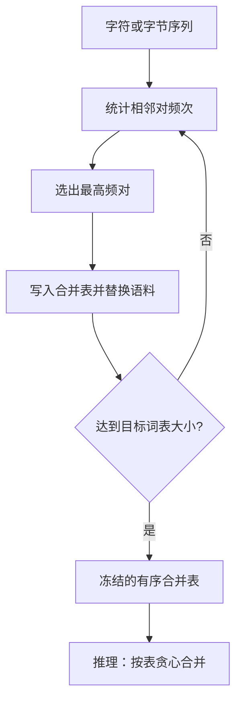

# BPE 合并规则

我们把罕见词与未登录词写成子词单元的序列，用一种简单的数据压缩算法从语料里学出这些单元：反复合并出现最频繁的符号对。

<footer>—— 据 Sennrich, Haddow, Birch, Neural Machine Translation of Rare Words with Subword Units, ACL 2016 整理</footer>

[上一课](/llm/token-as-discrete-unit)已经把输入收成有限词表上的离散符号。本课不重讲 token 是什么、编号有没有语义。缺口是：$V$ 里的符号从哪来。字符级词表太细，序列过长；词级词表太粗，罕见形态和粘着变化会把 $|V|$ 撑爆，并制造大量未知符。Sennrich 等人把 Gage 的字节对编码（Byte Pair Encoding, BPE）从压缩搬到翻译：用频率驱动的合并规则，从底向上长出一套中等粒度的符号。

## 问题

[离散符号与词表](/llm/token-as-discrete-unit)只要求 $V$ 有限。若直接用空格分词，英语还勉强，形态丰富的语言和专有名词会让词表在长尾上无限涨；若只用字符，英文一个词要拆成许多位置，后续块的计算按长度付账。需要一种从语料统计里决定「哪些字符应该焊在一起」的程序，使常见词保持整块、罕见词仍能拆开拼写，而不必为每个词形单独占一个编号。

频率是最便宜的统计量。不必估计生成模型，不必做动态规划，只要会数相邻对。问题于是收成：从字符（或字节）序列出发，按什么顺序把相邻对焊成新符号，以及焊多少次才停。这套顺序必须能写成一张表，训练与推理共用，否则同一段原文会变成不同的离散序列。

### 词级与字符级各自卡住的地方

词级卡住的是覆盖。训练没见过的复合词、数字、代码标识符，要么 UNK，要么把整张表撑到百万级。字符级卡住的是长度与组合负担：模型必须在很深的层里才拼出常见词，短程统计被浪费在拼写上。BPE 要的不是语言学词素，而是一条可复现的压缩路径，使高频片段变成原子、低频片段仍能用更短原子拼出来。

BPE 的「子词」是合并的副产品，不是事先标好的词素。`ing` 常被焊住，只因为语料里它常作为相邻对出现，不是因为模型懂英语后缀。

## 方法

训练阶段从语料的字符序列开始（原论文在词内做，词与词之间不跨空格合并；后来的字节级实现把空格也当成普通符号）。统计所有相邻对的频次，选出最高频的一对 $(a,b)$，向词表加入新符号 $ab$，并把语料里的该对替换成这个新符号。重复直到词表达到预设大小，或直到没有足够频繁的对。产出是一张有序合并表：第 $k$ 步合并哪一对。

推理时不再数频次。从字符序列出发，反复在当前位置允许的对里，挑选合并表中排最前、即训练时最早学会的那一对，焊住，直到不能再合并。这是贪心的、确定性的。同一字符串每次得到同一序列。词表 $V$ 等于初始字母表加上合并产生的新符号，再加特殊符号。

### 合并表就是词表的构造函数

实现上常把初始字母表定为 unicode 字符或 256 个字节，再追加数万次合并。GPT-2 一类字节级 BPE 把任意字节先映到原子，再合并，从而训练时几乎不依赖语言特定的预分词。Sennrich 原实现先按空格切词，再在词内合并，翻译任务里这能避免把短语焊成一个符号。两种实现共享同一条规则：频率决定下一对，顺序决定推理时的优先级。

「按频次合并」只发生在训练。推理若再按当前句子的频次合并，同一词在不同上下文里会切成不同符号，嵌入无法对齐。合并表必须冻结。

## 机制

BPE 是贪心压缩，不是似然模型。每一步只看当前表示下哪一对出现最多，不回头检查早先的合并是否阻碍了更好的全局切分。因此它可能焊出对似然次优的符号：某个中频片段因为早期的局部计数被焊进更大块，另一种更整齐的拆法再也走不到。确定性却是优点：无需 Viterbi，切分与训练时的计数路径一致。

因为合并只发生在相邻对上，BPE 天然保持局部拼写结构。未见过的词只要其字符（字节）在初始表里，就能拆成已有符号的序列，而不必立刻 UNK。这正是 Sennrich 要的：罕见词的「拼写路径」仍在 $V$ 里。代价是同一词的常见形与罕见形可能共享词干符号、却在词缀上分开，嵌入必须自己学会这两段该不该合成一个意思。

### 与纯压缩算法的差别

Gage 的 BPE 为了压缩比会合并到不能再合并为止。神经翻译里合并次数是超参：焊得太少，序列偏长；焊得太多，词表变大，且开始出现跨形态的巨大块，罕见块的嵌入学不透。停止条件由目标 $|V|$ 给出，不是由压缩比最优给出。后课会把 $|V|$、压缩率、UNK 率放到同一张权衡里；本课只负责「表是怎么长出来的」。

空格是否参与合并，会改变「词」的边界是否还存在。字节级 BPE 常常把前导空格焊进下一个词的第一个符号，detokenize 时才能知道词界。那是 [往返](/llm/detokenize-roundtrip) 的题目，不是合并规则本身。

## 边界

BPE 不提供同一字符串的多种切分，因此不能在训练时做子词正则化——那是下一课 Unigram 要补的。它也不保证切分在语言学上可解释，更不保证跨语言公平：高频语言吃掉更多合并名额，低频语言停在更碎的字符附近。预分词若依赖空格，对中日文和无空格脚本必须另接分词器，否则整句可能被当成一个超长「词」再内部合并，行为与论文里的词内 BPE 不同。

合并对数字、代码、URL 往往不友好：`2024` 可能被焊成若干碎片，版本号每次出现切法还算稳定，但语义上「是一个数」要靠后面的层来拼。这不是 BPE 的缺陷声明，而是频率目标与任务目标不一致时的预期行为。若需要按似然选择切分，或需要在训练时采样替代切分，应换 Unigram，而不是给 BPE 加温度。

## 小结

- 本课不重讲离散符号；只补词表如何从频率合并里长出来。
- BPE 从字符或字节出发，反复把当前最高频相邻对焊成新符号，产出有序合并表。
- 推理按冻结的表贪心合并，确定性、无似然、不回头。
- 罕见词靠更短符号拼出，从而减少词级 UNK；停止条件是目标 $|V|$，不是压缩最优。
- 贪心路径可能对全局切分次优；多种切分与正则化留给 Unigram。
- 出处：Gage, *A New Algorithm for Data Compression*, 1994；Sennrich, Haddow, Birch, ACL 2016。
