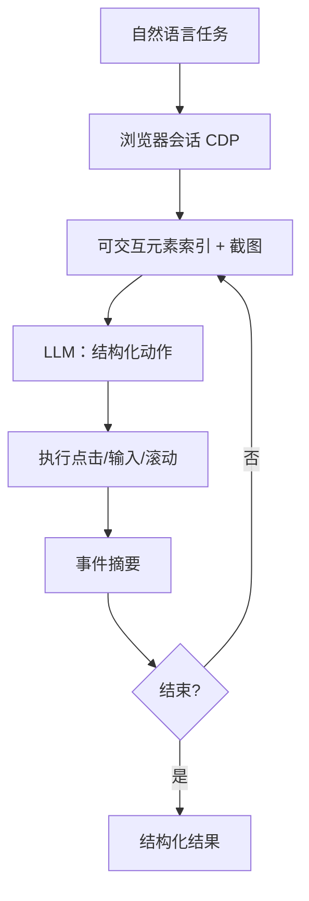

# Browser-use Agent

    
把当前页编成带索引的可交互元素，问语言模型下一步点谁、填什么，在浏览器里执行，再观察，直到任务结束。

    <footer>—— Müller 与 Žunić，Browser Use 开源软件，GitHub 2024</footer>

**Browser Use**（仓库 `browser-use/browser-use`）是 Magnus Müller 与 Gregor Žunić 发布的开源 Python 库：给任意聊天模型一套浏览器动作，而不是再训练一个「计算机使用」专用权重。早期实现经 Playwright 驱动 Chromium；2025 年中起主干迁到 Chrome DevTools Protocol（CDP）与自研事件总线，去掉 Playwright 进程跳。本篇写开源代理循环的观察接口与评测位置。只讨论对自己的站点、预发环境或公开基准页做自动化。不写隐蔽绕过、验证码破解、未授权爬取或攻击性利用。

## 问题

闭源计算机使用 API 把视觉策略锁在一家模型里，换骨干就要换整条产品。研究与工程需要：**同一套浏览器运行时，插 GPT / Claude / Gemini / 本地模型**，用结构化动作而不是让模型发明选择器字符串。裸 Playwright 脚本确定、可回归，但每次站点改版都要人手改脚本。纯像素计算机使用更通用，却贵、慢、对坐标误差敏感。Browser Use 卡在中间：运行时负责枚举可交互节点并编号，模型只输出「对 12 号元素点击」或「向该框键入」，降低动作空间的熵。

观察接口决定失败形态。只喂 DOM，canvas 与图标按钮会消失；只喂截图，模型要自己数像素，索引元素的优势没了。项目采用 **DOM（或 CDP 抽出的可交互树）加截图** 的混合观察，让模型同时看到编号高亮与视觉布局。这与 Operator / Gemini Computer Use 的「主要靠像素出坐标」不同，也与 Playwright MCP 的「无代理循环、只暴露确定性工具」不同。

### 库、CLI 与托管云不是同一合同

GitHub 同时提供 Python 库、给编码代理用的 CLI skill、以及商业托管云。库面向可重复的产品自动化（定时任务、QA、嵌入自己的服务）；CLI 面向「已有 Cursor / Claude Code，临时让它开浏览器」。云端宣传的规模化、代理轮换等能力**不是**开源论文数字，本篇不把营销图当基准。引用软件时用 Müller & Žunić 2024 的 BibTeX（`@software{browser_use2024}`），不要编造不存在的 NeurIPS 论文。

2025 年 8 月前后的重构把 Playwright 从默认路径拿掉，改走 `cdp-use`。旧博客写「底层是 Playwright」对 0.6 之前成立，对当前主干不成立。写集成版本号，不要混用两套事件模型。

## 方法

最小循环：(1) 导航到任务相关 URL（由用户或上一步指定）；(2) 抽取可交互元素，赋稳定索引，可选在截图上叠编号；(3) 把任务、当前 URL、元素表、最近事件摘要送给 LLM，要求结构化输出（动作名 + 索引 + 文本）；(4) 运行时执行点击、输入、滚动、切换标签、提取文本等白名单动作；(5) 把新观察与 `recent_events_summary`（下载、弹窗、崩溃、导航）追加进下一步。一步可含多个动作（历史上 `max_actions_per_step` 默认约 3），用结构化输出 / JSON schema 约束，而不是自由文本正则。

评测应冻结：骨干模型、最大步数、是否允许出网、浏览器视口、以及任务集。公开讨论常拿 WebArena、WebVoyager、Online-Mind2Web 一类浏览器基准做对照，但 **仓库本身不是这些基准的官方提交包**。要把 Browser Use 当方法，必须自己用同一 runner 跑，并写明 Playwright 世代还是 CDP 世代。确定性回归（同一工作流可重放）被作者列为未完全解决的工程问题：A/B、会话过期、站点改版都会破坏轨迹。合理用法是：用代理发现流程，再把稳定路径写成 Playwright/CDP 脚本；不要把非确定性循环当每天一万次的生产爬虫。

### 事件驱动观察相对「步间快照」

Playwright 世代往往只在动作之间更新世界图像。CDP 世代用 watchdog 订阅下载、渲染进程崩溃、弹窗、权限请求，把异步事件写进下一步提示。这对评测的意义是：失败可归因于「模型选错索引」还是「页面在动作间隙自己变了」。压力测试叙述里，数千高亮元素时 DOM 构建加截图可压到数秒量级，另加一次 LLM 调用——步时延由模型主导，不是由点击系统调用主导。因此换更小的骨干会直接改变任务成功率与费用，这是方法自变量，要写进表头。

## 机制

索引元素把连续 GUI 变成离散分类：模型在 $N$ 个节点上做选择，而不是在 $W\times H$ 像素上回归。编号在 DOM 变化后必须重抽，否则「点 12」会点到别的控件——这是该类 ACI 的经典漂移。混合视觉让模型在索引缺失时仍能描述布局，但不能发明不存在的索引。结构化输出把动作钉在 schema 上，减少「输出一段 JavaScript 让页面自己跑」的越权面；宿主仍应拒绝 schema 外字段。

与 [OpenAI Operator](/llm/openai-operator)、[Gemini Computer Use](/llm/gemini-computer-use) 相比：后两者卖专用视觉策略与坐标动作；Browser Use 卖**可换 LLM 的浏览器 ACI**。与 [OpenHands](/llm/openhands) 相比：OpenHands 的浏览只是软件工程平台里的一种动作；Browser Use 把浏览器当作主运行时。与 Playwright MCP 相比：MCP 服务器暴露确定性工具，自己没有「直到任务完成」的代理环；环在宿主。需要协议层工具发现时读 [MCP](/llm/mcp)；需要多步推理信封时读 [ReAct](/llm/react)。

动作白名单应由宿主收紧：只开任务需要的源、默认禁任意文件下载执行、禁把 cookie 面板内容当凭据回填。模型提议的 URL 要过允许列表。这些是运行时合同，不是模型能力。

## 边界与工程取舍

### 不要把开源循环当成通用计算机使用

Browser Use 不声称 OSWorld 级桌面控制；它的世界是浏览器。用它去点本机系统设置，超出库的抽象。站点服务条款、登录墙、验证码是法律与产品边界：本篇的合法范围是你拥有或被授权测试的界面，以及学术基准里的自托管站点。云产品文档里若出现对抗检测、验证码相关能力，那是商业产品叙述，不在这篇开源架构里展开，也不当作评测默认项。

API 一年内从 `Controller` 到 `Tools`、从 Playwright 到 CDP，集成必须钉版本。Token 费用与步数线性相关，已知稳定流程应降级为脚本。多标签与 iframe 在 CDP 下比旧 IPC 路径更可观察，但仍需把跨源目标纳入会话模型，否则索引只覆盖主框。评测报告完成率时，应同时抽查「是否遵守任务约束」：有研究指出网页代理的完成率会高估真实正确率——引用时分开「跑完」与「做对」。

出处：Müller 与 Žunić，*Browser Use: Enable AI to control your browser*，GitHub，2024。架构变迁见项目 changelog 与移除 Playwright 的重构说明。浏览器基准对照 Zhou 等 WebArena、He 等 WebVoyager；不要把第三方博客的未冻结百分比写成官方论文表。

## 小结

- Browser Use 是开源浏览器 ACI：元素索引 + 结构化动作 + LLM 循环，骨干可换。
- 观察是可交互树与截图；CDP 世代用事件摘要补步间变化。
- 评测要钉模型、步数、视口与库版本；仓库不是 WebArena 官方提交。
- 与 CUA / Gemini Computer Use 的差别是「通用 LLM + 索引元素」对「专用视觉坐标模型」。
- 只用于授权界面与基准环境；不讨论攻击或绕过防护。
- 出处：Müller & Žunić，GitHub 2024。
