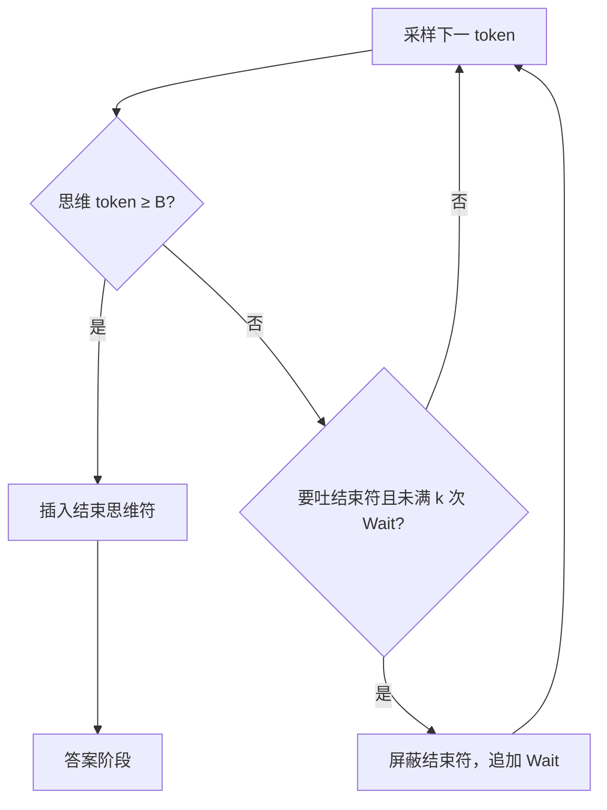

# Budget Forcing / s1

    
思维分隔符是采样循环里的硬旋钮：到预算就插入结束思维；还想续想，就挡住结束符并追加 Wait——控制的是序列长度，不是另训一张搜索模型。

    <footer>—— Muennighoff 等，s1: Simple test-time scaling，arXiv:2501.19393；本篇只钉解码干预，数据与 SFT 见姊妹篇</footer>

s1 论文同时贡献了 s1K 精选蒸馏与名为 **budget forcing** 的测试时干预。选数、1K 消融、与 R1 蒸馏的样本效率对比，已写在 [s1 / budget forcing](/llm/s1-budget-forcing)。本篇把 forcing 从论文里抽出来，当成一种**与权重分离的解码原语**：它假定模型已经通过 SFT 学会「思维段 / 答案段」模板，然后在采样器里对结束思维标记做插入或屏蔽。更一般的测试时计算见 [Snell](/llm/snell-test-time)。不把它写成 RL，也不把 Wait 写成通用控制 API。

## 问题

长链模型有两种不受控：过早结束思维，或在重复循环里耗尽 `max_tokens` 仍不给最终答案。只调 `max_new_tokens` 解决不了前者——模型在分隔符上自己停；也解决不好后者——你只会得到更长的循环。需要在**已经生成的思维后缀**上施加与训练模板同构的硬约束：结束符出现的时机，由运行时而不是由随机采样单独决定。

并行 Best-of-N 覆盖多条独立短链，不延长同一条草稿。Budget forcing 是序列缩放：沿同一条链多写 token。Snell 指出深度扩展要求策略已经会用长链；forcing 不创造这种能力，只是在能力存在时把长度拧成横轴，以便画准确率—token 斜率。因此它的前置条件是分隔符 SFT，通常就是 s1 那种教师长链微调，而不是任意聊天模型。

### 上限与下限不是对称操作

上限：思维 token 达到预算，向上下文**追加**结束思维分隔符（论文常再加 `Final Answer:`），迫使条件分布进入作答模式。这是插入，不是把已生成内容删掉。下限：模型下一步要吐结束符时，把它从允许词表里屏蔽，并在当前思维末尾追加字符串 `Wait`，让模型在「Wait」之后按语料里的关联继续写——回头检查、Alternatively、换一种证法。可重复多次；原文 AIME 曲线画到 2/4/6 次。超过约六次，斜率变平并可能循环，此时上限强迫用来从循环里救出一个当前答案。

Wait 从未作为单独监督目标出现。它利用教师轨迹与网络文本里「停顿词后面跟着修正」的统计。换 `Let`、`Perhaps`，或换未在长链上 SFT 的基座，斜率会变，后续复现已观察到关键词敏感。

## 方法

实现必须改采样循环，而不是只设 `stop`。伪流程：在思维阶段统计 token；若计数 $\ge B$，插入结束分隔符并切换到答案阶段；若模型发出结束分隔符且次数低于下限 $k$，拒绝该 token，追加 `Wait`，继续思维阶段。答案阶段再用常规停止条件。分隔符字符串必须与 SFT 模板逐字节一致，否则插入的是模型没见过的边界，作答质量塌。

论文中的 s1-32B 在 Qwen2.5-32B-Instruct 上用 s1K SFT 之后，AIME24 上强迫拉长可从约 50% 到 57%；表 2 在最大 32K 思维 token 的 forcing 下，s1K 配置 AIME 50.0、MATH-500 93.0、GPQA Diamond 57.6（区间见原文）。这些数字是 **SFT 模型 + forcing**，评测若禁止改 logits / 禁止插入字符串，测到的是另一条模型。相对声明「超过当时 o1-preview 最多约 27%」绑定题目集与快照，封闭模型升级后不要当永久排名。

对照。多数票：并行 $N$ 条，不改单条长度。Snell 的自适应计算：按题决定搜还是改。长度惩罚 / 余弦奖励：在**训练**时改目标，不是测试时插入。R1 类模型若已在 RL 里内化「想够再停」，产品用思考开关调预算，不必再塞 Wait。Forcing 是开源侧把旋钮做出来的最小干预。

### 为何必须先有思维/答案模板

插入结束符能起作用，是因为 SFT 把「分隔符之后开始写 Final Answer」写成了高概率续写。没有这条模板，插入只是一段奇怪中缀，模型可能继续思维或乱码。屏蔽结束符能起作用，是因为结束符是离散的特殊串，logits 上可禁；若模型用自然语言「所以答案是」绕过特殊符，下限失效。这就是为什么 forcing 不是模型无关的运行时特性，而是与 chat template 同类的契约。

服务上，插入与屏蔽发生在每步采样，和连续批处理、CUDA Graph、推测解码的假设冲突：序列被运行时改写，prefix cache 的键变了。工程上常把思维阶段单独跑，强制点打断 graph。延迟与 token 费线性于 $B$ 与 Wait 次数；简单题上强迫加长是过度思考，准确率可能掉。

## 机制

序列缩放改变的是同一条链上的计算深度。Transformer 的长程串行依赖必须经过已写出的 token，见 CoT 作为工作记忆的讨论。多写 Wait 之后的句子，等于多给几层「读自己的草稿再改」。若草稿模板里没有「推翻自己」，多写只会重复。s1 用 1K 精选链内化模板；forcing 只负责走得更久。并行采样没有这条读—改回路，所以论文观察到：基座上多数票追不上 SFT 后再序列加长。

斜率弯曲的机制是重复与模式崩塌：Wait 触发的续写逐渐变成复制上一段，信息增量趋于零。强迫结束把崩塌截断，用当前草稿里已有的数字当答案，可能对也可能错。没有原则上的最优 $k$，只有在 AIME24 上调过的次数。把 57% 写成可无限加 token 的定律，与图不符。

Forcing 不提供验证器。错的自检仍是错。它与 PRM 搜索互补：PRM 决定哪一步该剪，forcing 决定还许不允许停。两者都改测试时计算，改的接口不同。

### 可控性是一等指标

论文把「思考 token 数可被实验者设定」列为方法成功标准。不可控的加长（只加大 `max_tokens`）画不出干净的横轴，斜率无定义。插入给出硬切，屏蔽给出硬续，横轴才是旋钮。这与产品里「思考预算」开关同构，差别是 s1 用显式字符串，闭源系统可能用内部特殊 token。评测协议必须声明是否允许这种干预，否则 s1 曲线不能与「原样 generate」混报。

## 边界与工程取舍

教师是 Gemini Thinking 一类封闭 API，s1K 的许可与污染要单独看；8-gram 去污不是证明。AIME 30 题置信区间宽。Wait 对未 SFT 的指令模型可能有害。多语言分隔符、不同 chat template，都要重做强迫字符串。它不能替代可验证奖励上的探索：学生不会发明教师轨迹外的新策略，只会把教师风格拉长。

相对 Open-R1：后者在训练环用 GRPO 改权重；forcing 不改权重。相对 deliberative alignment：后者把安全规格写进思维内容；forcing 不管写什么，只管写多久。相对 CoT 监控：更长的思维给监视器更多文本，也给模型更多空间把意图写出来或写得更绕，监控论文应单独评。

「超过 o1-preview 最多 27%」是论文对部分竞赛数学的相对声明。本篇不把它当 forcing 原语的性质。原语的性质是：在已有模板的模型上，结束符插入/屏蔽能把长度变成可控横轴。

### 何时不必做 budget forcing

权重里已经能按开关调节思维长度。评测禁止干预解码器。没有分隔符模板。任务以短答案为主，加长只会过度思考。需要逐步剪枝时优先 PRM 搜索，而不是盲目 Wait。

## 小结

- Budget forcing：超预算则插入结束思维符；未满下限则屏蔽结束符并追加 Wait。
- 前置条件是思维/答案分隔的 SFT 模板；Wait 依赖语料关联，不是稳定 API。
- 它是序列测试时缩放，与多数票的并行缩放不同；斜率约六次 Wait 后变平。
- 选数与 1K 消融见姊妹篇；本篇只把解码干预写成可实现的采样契约。
- 出处：Muennighoff 等，*s1: Simple test-time scaling*，arXiv:2501.19393，2025。
