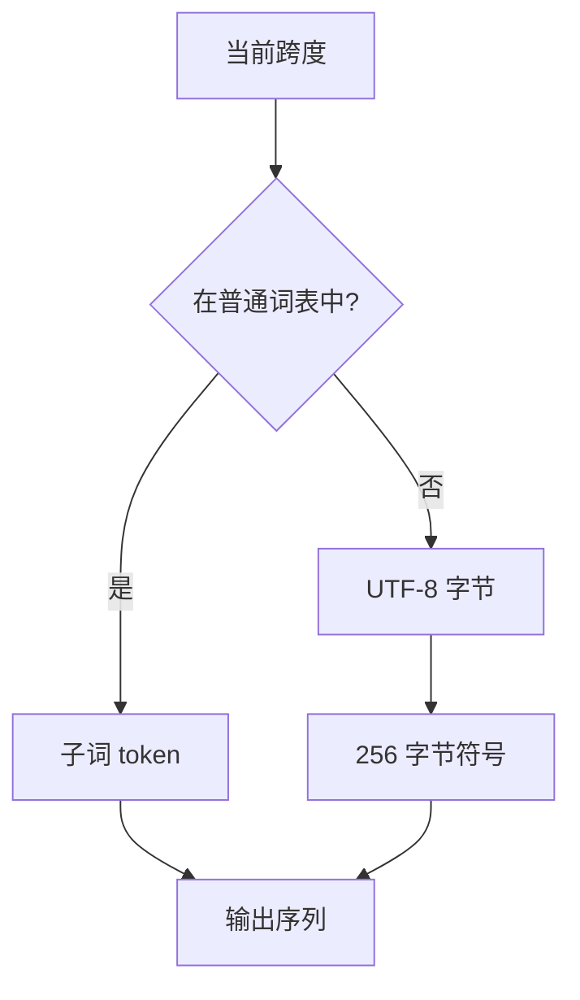

# 字节回退

把词表里没有的字符拆成 UTF-8 字节，用 256 个字节符号拼回去，模型就不必为每一个未见码点准备一个 UNK。

<footer>—— 据 Kudo & Richardson，SentencePiece，EMNLP 2018；对照 Touvron 等，LLaMA，2023 整理</footer>

[上一课](/llm/pretokenization-regex)用正则把文本切成块，再在块内合并。块内若仍出现词表没有的 Unicode 字符，Sennrich 式字符表会落到 UNK，整块信息被一个编号吞掉。本课不重讲正则，也不重讲 [BPE](/llm/bpe-merge-rule) 的焊对顺序。缺口是：闭合字母表如何覆盖开放的 Unicode，而不把词表撑到码点级。SentencePiece 的字节回退（byte fallback）把未见字符拆成 UTF-8 字节符号。

## 问题

[分词器设计](/llm/tokenizer-design)已经区分字节级 BPE 与字符级 BPE。GPT-2 把任意 UTF-8 先映到 256 个原子再合并，训练时几乎没有 UNK。SentencePiece 默认词表却常从 Unicode 字符起步：常见汉字、拉丁字母进表，罕见符号、emoji、私用区、损坏字节进不了表。预分词正则不会帮你：它只切块，不保证块里每个码点都有编号。

UNK 的危害不是「少一个词」，而是训练与推理的信息不对称。训练语料若很少出现某字符，词表构建会把它丢掉；上线后用户一贴，整段被 UNK，梯度从未教过模型这个位置该读什么。需要一条确定的退路：任何码点都能写成已有符号的序列，且能无损拼回。

### 256 个字节不是 256 个「字母」

UTF-8 是变长编码。一个 BMP 汉字三字节，一个 emoji 可能四字节。回退之后，表面上「一个字」会变成三四个 token，fertility 立刻上升。这是覆盖换长度，不是免费的万能词表。后课会把这种膨胀计进公平性；本课只保证「能拼回去」。

字节回退与 GPT-2 的「全部从字节起步」不是同一设计。前者是字符表为主、未见才拆字节；后者是词表从一开始就长在字节上。LLaMA 一类 SentencePiece 词表走的是前者。

## 方法

训练词表时保留 256 个字节符号（常写成 `<0x00>`…`<0xFF>`），再在上面叠加从语料学到的多字节子词。切分时：优先用普通子词匹配当前跨度；若当前码点不在表里，或子词匹配失败，就把该码点的 UTF-8 字节依次换成字节符号。解码时先把字节符号拼回字节串，再按 UTF-8 解释；若字节序列非法，实现必须定义是替换、丢弃还是报错。

LLaMA 的公开词表带字节回退，因此能吃代码、拉丁扩展、偶发中日韩，而不必在 32k 词表里为每个 CJK 字符占位。常见字仍作为整字符或短合并存在，罕见字走字节。这比纯字节 BPE 更省常见文本的长度，又比纯字符表少 UNK。

### 回退必须是确定性的

同一码点每次必须拆成同一串字节符号，否则嵌入无法对齐。不要在回退路径上做 Unigram 采样：采样只作用于表内子词；一旦落到字节，路径应唯一。训练语料里若大量触发回退，说明词表构建时字符覆盖不够，应回头加语料或加合并，而不是指望模型在三字节碎片上学汉字。

损坏的 UTF-8（孤立续字节、过长编码）会让回退与解码不一致。分词器应在 [网页清洗](/llm/web-clean-dedup) 之后面对合法 Unicode；回退是兜底，不是修数据的地方。

## 机制

字节回退把开放码点集映射到固定的 256 维基底。任意字符串的「拼写路径」都在 $V$ 里，离散符号的完备性被补上。模型要学的是：连续的 `<0xE4><0xB8><0xAD>` 在中文语境里常常等于「中」——这是用深度去补词表的覆盖空洞，和 ByT5 把全部建模压在字节上是同一逻辑的局部版本。

因为回退符号在语料里相对稀，它们的嵌入更新少、范数往往异常。这会在后面的 glitch token 课变成可观测的病变；本课只需记住：回退符号是合法成员，不是调试输出。

## 边界

字节回退不修复词表的语言偏见：高频语言仍占满合并名额，低频语言更多走字节，序列更长、同样上下文窗口里有效内容更少。它也不等于数字的正确切分——数字字符可能在表里，却被 BPE 焊成不规则块。下一课才处理数。

把词表扩到覆盖全部 Unicode 平面可以消灭回退，但 $|V|$ 与嵌入矩阵会胀到无法接受。回退是用序列长度换词表大小。若某语言是产品主路径，应在训练语料里把它的字符变成「普通子词」，让回退只打在真正的长尾上。

## 小结

- 本课不重讲正则切块；只补未见码点如何避免 UNK。
- 字节回退用 256 个 UTF-8 字节符号拼出任意字符，SentencePiece / LLaMA 走这条路。
- 它与「全程字节 BPE」不同：常见字符仍是整子词，罕见才拆字节。
- 回退路径必须确定；非法 UTF-8 应在清洗阶段挡掉。
- 覆盖换长度，低频语言会更碎，公平性留到 fertility 课。
- 出处：Kudo & Richardson, *SentencePiece*, EMNLP 2018；Touvron et al., *LLaMA*, 2023；Radford et al., GPT-2, 2019。
