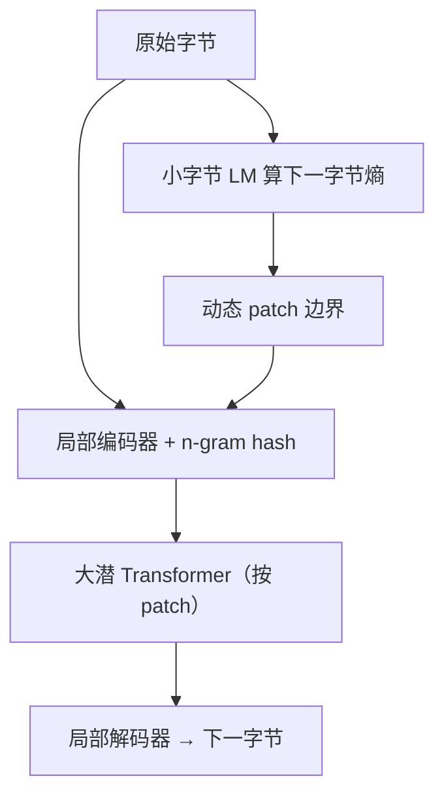

# Byte Latent Transformer

    
词表是启发式压缩；按下一字节熵动态切成补丁，计算应花在难预测的地方，而不是每个 token 均分。

    <footer>—— Pagnoni 等，Byte Latent Transformer: Patches Scale Better Than Tokens，arXiv:2412.09871 / ACL 2025</footer>

几乎所有 LLM 端到端训练，却在入口留下 [BPE](/llm/sentencepiece)：[ByT5](/llm/byt5) 已证明字节可行，但序列过长，大模型的 FLOPs 被每字节一次的大 FFN 吃光，注意力反不是主项。Meta FAIR 与华盛顿大学、芝加哥大学的 Artidoro Pagnoni、Srinivasan Iyer 等人提出 **Byte Latent Transformer（BLT）**：无固定词表，字节由轻量局部编码器收成动态 **patch**，昂贵的潜 Transformer 只在 patch 上跑，局部解码器再还原字节。切分由小字节 LM 的下一字节熵决定。首次在最多 **8B 参数、4T 训练字节** 上做 FLOP 对照缩放，训练 FLOP 对齐 Llama 3 量级，推理可少用最多约 **50%** FLOPs，并对噪声与拼写类任务更稳。代码：github.com/facebookresearch/blt。本篇写熵切分与三模块，不把「取消分词」写成已淘汰 128k 词表生态。

## 问题

静态词表按语料频率合并字节，偏向高资源语言与网页英文，对噪声、拼写、音韵、低资源翻译不公平。加长词表能加长平均 token、减少步数，但词嵌入表膨胀——Llama 3 相对 Llama 2 平均 token 从约 3.7 升到 4.4 字节，嵌入表约 4×。直接在字节上跑大 Transformer，长度是 token 的数倍，不可接受。

MegaByte 式固定步长切 patch：实现简单，但「空格与数学符号」得到相同计算，同一词还会被切在不同边界。按空白切对许多语言不成立，且无法调节平均 patch 大小。需要一种**增量**切分：生成时只能看已经写出的字节，BPE 不满足 $f_p(x_{<i})=f_p(x)_{<i}$（同一前缀会因后续合并而改变切法）。

### 熵作为计算密度

词首字节通常难预测，词内后续字节熵低。全局阈值 $\theta_g$：下一字节熵 $H(x_i)>\theta_g$ 则开新 patch；或相对阈值：熵上升超过 $\theta_r$。高熵处短 patch（多算），低熵处长 patch（少算）。预处理在 dataloader 里用小模型算熵，不是 Nawrot 等那种再训一个边界分类器。平均 patch 大小直接决定潜 Transformer 步数，也就是训练 / 推理主成本。

对照实验把每批字节数期望对齐，加大 patch 就缩短序列长度，避免「更长上下文」偷来的优势。Llama 2 数据上约 8k 字节上下文；BLT-1T 上约 16k 字节。打包时按 patch 填满昂贵核，字节侧再 pad/截断防尖峰。

## 方法

三模块。**局部编码器** $\mathcal{E}$：256 维字节嵌入，加 3–8 元 hash n-gram 嵌入（滚动多项式哈希进定长表），局部块因果注意力，再用 Perceiver 式交叉注意力把字节池化成 patch 查询。**潜全局 Transformer** $\mathcal{G}$：层数远大于局部，块因果 mask，只在 patch 上自回归，消耗大部分 FLOPs。**局部解码器** $\mathcal{D}$：交叉注意力角色对调——字节当查询、patch 当键值——再局部 Transformer 预测下一字节，输出词表 256。

熵模型约 100M、14 层、宽 512、滑窗 512 字节，与 BLT 同分布训练。感受野足够小时可打成查找表。大规模 BLT-Entropy（平均 patch 4.5）在换行处重置熵上下文，并用近似单调约束，减轻选择题等重复段落里「熵漂移」导致的超长 patch。

缩放：固定推理 FLOP 时，BLT 可同时加大模型与平均 patch——潜层跑得更少，省下的预算加宽 $\mathcal{G}$。图 1 显示 patch 6 与 8 的曲线越过 Llama 2/3 BPE 趋势。训练 FLOP 对齐下与 Llama 3 打平，并可用略降评测换最多约 50% 推理 FLOP。直接字节还带来长尾：噪声鲁棒、正字法、音韵、低资源英译。ACL 2025 长文版本把 FLOP 对照写到 8B / 4T bytes。

### 补丁不是词

Token 来自训练前固定词表，模型往往看不见底层字节；patch 无词表，任意字节串都能映射到潜向量，局部模块始终能看原始字节。生成时每步判断是否触及边界，以决定是否调用 $\mathcal{G}$。这比 BPE 解码多一次边界逻辑，但换来增量性质。交叉注意力只允许 patch 看见自己的字节，文档边界不跨越。

## 机制

均分计算假设每个 token 一样难。熵切分把「预测 Mozart 的首字母」与「补全 zart」分开：前者开新 patch 调用大模型，后者留在局部解码。Hash n-gram 把上下文字节模式注入局部编码器，弥补没有词嵌入表。全局模型的 FLOPs 按 $1/n_p$ 摊到每字节，平均 patch 越大越便宜，直到局部模块与交叉注意力占满——故存在最优平均 patch，而不是越大越好。

相对词表模型的新缩放轴：推理预算锁定时，可以「更大 $\mathcal{G}$ + 更稀的调用」。BPE 几乎锁死这条轴。鲁棒性来自：噪声是字节级扰动，BPE 会切出从未见过的 token 碎片；BLT 仍在 256 元上局部编码。

FLOPs 公式按 Chinchilla 计 FFN、QKVO 与注意力；输入嵌入当查找、计 0 FLOP。反向按前向两倍。复现必须用同一套计数，否则 50% 对不上。

## 边界与工程取舍

### 生态与熵模型绑定

推理要带着熵模型或查找表，切分与训练分布不一致会改变平均 patch，从而改变速度与质量。多语空格假设被刻意丢掉，但熵模型仍可能偏训练语种。8B / 4T 证明规模可行，不是证明 70B 聊天模型已该取消 tokenizer。工具与评测套件大量假设子词 ID，迁移成本在基础设施不在公式。熵阈值按目标平均 patch 在预训练混合上标定；换域后平均长度会漂，服务延迟跟着漂。局部窗口 $w_\mathcal{E}$ 允许字节注意力跨过动态边界、但不跨文档，这是为了让词首字节看见上一词尾，同时避免把无关文档的熵结构泄漏进当前 patch。

出处：Pagnoni, Pasunuru, Rodriguez, Nguyen, Muller, Li, Zhou, Yu, Weston, Zettlemoyer, Ghosh, Lewis, Holtzman, Iyer，arXiv:2412.09871，ACL 2025。基线 Llama 2/3 词表与数据配方见对应技术报告。MegaByte：Yu et al. 2023。

出处：Pagnoni et al.，*Byte Latent Transformer: Patches Scale Better Than Tokens*，arXiv:2412.09871 / ACL 2025。代码 facebookresearch/blt。BPE：Sennrich et al. 2016；Llama 3：Grattafiori et al. 2024。

## 小结

- BLT 在原始字节上训练，用熵动态切 patch，大 Transformer 只跑 patch。
- 局部编解码 + 交叉注意力保持字节可见性；无固定词表。
- 8B / 4T bytes 的 FLOP 对照与 Llama 3 打平，推理可少约 50% FLOPs。
- 固定推理预算时可同时加宽模型与加长平均 patch。
- 出处：Pagnoni et al.，arXiv:2412.09871。
