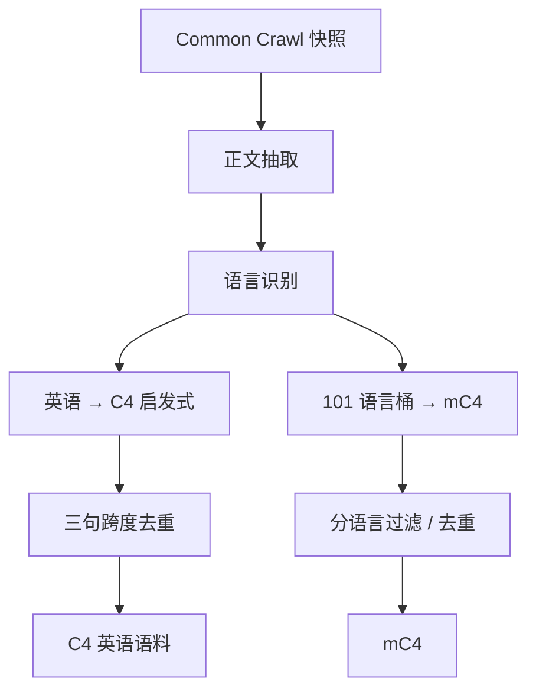

# C4 / mC4

    
从 Common Crawl 出发，用可复现的启发式丢掉不像自然语言的行与页，再对重复跨度去重，得到可训练的 Colossal Clean Crawled Corpus。

    <footer>—— Raffel et al., C4 / T5, JMLR 2020；Xue et al., mC4 / mT5, NAACL 2021</footer>

Colin Raffel、Noam Shazeer、Adam Roberts 等人在 T5 论文（*Exploring the Limits of Transfer Learning with a Unified Text-to-Text Transformer*，JMLR 2020，arXiv:1910.10683）里不仅提出 text-to-text 框架，还公开了英语网页语料 **C4**（Colossal Clean Crawled Corpus）：对 **2019 年 4 月** Common Crawl 快照做一系列启发式过滤与跨度去重，得到约 **750 GB** 量级的干净英语文本。Linting Xue 等人的 **mT5**（NAACL 2021，arXiv:2010.11934）把同一哲学推到多语言：**mC4** 覆盖 **101** 种语言，用 cld3 一类语言识别从 Crawl 分桶，体积远大于英语 C4。本篇写清洗合同与英/多语差异，对照 [网页清洗与去重](/llm/web-clean-dedup) 的管线视角。C4 是数据产物，不是爬虫教程；使用须遵守 Crawl 与衍生集条款。

## 问题

WET 纯文本仍充满菜单、脚本残渣、占位符与转载。直接做语言建模会把 cookie 横幅当句法。需要一套**不靠人工读网页**、可在当时 Google 规模上跑完的规则：宁可变少，也不把明显非句子留下。Raffel 等人同时要可复现：后来者应能从同一快照（或公开的 C4 导出）重建分布，而不是只看到「我们用了网页」。

多语言把问题放大。英语启发式（行以句号结尾、脏词表、javascript 字样）对无空格文字、不同标点与脚本会系统性误杀或误留。mC4 必须先语言识别再分桶，否则「英语 C4 规则 × 全世界」会得到扭曲的语种配比。Xue 等人要的是：在 101 种语言上都能做 T5 式预训练，而不是 101 份互不相干的私有爬取。

### 启发式看见的是形态，不是知识

典型规则：丢掉不以终结标点结束的行；页内句子过少或过短则丢页；命中脏话表则丢页；含 `javascript`、`lorem ipsum`、花括号等模式则丢；英语页要求 langdetect 概率足够高；**三句及以上的重复跨度**在全集去重。它们便宜、可复现，也误杀诗歌、标题、代码注释，放过通顺的 SEO 空文。C4 偏严，是刻意的精度优先。后续 RefinedWeb / FineWeb 证明：同一 Crawl 上换抽取与过滤，下游可以再涨——说明 C4 不是网页语料的上限，而是一条可引用的基线合同。

Raffel et al.，T5，JMLR 2020：C4 来自 2019-04 Common Crawl，公开过滤条款与约 750GB 英语。Xue et al.，mT5，NAACL 2021：mC4，101 语言。不要把 TensorFlow Datasets 里 `c4/en.noblocklist` 与默认 `c4/en` 当成同一训练集——脏词过滤是开关，会改体积与毒性。

## 方法

管线顺序通常是：抽取正文 → 语言识别 → 行/页启发式 → 文档或跨度去重。C4 的跨度去重针对模板化转载：同一三句在语料中多次出现则剪掉，而不一定删整页。英语识别用 langdetect 高阈值，把非英页拒于门外。T5 训练在 C4 上做 span corruption，因此 C4 的「像不像句子」会直接进入填空分布。公开 `c4` 数据集让没有 TPU 农场的人也能取用清洗结果，这与论文里对比 Pile 时提到的「自造 C4 计算壁垒」并不矛盾——壁垒在「从原始 Crawl 重跑」，不在「下载已清洗分片」。

mC4：对每个语言桶独立存，体积与质量随语言极不均衡；高资源语言接近英语网页形态，低资源桶更脏、更短、更易被错误语言标签污染。mT5 用这些桶做多语言 span corruption，采样策略（是否按语种温度采样）会再改有效分布，那是训练配方，不是 mC4 文件本身。引用 mC4 应写语言数与识别器，写「用了 Common Crawl」等于没写。

### 抽取器设定上限，规则不能挽回烂正文

同一 URL，不同 HTML 正文抽取器得到不同字符。导航残留会让后续任何脏词表与句号规则失效或误触发。Pile-CC 后来改用 jusText 打 WARC，部分是针对 WET 质量。讨论 C4 时要把「2019 年那次抽取」冻住：用 2024 年抽取器重跑 2019 Crawl，已不是同一 C4。去重粒度也是方法：只按 URL 会留下换域名转载；只按文档哈希会留下改了广告的近重复。C4 的三句跨度是折中。

## 机制

启发式改变支撑：某些字符串模式的概率被压到近零。去重改变频率：转载新闻不再按出现次数垄断梯度。二者都会间接改领域配比——新闻镜像多，去重后论坛相对上升。对 T5 的 span corruption，丢掉无句号的行意味着模型更少在菜单 token 上做填空，百科与新闻句式被强化。mC4 的语言识别错误会把语言 A 的页打进 B 桶，造成「神秘的多语混写」监督；低资源语言尤其严重。

与 The Pile 对比：C4 几乎是单源网页 + 规则；Pile 是多源加权。C4 更干净地回答「网页能不能当主语料」；Pile 回答「要不要额外买学术与代码」。T5 在 C4 上的迁移学习数字，不能直接当成 mC4 上 101 语言各自的数字——mT5 论文有单独的多语基准。泄漏方面，网页与下游阅读理解、问答集的 n-gram 重叠要单独查；清洗「看起来干净」不等于与评测集无交。

英语句号规则对中文、日文不友好；脏词表有文化偏见。把 C4 规则原样打到中文抓取上，不是「高质量」，是配比失真。mC4 分桶之后仍可能套用过强的英语形态假设，使用低资源语言时应看该桶的手工抽查，而不是只看总 TiB。

## 边界与工程取舍

### 快照年份与过滤开关都是合同条款

C4 不测代码（花括号页被丢）、不测表格、不测口语标题党。通顺垃圾能通过。默认 blocklist 会少收某些方言与身份相关文本，`noblocklist` 变体更脏也更全，产品必须选边并写入数据卡片。快照年份锁定世界知识：2019-04 没有后来的事件，用 C4 训出来的「世界」停在那次抓取。mC4 的 101 是识别器标签数，不是 101 种语言质量同构。许可证与个人数据：衍生自 Crawl，下游商用要自己做合规，论文不代替法律意见。换一年的 Crawl 重跑同一启发式，得到的也不是「那个 C4」。

不要用 C4 的 GiB 与 The Pile 的 825 GiB 直接比「谁更大所以谁更好」——域不同。也不要把 mC4 写成「C4 的翻译版」——它是分语言的网页桶，不是平行语料。现代网页集（RefinedWeb、FineWeb、DCLM）应作为后继合同引用，C4 仍是必须会指认的基线。

出处：Raffel, Shazeer, Roberts, Lee, Narang, Matena, Zhou, Li, Liu，*Exploring the Limits of Transfer Learning with a Unified Text-to-Text Transformer*，JMLR 2020（C4）。Xue et al.，*mT5: A Massively Multilingual Pre-trained Text-to-Text Transformer*，NAACL 2021（mC4）。

## 小结

- C4：2019-04 Common Crawl 上偏严启发式 + 三句去重的英语网页语料，T5 的主语料。
- mC4：101 语言的多语网页桶，服务 mT5；识别与形态规则会扭曲低资源配比。
- 抽取、语言识别、启发式、去重都是训练分布的一部分，必须写入数据卡片。
- 与 The Pile 比的是混合物而非「谁更干净」；与后继网页集比的是过滤版本。
- 出处：Raffel et al. JMLR 2020；Xue et al. NAACL 2021。
