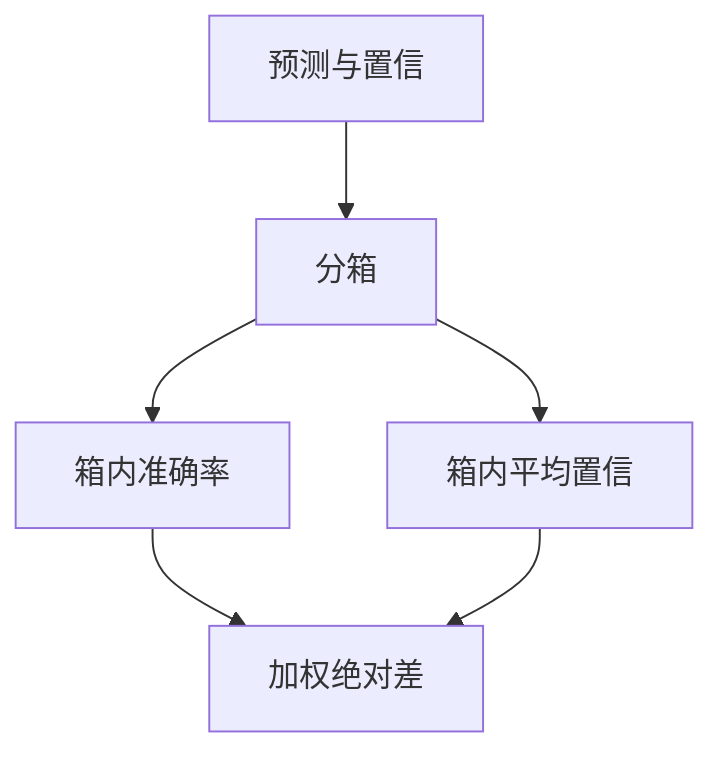

# 校准与 ECE

准确率高仍可以系统性过自信。把预测概率装进箱子，看置信与命中率差多少，这才是校准，不是再刷一题准确率。

<footer>—— Guo 等对现代网络校准的观察；ECE 见 Naeini 等</footer>

[上一课](/llm/pass-at-k)说明多样本可以「撞到对的」。产品还要问：模型说有八成把握时，是不是大约八成对。本课写校准与期望校准误差（Expected Calibration Error, ECE）。缺口不是再讲 softmax，而是把**置信数字**当成要评测的输出。后课 TruthfulQA 会用到：会说假话的模型往往也过自信。

## 问题

Guo 等人指出，深度网络在准确率升高的同时 ECE 变差：温度缩放之前，top-1 置信普遍偏高。语言模型同样：选项似然或「口头概率」不是频率。Kadavath 等人问模型「你答得对吗」，发现一定条件下口头置信有信号，但远非已校准。把未校准置信拿去拒答或级联，阈值没有频率含义。

ECE 把预测按置信分箱，每箱比平均置信与平均准确率，再按箱质量加权求和。箱数、是否自适应分箱、是否只看正确类，都会改 ECE 的值——它是协议，不是唯一的校准本体。

Brier 分数同时惩罚校准与锐度；ECE 更接近「置信刻度准不准」。只报 ECE 可能奖励「永远说 0.5」的钝模型。准确率与校准要同表。

## 方法

对分类式评测：取预测类的概率 $\hat{p}$，分 $M$ 箱，

$$
\mathrm{ECE}=\sum_{m=1}^{M}\frac{|B_m|}{n}\bigl|\mathrm{acc}(B_m)-\mathrm{conf}(B_m)\bigr|.
$$

口头概率：用固定提示引出 0–100 的数字，再当 $\hat{p}$；这与 token 似然不是同一个随机变量，必须分列。温度缩放在验证集上拟合一个 $T$，只改置信不改 argmax，可降低 ECE，不提高准确率——不要把它写成能力进步。

## 机制

过自信来自：训练损失推动概率质量堆到众数、RLHF 奖励「听起来确定」、解码温度低于训练。ECE 看见的是边际频率，看不见条件于题目难度的校准。难的题上自信仍高，是更危险的失准，需要按难度分层报。选择性预测（低于阈值则弃权）把校准变成决策：阈值应按验证集上的风险来，而不是按 0.8 的整数魅力。

## 边界

生成式开放答案没有单一 $\hat{p}$。可用自洽投票比例或口头置信当代理，但那是另一套仪器。下一课 TruthfulQA 测的是「是否说人爱听的假话」，与 ECE 相关但不是同一声明。

## 小结

- ECE 测置信与频率的箱级偏差，必须与准确率同表。
- token 似然与口头概率分列；温度缩放只校准不增能力。
- 按难度分层，避免平均 ECE 掩盖难题上的过自信。
- 出处：Naeini 等 ECE；Guo 等 ICML 2017；Kadavath 等口头自信。
