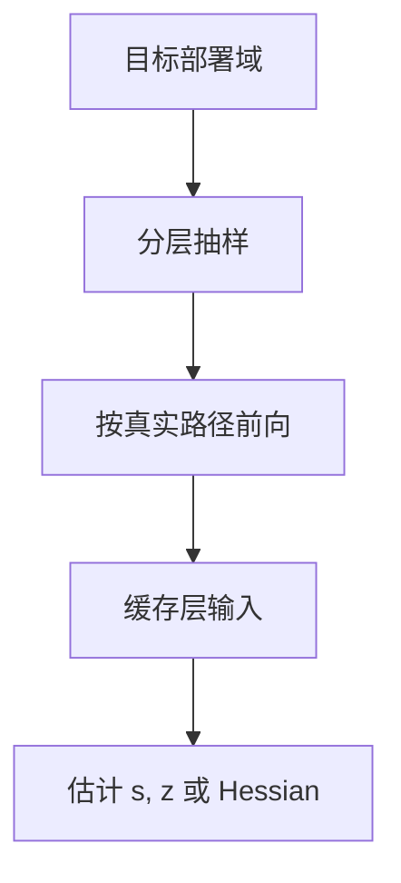

# 校准集

PTQ 不回传，只问校准样本：动态范围、Hessian、哪一通道重要，都从这一小撮激活里读。集偏了，格子就对准错误的世界。

<footer>—— 对照 GPTQ / AWQ / SmoothQuant 用数百段文本缓存激活的做法</footer>

[粒度](/llm/quant-granularity) 决定 $s$ 管多宽。本课写 $s$ 从哪来： **校准集**。缺口不是再讲 round，而是样本如何代表部署分布——以及为何「C4 上 PPL 好看」换指令数据就炸。[GPTQ](/llm/gptq) 已强调过拟合校准域；本课把集的构造做成一课，供 AdaRound、Hessian、混精搜索共用。

## 问题

校准要覆盖：语言域、长度、特殊 token、多模态前缀（若有）、以及会激发[离群通道](/llm/why-activation-outliers) 的那些模式。条数通常几十到几百：太少，max/百分位与 $XX^\top$ 不稳；太多，PTQ 失去「数小时打完」的意义，并开始像微型训练。

域偏移：用网页文本校准聊天模型，指令格式与代码块上的激活统计会变，$s$ 偏小则饱和，偏大则台阶变粗。长上下文：短校准看不见 RoPE 相关爆炸，线上长请求才饱和。问题是 **校准分布 = 部署分布的代理**，不是「随便抓 128 条」。

QAT 用训练数据过量化噪声，不叫本课的校准集。本课只限 PTQ：冻结权重，用前向激活估统计量或解重建。

## 方法

构造：从目标域分层抽样（通用、代码、多语、超长各留配额），固定种子以便复现。预处理与推理一致：同样的 chat template、同样的系统提示、同样的最大长度。缓存每层输入 $X$ 时，用将要部署的精度路径（已经量化的前层）——[GPTQ](/llm/gptq) 写过误差要沿真实路径走。

统计：min/max 或百分位估 $s,z$；百分位抗单个异常 token，但可能系统性地低估真离群。可报两条：$p=100$ 与 $p=99.9$，看下游谁稳。Hessian / 重建类方法对 $X$ 的二阶更敏感，校准条数不够时要阻尼，方法退化。

不要用评测集当校准集：既污染评测，又往往太「干净」，估不出脏输入上的饱和。校准与评测要拆开。

## 机制

$max|X|$ 由极值 token 决定，方差巨大，所以纯 min/max 不稳定。百分位把极值当离群扔掉，若极值其实是功能通道，等于系统性欠载。消融应用[离群课](/llm/why-activation-outliers) 的钳制实验：扔掉的百分位若伤 CE，就不要用那么低的 $p$。

层间：前层量化改变后层 $X$。一次性用 FP16 激活给所有层估 $s$，会乐观。逐层用已量化前缀，校准时间涨，偏差降。这是准确性机制，不是实现癖好。

MoE：校准必须让各专家都被打到，否则冷专家的 $s$ 来自噪声。路由若随域变，专家尺度在线上会错。共享专家优先保证覆盖。

## 边界与工程取舍

不要把论文附录的 pile 子集当你的产品校准。不要在换 tokenizer 或 chat 模板后复用旧 $s$。不要把校准做成每天全量——固定一版，变更要走发布。下一课 AdaRound 在给定校准 $X$ 上改舍入，校准偏了它会更用力地拟合错误世界。

## 小结

- PTQ 的格子与重建全部读校准激活；集必须代理部署域与长度。
- 条数在「统计稳定」与「仍是 PTQ」之间；用真实量化路径缓存 $X$。
- 百分位抗噪但可能切掉功能离群；要消融。
- 校准与评测分离；模板变更即作废。
- 出处：GPTQ/AWQ/SmoothQuant 的校准实践。
